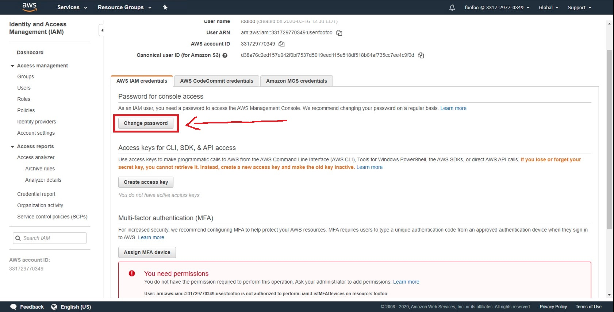
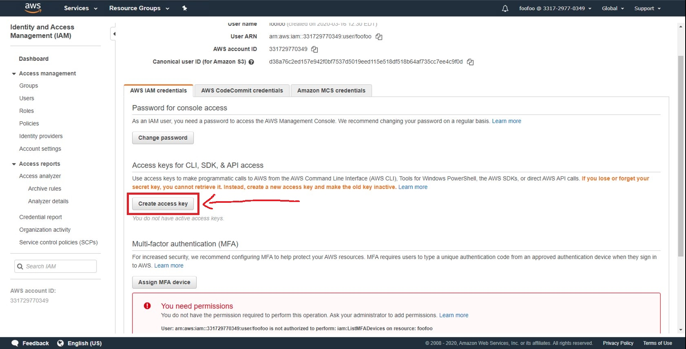

##### 3D Model Libraries

# Non-free models

TDW includes a non-free model library: `models_full.json`. This library has *far* more models than the free `models_core.json` and far more categories. Like `models_core.json`, they are photorealistic.

```python
from tdw.librarian import ModelLibrarian

for librarian_filename in ["models_core.json", "models_full.json"]:
    librarian = ModelLibrarian(librarian_filename)
    categories = librarian.get_model_wnids_and_wcategories()
    print(librarian_filename)
    print(f"Number of models: {len(librarian.records)}")
    print(f"Number of semantic categories: {len(categories)}")
    print("")
```

Output:

```
models_core.json
Number of models: 513
Number of semantic categories: 106

models_full.json
Number of models: 2399
Number of semantic categories: 239
```

For the sake of convenience, `models_full.json` includes all of the models in `models_core.json`:

```python
from tdw.librarian import ModelLibrarian

core = ModelLibrarian("models_core.json")
full = ModelLibrarian("models_full.json")
for core_record in core.records:
    full_record = full.get_record(core_record.name)
    assert full_record is not None
```

## How to access non-free models

**`models_full.json` is non-free and can't be downloaded without special access privlieges.**

### Requirements

- You must be affiliated with MIT, IBM, or Stanford. (This will change in the future.)
- Amazon S3 access keys

### 1. Obtain Amazon S3 access keys

If you haven't done so already, [email Jeremy Schwartz](mailto:jeremyes@mit.edu) to request access keys for the full model library. You will receive an email with the title “Welcome to ThreeDWorld(TDW)”. This email will contain login instructions and your username for the TDW Amazon AWS console, where you will generate your access credentials. _You will also receive a second email_, containing the temporary password associated with that username. Note this email will be an encrypted email, and will require entering an access key to open which will be sent to you separately via Slack DM. 

You must change your password immediately upon login, per the instructions below.  Also, you will not have permissions to perform any actions in the Console; you will only be able to generate your access credentials as described below.

After clicking on the link, you will be taken to the Amazon AWS Console page for the TDW account. Click on the down arrow marked in red below:


This will display the drop-down menu for your login. Click on “My Security Credentials”:


You will go to the credentials management page, where you will first change the temporary password you logged in with by clicking in the “Change password” button:



Next, you will generate your access key, which is in the form of a public / private key pair; click on the “Create access key” button as shown below. 



This is your _only_ opportunity to save the information for both keys, so you must either download the CSV using the button highlighted below (recommended), or else show the secret access key and make a note of both keys.


### 2. Set up your credentials file

1. Create a new file here:

```
<home>/.aws/credentials
```

Where `<home>` is your home directory. Note that `credentials` doesn't have a file extension.

2. Add this to the file:

```
[tdw]
aws_access_key_id=<access key id>
aws_secret_access_key=<secret acccess key>
```

Replace `<access key id>` with your access key ID, and `<secret access key>` with your secret access key.

### 3. Validate your credentials and add a config file

You need a config file in addition to your credentials file:

```
<home>/.aws/config
```

You can create this config file in one of two ways.

#### Option A: Copy-paste the following:

```
[default]
region = us-east-1
output = json
```

#### Option B: Run TDW's own validation

With Python3:

```python
from tdw.tdw_utils import TDWUtils

TDWUtils.validate_amazon_s3()
```

This will validate that everything is set up correctly and generate a config file for you.

#### 3. (Optional) Create images of all of the models

You can run [`screenshotter.py --type models_full`](../core_concepts/objects.md) to generate images of every model in the library. Be aware that it will take at least an hour to create every image.

***

**This is the last document in the "3D model libraries" tutorial.**

[Return to the README](../../../README.md)

***

Python API:

- [`ModelLibrarian`](../../python/librarian/model_librarian.md)
- [`TDWUtils.validate_amazon_s3()](../../python/tdw_utils.md)

