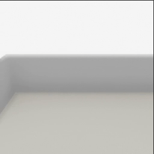

##### Core Concepts

# Add-ons and the `ThirdPersonCamera`

**Add-ons** in TDW are objects that can be added to a controller and act as wrappers for the Command API. They will inject commands at every `communicate()` call. You can attach an add-on to the controller by adding it to the `c.add_ons` list.

The purpose of add-ons is to simplify repetitious or complex behavior in TDW and to standardize common API calls. The most important thing to know about add-ons is that there is nothing that add-on can do that can't be done with low-level commands.

The [`ThirdPersonCamera`](../../python/add_ons/third_person_camera.md) add-on will add a third-person camera avatar to the scene. It can do everything covered [in the previous document](avatars.md) but with simplified controls. 

To start, we'll define the camera and append it to the `c.add_ons` list:

```python
from tdw.controller import Controller
from tdw.tdw_utils import TDWUtils
from tdw.add_ons.third_person_camera import ThirdPersonCamera

c = Controller()

# Create the third-person camera.
camera = ThirdPersonCamera(avatar_id="a",
                           position={"x": -1, "y": 5.7, "z": -3.8},
                           rotation={"x": 26, "y": 0, "z": 0})
# Append the third-person camera add-on.
c.add_ons.append(camera)
```

At this point the controller still hasn't sent any commands  to add the camera. Add-on commands are always sent when `c.communicate()` is called:

```python
from time import sleep
from tdw.controller import Controller
from tdw.tdw_utils import TDWUtils
from tdw.add_ons.third_person_camera import ThirdPersonCamera

c = Controller()

# Create the third-person camera.
camera = ThirdPersonCamera(avatar_id="a",
                           position={"x": -1, "y": 5.7, "z": -3.8},
                           rotation={"x": 26, "y": 0, "z": 0})
# Append the third-person camera.
c.add_ons.append(camera)
c.communicate([TDWUtils.create_empty_room(12, 12)])
sleep(2)
c.communicate({"$type": "terminate"})
```

Result:


## Moving the `ThirdPersonCamera`

The third-person camera can be moved via `camera.teleport(position)` and rotated via `camera.rotate(rotation)`:

```python
from tdw.controller import Controller
from tdw.tdw_utils import TDWUtils
from tdw.add_ons.third_person_camera import ThirdPersonCamera

c = Controller()

camera = ThirdPersonCamera(avatar_id="a",
                           position={"x": -1, "y": 5.7, "z": -3.8},
                           rotation={"x": 26, "y": 0, "z": 0})
c.add_ons.append(camera)
c.communicate([TDWUtils.create_empty_room(12, 12),
               {"$type": "set_target_framerate",
                "framerate": 30}])
for i in range(20):
    # Raise the camera up by 0.1 meters.
    camera.teleport(position={"x": 0, "y": 0.1, "z": 0},
                    absolute=False)
    # Rotate around the yaw axis by 2 degrees.
    camera.rotate(rotation={"x": 0, "y": 2, "z": 0})
    c.communicate([])
c.communicate({"$type": "terminate"})
```

Result:



Note that we're iterating by calling `c.communicate([])`. This sends an empty list of commands (plus any commands injected by the `camera` add-on). 

## Add-ons order of execution

Add-on commands are always sent in the order that they appear in `c.add_ons`. Add-on commands are always sent after the commands explicitly listed in `communicate(commands)`.

To demonstrate this, we'll add a second add-on, [`Debug`](../../python/add_ons/debug.md). This add-on will log all commands sent to a build and optionally play them back.

```python
from tdw.controller import Controller
from tdw.tdw_utils import TDWUtils
from tdw.add_ons.third_person_camera import ThirdPersonCamera
from tdw.add_ons.debug import Debug
from tdw.backend.paths import EXAMPLE_CONTROLLER_OUTPUT_PATH

c = Controller()

# Create the third-person camera.
camera = ThirdPersonCamera(avatar_id="a",
                           position={"x": -1, "y": 5.7, "z": -3.8},
                           rotation={"x": 26, "y": 0, "z": 0})
path = EXAMPLE_CONTROLLER_OUTPUT_PATH.joinpath("add_ons/log.txt")
print(f"Log will be saved to: {path}")
# Add a debug add-on.
debug = Debug(record=True, path=path)

# Append the third-person camera and debug add-ons.
c.add_ons.extend([debug, camera])

c.communicate(TDWUtils.create_empty_room(12, 12))
c.communicate({"$type": "terminate"})

# Show the commands from the first logged frame.
for command in debug.playback[0]:
    print(command["$type"])
```

Output:

```
create_exterior_walls
send_log_messages
create_avatar
set_pass_masks
set_render_order
set_anti_aliasing
teleport_avatar_to
rotate_sensor_container_by
rotate_sensor_container_by
rotate_sensor_container_by
```

- [`create_exterior_walls`](../../api/command_api.md#create_exterior_walls) is first in the list because  we called `c.communicate(TDWUtils.create_empty_room(12, 12))` (which sends a `create_extertior_walls` command).
- [`send_log_messages`](../../api/command_api.md#send_log_messages) was added by the `Debug` add-on. Because the list of add-ons is `[debug, camera]`, this command is sent before `camera`'s commands.
- The ret of the commands are injected into the list by the `ThirdPersonCamera`.

***

**Next: [Objects](objects.md)**

[Return to the README](../../../README.md)

***

Example controllers:

- [third_person_camera.py](https://github.com/threedworld-mit/tdw/blob/master/Python/example_controllers/core_concepts/third_person_camera.py) Example usage of the `ThirdPersonCamera`.

Python API:

- [`AddOn`](../../python/add_ons/add_on.md) (abstract base class for all add-ons)
- [`ThirdPersonCamera`](../../python/add_ons/third_person_camera.md) 
- [`Debug`](../../python/add_ons/debug.md) 

Command API:

- [`create_exterior_walls`](../../api/command_api.md#create_exterior_walls)
- [`send_log_messages`](../../api/command_api.md#send_log_messages)

