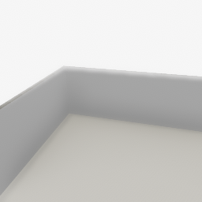
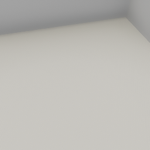

##### Core Concepts

# Avatars and cameras

As mentioned [earlier](design_philosophy.md), TDW doesn't impose metaphors regarding what an agent is or whether there needs to be one at all.

**Avatars** are a type of agent in TDW but not the only one. The most commonly used avatar is a non-embodied camera; you can think of this avatar as being more or less equivalent to a third-person camera (though the [commands](1.2.2_commands.md) for cameras have slightly different parameters than avatars).

To add the third-person camera avatar to the scene:

```python
from tdw.controller import Controller
from tdw.tdw_utils import TDWUtils

c = Controller()
c.start()
c.communicate([TDWUtils.create_empty_room(12, 12),
               {"$type": "create_avatar",
                "type": "A_Img_Caps_Kinematic",
                "id": "a"}])
```

 ...which will render this image in the build application's window:


The avatar is currently at position (0, 0, 0). To move it to a better location, send `teleport_avatar_to`:

```python
from tdw.controller import Controller
from tdw.tdw_utils import TDWUtils

c = Controller()
c.start()
c.communicate([TDWUtils.create_empty_room(12, 12),
               {"$type": "create_avatar",
                "type": "A_Img_Caps_Kinematic",
                "id": "a"},
               {"$type": "teleport_avatar_to",
                "avatar_id": "a",
                "position": {"x": -1, "y": 0.6, "z": 2.4}}])
```

...which will render this image:


This is a *little* better (the camera is now above floor level) but still not great. Let's rotate the avatar's **sensor container** (its camera) for a better view of the scene:

```python
from tdw.controller import Controller
from tdw.tdw_utils import TDWUtils

c = Controller()
c.start()
c.communicate([TDWUtils.create_empty_room(12, 12),
               {"$type": "create_avatar",
                "type": "A_Img_Caps_Kinematic",
                "id": "a"},
               {"$type": "teleport_avatar_to",
                "avatar_id": "a",
                "position": {"x": -1, "y": 5.7, "z": -3.8}},
               {"$type": "rotate_sensor_container_by",
                "axis": "pitch",
                "angle": 26,
                "avatar_id": "a"},
               {"$type": "rotate_sensor_container_by",
                "axis": "yaw",
                "angle": -15,
                "avatar_id": "a"}])
```

...which will render this image:



## `TDWUtils.create_avatar()`

`TDWUtils` includes a helpful wrapper function for creating avatars: [`create_avatar()`](https://github.com/threedworld-mit/tdw/blob/master/Documentation/python/tdw_utils.md#create_avataravatar_typea_img_caps_kinematic-avatar_ida-positionnone-look_atnone---listdict):

```python
from tdw.controller import Controller
from tdw.tdw_utils import TDWUtils

c = Controller()
c.start()
commands = [TDWUtils.create_empty_room(12, 12)]
commands.extend(TDWUtils.create_avatar(avatar_type="A_Img_Caps_Kinematic",
                                       position={"x": -1, "y": 5.7, "z": -3.8},
                                       look_at={"x": 0, "y": 1, "z": 0}))
c.communicate(commands)
```

...which will render this image:



## Moving and rotating the avatar

To move and rotate the avatar, simply teleport and rotate it by small increments per frame:

```python
from tdw.controller import Controller
from tdw.tdw_utils import TDWUtils

"""
Move the avatar and rotate the camera.
Note that in this example, the `avatar_id` parameters are missing. That's because they all default to "a".
"""

c = Controller()
c.start()
y = 5.7
c.communicate([TDWUtils.create_empty_room(12, 12),
               {"$type": "create_avatar",
                "type": "A_Img_Caps_Kinematic",
                "id": "a"},
               {"$type": "teleport_avatar_to",
                "position": {"x": -1, "y": y, "z": -3.8}},
               {"$type": "rotate_sensor_container_by",
                "axis": "pitch",
                "angle": 26},
               {"$type": "set_target_framerate",
                "framerate": 30}])
for i in range(20):
    y += 0.1
    c.communicate([{"$type": "rotate_sensor_container_by",
                    "axis": "yaw",
                    "angle": 2},
                   {"$type": "teleport_avatar_to",
                    "position": {"x": -1, "y": y, "z": -3.8}}])
c.communicate({"$type": "terminate"})
```

...which moves the avatar like this:


## The `ThirdPersonCamera` add-on

**Add-ons** in TDW are objects that can be added to a controller and act as wrappers for the Command API. They will inject commands at every `communicate()` call based on the output data from the build.

The [`ThirdPersonCamera`](../../python/add_ons/third_person_camera.md) add-on will add a third-person camera avatar to the scene. Unlike the avatar created by `TDWUtils.create_avatar()` this add-on has per-frame camera controls.

This controller does the exact same thing as the previous example:

```python
from tdw.controller import Controller
from tdw.tdw_utils import TDWUtils
from tdw.add_ons.third_person_camera import ThirdPersonCamera

c = Controller()
c.start()

# Create the third-person camera.
cam = ThirdPersonCamera(avatar_id="a",
                        position={"x": -1, "y": 5.7, "z": -3.8},
                        rotation={"x": 26, "y": 0, "z": 0})

# Append the third-person camera add-on.
c.add_ons.append(cam)
c.communicate([TDWUtils.create_empty_room(12, 12),
               {"$type": "set_target_framerate",
                "framerate": 30}])
for i in range(20):
    # Raise the camera up by 0.1 meters.
    cam.teleport(position={"x": 0, "y": 0.1, "z": 0},
                 absolute=False)
    # Rotate around the yaw axis by 2 degrees.
    cam.rotate(rotation={"x": 0, "y": 2, "z": 0})
    c.communicate([])
c.communicate({"$type": "terminate"})
```

## Embodied avatars

**There are several embodied avatars in TDW; however, we don't recommend you use them.** Avatars are one of the oldest components of TDW and they've been gradually superseded. [There are many non-avatar embodied agents in TDW](TODO), all of which are more sophisticated than the embodied avatars. For more information regarding embodied avatars, read the API documentation for [`create_avatar`](../../api/command_api.md#create_avatar).

***

**Next: [Objects](objects.md)**

Example controllers:

- [move_avatar.py](https://github.com/threedworld-mit/tdw/blob/master/Python/example_controllers/core_concepts/move_avatar.py) Move an avatar and rotate its camera.
- [third_person_camera.py](https://github.com/threedworld-mit/tdw/blob/master/Python/example_controllers/core_concepts/third_person_camera.py) Example usage of the `ThirdPersonCamera`.

Python API:

- [`TDWUtils.create_avatar(avatar_type, position, look_at)`](../../python/tdw_utils.md)
- [`AddOn`](../../python/add_ons/add_on.md) (abstract base class for all add-ons)
- [`ThirdPersonCamera`](../../python/add_ons/third_person_camera.md) 

Command API:

- [`create_avatar`](../../api/command_api.md#create_avatar)
- [`teleport_avatar_to`](../../api/command_api.md#teleport_avatar_to)
- [`rotate_sensor_container_by`](../../api/command_api.md#rotate_sensor_container_by)
- [`set_target_framerate`](../../api/command_api.md#set_target_framerate)

[Return to the README](../../README.md)