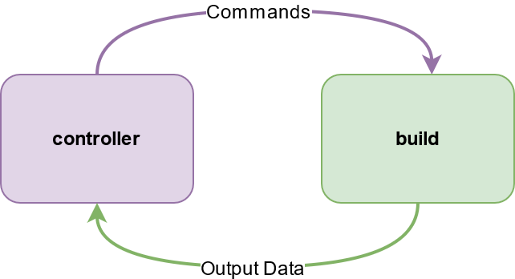

# Core concepts: The controller

A controller is the Python object that communicates with the simulation application (the build). Typically, users are responsible for writing their own controllers, though the documentation for TDW includes numerous examples.

You've already seen a minimal controller script example:

```python
from tdw.controller import Controller

c = Controller()
c.communicate({"$type": "terminate"})
```

This will launch the build and immediately kill the process.

In many cases, you'll want to add your own functions to a controller. To do this, create a child class of `Controller`:

```python
from tdw.controller import Controller

class MyController(Controller):
    pass


if __name__ == "__main__":
    c = MyController()
    c.communicate({"$type": "terminate"})
```

This example will print all of the commands sent to the build:

```python
from typing import Union, List
from tdw.controller import Controller

class MyController(Controller):
    def communicate(self, commands: Union[dict, List[dict]]) -> list:
        print(commands)
        return super().communicate(commands=commands)
 

if __name__ == "__main__":
    c = MyController()
    c.communicate({"$type": "terminate"})
```

## Frames, Commands, and Output Data

- Every time the controller calls `communicate()`, the simulation advances 1 **frame**. A frame is equivalent in TDW to both a visual camera render and a physics step.  If the controller *doesn't* call `communicate()`, the simulation pauses until it does.. (Compare this to a video game, where the application will continuously update its visual and physics state regardless of whether it receives input from the user.)
- The controller sends **commands** to the build per communicate call. In the above examples, `{"$type": "terminate"}` is a command.
- The build receives **output data** from the build per communicate call.




***

**Next: [Commands](commands.md)**

Python API:

- [`Controller`](../../python/controller.md)  (Base class for all TDW controllers)

Command API:

- [`terminate`](../../api/command_api.md#terminate)
- [`do_nothing`](../../api/command_api.md#do_nothing)

[Return to the README](../../README.md)