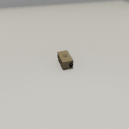
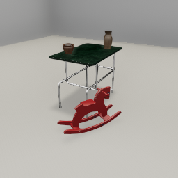

##### Core Concepts

# Images

TDW makes a distinction between images rendered to the build's application window (render frames) and encoded image output data. By default, avatar cameras generate render frames but don't actually return output data; this is because serializing image output data is one of the slowest processes in TDW. Only request image data when you really need it!

Image data in TDW is divided into **capture passes**. By far the most commonly used capture pass is `_img`, which is a render of what the camera is currently viewing. Other capture passes will return more specialized data.

To capture an `_img` pass, we'll first create a scene, add an object, and add an avatar. 

```python
from tdw.controller import Controller
from tdw.tdw_utils import TDWUtils

c = Controller()
object_id = c.get_unique_id()

commands = [TDWUtils.create_empty_room(12, 12),
            c.get_add_object(model_name="iron_box",
                             position={"x": 0, "y": 0, "z": 0},
                             object_id=object_id)]
commands.extend(TDWUtils.create_avatar(position={"x": 2, "y": 1.6, "z": -0.6},
                                       avatar_id="a",
                                       look_at={"x": 0, "y": 0, "z": 0}))
```

Now we need to add two more commands:

- [`set_pass_masks`](../../api/command_api.md#set_pass_masks) to enable the `_img` pass.
- [`send_images`](../../api/command_api.md#send_images) to request image data per frame.

We'll send all of these commands and receive a response:

```python
from tdw.controller import Controller
from tdw.tdw_utils import TDWUtils

c = Controller()
object_id = c.get_unique_id()

commands = [TDWUtils.create_empty_room(12, 12),
            c.get_add_object(model_name="iron_box",
                             position={"x": 0, "y": 0, "z": 0},
                             object_id=object_id)]
commands.extend(TDWUtils.create_avatar(position={"x": 2, "y": 1.6, "z": -0.6},
                                       avatar_id="a",
                                       look_at={"x": 0, "y": 0, "z": 0}))
commands.extend([{"$type": "set_pass_masks",
                  "pass_masks": ["_img"],
                  "avatar_id": "a"},
                 {"$type": "send_images",
                  "frequency": "always",
                  "ids": ["a"]}])

resp = c.communicate(commands)
```

We can then read the [`Images`](../../api/output_data.md#Images) output data, which contains metadata about the image plus the image itself. We can then choose what to do with the image: If we want to analyze it at runtime, we could convert it to a [PIL image](https://pillow.readthedocs.io/en/stable/reference/Image.html). Or, we could immediately save it to disk. The following example does both options:

```python
from tdw.controller import Controller
from tdw.tdw_utils import TDWUtils
from tdw.output_data import OutputData, Images
from tdw.backend.paths import EXAMPLE_CONTROLLER_OUTPUT_PATH

"""
Create a scene, add an object, and save the image.
"""

c = Controller()
object_id = c.get_unique_id()

commands = [TDWUtils.create_empty_room(12, 12),
            c.get_add_object(model_name="iron_box",
                             position={"x": 0, "y": 0, "z": 0},
                             object_id=object_id)]
commands.extend(TDWUtils.create_avatar(position={"x": 2, "y": 1.6, "z": -0.6},
                                       avatar_id="a",
                                       look_at={"x": 0, "y": 0, "z": 0}))
commands.extend([{"$type": "set_pass_masks",
                  "pass_masks": ["_img"],
                  "avatar_id": "a"},
                 {"$type": "send_images",
                  "frequency": "always",
                  "ids": ["a"]}])

resp = c.communicate(commands)
output_directory = str(EXAMPLE_CONTROLLER_OUTPUT_PATH.joinpath("send_images").resolve())
print(f"Images will be saved to: {output_directory}")

for i in range(len(resp) - 1):
    r_id = OutputData.get_data_type_id(resp[i])
    # Get Images output data.
    if r_id == "imag":
        images = Images(resp[i])
        # Determine which avatar captured the image.
        if images.get_avatar_id() == "a":
            # Iterate throught each capture pass.
            for j in range(images.get_num_passes()):
                # This is the _img pass.
                if images.get_pass_mask(j) == "_img":
                    image_arr = images.get_image(j)
                    # Get a PIL image.
                    pil_image = TDWUtils.get_pil_image(images=images, index=j)
            # Save the image.
            TDWUtils.save_images(images=images, filename="0", output_directory=output_directory)
c.communicate({"$type": "terminate"})
```

Result:



## The `ImageCapture` add-on

You can add use an [`ImageCapture`](../../python/add_ons/image_capture.md) to save images per frame. Note that in this example, we don't need to manually initialize the camera, enable image capture, or parse output data; all of that is handled automatically by the `ImageCapture` add-on:

```python
from tdw.controller import Controller
from tdw.tdw_utils import TDWUtils
from tdw.add_ons.third_person_camera import ThirdPersonCamera
from tdw.add_ons.image_capture import ImageCapture
from tdw.backend.paths import EXAMPLE_CONTROLLER_OUTPUT_PATH

c = Controller()
object_id = c.get_unique_id()
cam = ThirdPersonCamera(position={"x": 2, "y": 1.6, "z": -0.6},
                        look_at=object_id,
                        avatar_id="a")
c.add_ons.append(cam)
output_directory = EXAMPLE_CONTROLLER_OUTPUT_PATH.joinpath("send_images_2")
# Add the ImageCapture add-on.
cap = ImageCapture(path=output_directory, avatar_ids=["a"], pass_masks=["_img", "_id"])
c.add_ons.append(cap)

# This will create the scene and the object.
# Then, the ThirdPersonCamera add-on will create an avatar.
# Then, the ImageCapture add-on will save an image to disk.
resp = c.communicate([TDWUtils.create_empty_room(12, 12),
                      c.get_add_object(model_name="iron_box",
                                       position={"x": 1, "y": 0, "z": -0.5},
                                       object_id=object_id)])
c.communicate({"$type": "terminate"})
```

## Other capture passes

The `set_pass_masks` command can enable multiple **image passes**. So far, we've only reviewed the `_img` pass but other passes such as the `_id` segmentation color pass are possible. [Read this for more information.](../../api/command_api.md#set_pass_masks)

## jpg vs. png encoding

The `_img` capture pass is standard rendering of the scene. It can be encoded as a lossless png or a lossy jpg. Generally, jpg encoding is significantly faster than png encoding and good enough for most use cases. To enable jpg encoding, send [`{"$type": "set_img_pass_encoding", "value": False}`](../../api/command_api.md#set_img_pass_encoding) or set `png=False` in the `ImageCapture` constructor. 

Larger jpg images will look better than smaller images, as will larger images that are later resized to be smaller.

| `_img` pass (png)        | `_img` pass (jpg)        |
| ------------------------ | ------------------------ |
|  |  |

***

**This is the last document in the "Core Concepts" section. We recommend you next read our guide on [troubleshooting and good coding practices in TDW](TODO).**

[Return to the README](../../../README.md)

***

Example controllers:

- [send_images.py](https://github.com/threedworld-mit/tdw/blob/master/Python/example_controllers/core_concepts/send_images.py) Capture an image and save it to disk.
- [image_capture.py](https://github.com/threedworld-mit/tdw/blob/master/Python/example_controllers/core_concepts/image_capture.py) Example implementation of the ImageCapture add-on.
- [panorama.py](https://github.com/threedworld-mit/tdw/blob/master/Python/example_controllers/core_concepts/panorama.py) Capture a series of images around a model to form a 360-degree panorama.

Python API:

- [`ImageCapture`](../../python/add_ons/image_capture.md)  (add-on that saves images every frame)
- [`TDWUtils.save_images(images, filename, output_directory)`](../../python/tdw_utils.md)  (Save all capture passes)
- [`TDWUtils.get_pil_image(images, index)`](../../python/tdw_utils.md)  (Convert a capture pass to a PIL image)

Command API:

- [`set_pass_masks`](../../api/command_api.md#set_pass_masks)
- [`send_images`](../../api/command_api.md#send_images)
- [`set_img_pass_encoding`](../../api/command_api.md#set_img_pass_encoding)

Output Data API:

- [`Images`](../../api/output_data.md#Images) 
