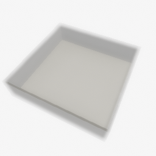
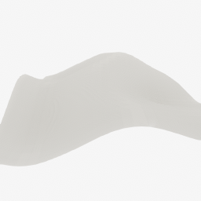
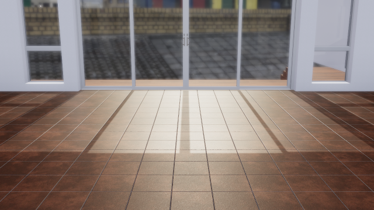

# Core concepts: Scenes

A **scene** is a static environment in a TDW simulation. It usually contains objects such as an empty room, outdoor terrain, etc. It might include additional objects such as trees, houses, etc., but these objects are also static (they can't be moved or adjusted). Scenes can contain [objects](objects.md), [avatars](avatars.md), and other non-static entities.

For most of the [TDW Command API](commands.md) to work, you must add a scene to the simulation. There can never be more than one scene in TDW; loading a new scene will discard the previous scene.

There are several ways to load a scene in TDW:

## Procedurally generate an indoor environment

Creating a procedurally-generated interior scene (often abbreviated to "proc-gen room") in TDW includes at least two steps:

1. Send the [`load_scene` command](https://github.com/threedworld-mit/tdw/blob/master/Documentation/api/command_api.md#load_scene).
2. Send the [`create_exterior_walls` command](https://github.com/threedworld-mit/tdw/blob/master/Documentation/api/command_api.md#create_exterior_walls).

These commands are relatively cumbersome to use, so TDW includes simple wrapper functions.

This controller:

```python
from tdw.controller import Controller
from tdw.tdw_utils import TDWUtils

c = Controller()
c.start()
c.communicate(TDWUtils.create_empty_room(12, 12))
```

...does the exact same thing as this controller:

```python
from tdw.controller import Controller

c = Controller()
c.communicate([{"$type": "load_scene",
                "scene_name": "ProcGenScene"},
               {'$type': 'create_exterior_walls', 
                'walls': [{'x': 0, 'y': 0}, {'x': 0, 'y': 1}, {'x': 0, 'y': 2}, {'x': 0, 'y': 3}, {'x': 0, 'y': 4}, {'x': 0, 'y': 5}, {'x': 0, 'y': 6}, {'x': 0, 'y': 7}, {'x': 0, 'y': 8}, {'x': 0, 'y': 9}, {'x': 0, 'y': 10}, {'x': 0, 'y': 11}, {'x': 1, 'y': 0}, {'x': 1, 'y': 11}, {'x': 2, 'y': 0}, {'x': 2, 'y': 11}, {'x': 3, 'y': 0}, {'x': 3, 'y': 11}, {'x': 4, 'y': 0}, {'x': 4, 'y': 11}, {'x': 5, 'y': 0}, {'x': 5, 'y': 11}, {'x': 6, 'y': 0}, {'x': 6, 'y': 11}, {'x': 7, 'y': 0}, {'x': 7, 'y': 11}, {'x': 8, 'y': 0}, {'x': 8, 'y': 11}, {'x': 9, 'y': 0}, {'x': 9, 'y': 11}, {'x': 10, 'y': 0}, {'x': 10, 'y': 11}, {'x': 11, 'y': 0}, {'x': 11, 'y': 1}, {'x': 11, 'y': 2}, {'x': 11, 'y': 3}, {'x': 11, 'y': 4}, {'x': 11, 'y': 5}, {'x': 11, 'y': 6}, {'x': 11, 'y': 7}, {'x': 11, 'y': 8}, {'x': 11, 'y': 9}, {'x': 11, 'y': 10}, {'x': 11, 'y': 11}]}])

```

...which will create this scene:



**Note: The scene won't be actually be visible.** The next tutorial page will cover how to add rendering to TDW.

## Create Perlin noise terrain

Send `perlin_noise_terrain` to generate a "terrain" mesh using Perlin noise. This controller:

```python
from tdw.controller import Controller

c = Controller()
c.start()
c.communicate({"$type": "perlin_noise_terrain",
               "size": {"x": 24, "y": 24},
               "subdivisions": 1,
               "turbulence": 1.75,
               "origin": {"x": 0.5, "y": 0.5},
               "texture_scale": {"x": 4, "y": 2},
               "dynamic_friction": 0.25,
               "static_friction": 0.4,
               "bounciness": 0.2,
               "max_y": 10})
```

...will create this scene:



## Create an empty scene

It's possible to create a totally empty scene with the [`create_empty_environment`](https://github.com/threedworld-mit/tdw/blob/master/Documentation/api/command_api.md#create_empty_environment) command. This is mainly for debugging TDW.

## Download and load a streamed scene

TDW includes many pre-generated photorealistic scenes. These scenes exist on a remote Amazon S3 server as ***asset bundles***, which are Unity3D-specific binary files that can be loaded into a Unity3D application (e.g. the TDW build) at runtime. To access a scene asset bundle, TDW downloads the scene into active memory (not to a local file).

Scene asset bundles can be quite large; expect downloads to require up to several minutes. When a scene is loaded into TDW, the previous scene (if any) is discarded from memory; if you want to use it again, TDW will need to re-download it.

To add a streamed scene to your simulation, send the [`add_scene` command](https://github.com/threedworld-mit/tdw/blob/master/Documentation/api/command_api.md#add_scene). Because this command's parameters can be difficult to use, TDW includes a helpful [`get_add_scene()` wrapper function](https://github.com/threedworld-mit/tdw/blob/master/Documentation/python/controller.md#get_add_sceneself-scene_name-str-library-str-----dict):

```python
from tdw.controller import Controller

c = Controller()
c.communicate(c.get_add_scene(scene_name="tdw_room"))
```

...does the exact same thing as this controller:

```python
from tdw.controller import Controller

c = Controller()
c.communicate({'$type': 'add_scene',
               'name': 'tdw_room',
               'url': 'https://tdw-public.s3.amazonaws.com/scenes/linux/2020.2/tdw_room'})
```

...which will create this scene:



## Scene metadata records and the `SceneLibrarian`

All asset bundles in TDW (including scenes) have associated metadata records. These records are stored in the `tdw` module as json files.

This is what the metadata for the scene `tdw_room` (the scene in the previous example) looks like:

```json
{'name': 'tdw_room', 
 'urls': {
     'Darwin': 'https://tdw-public.s3.amazonaws.com/scenes/osx/2020.2/tdw_room', 
     'Linux': 'https://tdw-public.s3.amazonaws.com/scenes/linux/2020.2/tdw_room',
     'Windows': 'https://tdw-public.s3.amazonaws.com/scenes/windows/2020.2/tdw_room'}, 
 'description': 'An interior space lit by sunlight from outside.', 
 'hdri': True, 
 'location': 'interior'}
```

TDW includes convenient wrapper classes for metadata records and collections of records. For scenes, records are stored in a [`SceneLibrarian`](../../python/librarian/scene_librarian.md#scenerecord-api). To access the record listed above:

```python
from tdw.librarian import SceneLibrarian

librarian = SceneLibrarian()
record = librarian.get_record("tdw_room")

# tdw_room
print(record.name)

# Prints the URL for your operating system. 
# For example, if you're using Linux, this will print record.urls["Linux"]
print(record.get_url()) 
```

Records are stored in a list: `librarian.records`. You can iterate through the list. This will print the names of each streamed scene in TDW:

```python
from tdw.librarian import SceneLibrarian

librarian = SceneLibrarian()
for record in librarian.records:
    print(record.name)
```

## Images of each scene

**TODO**

***

**Next: [Avatars and cameras](avatars.md)**

Python API:

- [`SceneLibrarian`](../../python/librarian/scene_librarian.md#scenerecord-api) (A collection of scene metadata records)
- [`Controller.get_add_scene(scene_name)`](../../python/tdw_utils.md)
- [`TDWUtils.create_empty_room(width, length)`](../../python/tdw_utils.md)

Command API:

- [`create_exterior_walls`](../../api/command_api.md#create_exterior_walls)
- [`create_empty_environment`](../../api/command_api.md#create_empty_environment)
- [`perlin_noise_terrain`](../../api/command_api.md#perlin_noise_terrain)
- [`add_scene`](../../api/command_api.md#add_scene)

[Return to the README](../../README.md)