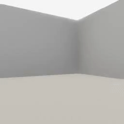

##### Embodied Avatars

# The `EmbodiedAvatar`

The [`EmbodiedAvatar`](../../python/add_ons/embodied_avatar.md) is an agent add-on for controlling an avatar of type `"A_Simple_Body"`. These avatars are physically embodied and can be one of several simple shapes.

## Add an embodied avatar to the scene

Adding an `EmbodiedAvatar` to the scene is very similar to adding a `ThirdPersonCamera`: simply define the avatar and append it to `c.add_ons`:

```python
from tdw.controller import Controller
from tdw.tdw_utils import TDWUtils
from tdw.add_ons.embodied_avatar import EmbodiedAvatar

c = Controller()
a = EmbodiedAvatar()
c.add_ons.append(a)
c.communicate(TDWUtils.create_empty_room(12, 12))
```

`EmbodiedAvatar` includes many optional parameters:

```python
from tdw.controller import Controller
from tdw.tdw_utils import TDWUtils
from tdw.add_ons.embodied_avatar import EmbodiedAvatar
from tdw.add_ons.avatar_body import AvatarBody

c = Controller()
a = EmbodiedAvatar(avatar_id="a",
                   body=AvatarBody.cube,
                   position={"x": 0, "y": 0, "z": 0},
                   rotation={"x": 0, "y": 30, "z": 0},
                   dynamic_friction=0.3,
                   static_friction=0.3,
                   bounciness=0.7,
                   mass=80,
                   color={"r": 1, "g": 0, "b": 0, "a": 0.9},
                   scale_factor={"x": 1, "y": 0.7, "z": 1},
                   field_of_view=70)
c.add_ons.append(a)
c.communicate(TDWUtils.create_empty_room(12, 12))
```

## Move an embodied avatar

You can move an embodied avatar by applying direction forces (`a.apply_force(force)`) and rotational torques (`a.apply_torque(torque)`).

The `EmbodiedAvatar` has *Rigidbody constraints*, a Unity concept. It can rotate around the yaw (y) axis but not other axes. In other words, the `EmbodiedAvatar` can't tip over and fall over.

To check if the avatar is moving, see `a.is_moving`.

In this example controller, we'll add an `EmbodiedAvatar` and a `ThirdPersonCamera` and enable image capture for both of them:

```python
from tdw.controller import Controller
from tdw.tdw_utils import TDWUtils
from tdw.add_ons.embodied_avatar import EmbodiedAvatar
from tdw.add_ons.third_person_camera import ThirdPersonCamera
from tdw.add_ons.image_capture import ImageCapture
from tdw.add_ons.avatar_body import AvatarBody
from tdw.backend.paths import EXAMPLE_CONTROLLER_OUTPUT_PATH

c = Controller()
embodied_avatar = EmbodiedAvatar(avatar_id="a",
                                 body=AvatarBody.capsule,
                                 position={"x": 1.5, "y": 0, "z": 0.3},
                                 rotation={"x": 0, "y": 30, "z": 0},
                                 color={"r": 0.6, "g": 0.3, "b": 0, "a": 1})
camera = ThirdPersonCamera(avatar_id="c",
                           position={"x": 0, "y": 9.4, "z": -4.4},
                           look_at={"x": 0, "y": 0.6, "z": 0})
path = EXAMPLE_CONTROLLER_OUTPUT_PATH.joinpath("embodied_avatar")
print(f"Images will be saved to: {path}")
capture = ImageCapture(avatar_ids=["a", "c"], path=path)
c.add_ons.extend([embodied_avatar, camera, capture])
c.communicate(TDWUtils.create_empty_room(12, 12))
embodied_avatar.apply_force(500)
embodied_avatar.apply_torque(-400)
while embodied_avatar.is_moving:
    c.communicate([])
c.communicate({"$type": "terminate"})
```

Result:

 

## Stop movement

Because embodied avatars exist within the context of the physics engine, they can't instantly stop movement. Setting a Rigidbody's velocity is 0 but over time will result in glitchy behavior. The correct way to stop an embodied avatar is to call `set_drag(drag, angular_drag)`. Setting high drag values will cause the avatar to slow down and eventually stop. Call `set_drag()` i.e with the default drag values before moving the avatar again.

This example controller adds a simple `move_by` function to move the avatar by a target distance:

```python
import numpy as np
from tdw.controller import Controller
from tdw.tdw_utils import TDWUtils
from tdw.add_ons.embodied_avatar import EmbodiedAvatar

class MoveBy(Controller):
    def __init__(self, port: int = 1071, check_version: bool = True, launch_build: bool = True):
        super().__init__(port=port, check_version=check_version, launch_build=launch_build)
        self.embodied_avatar: EmbodiedAvatar = EmbodiedAvatar()
        self.add_ons.append(self.embodied_avatar)

    def move_by(self, distance: float, force: float) -> float:
        p_0 = np.array(self.embodied_avatar.transform.position[:])
        self.embodied_avatar.apply_force(force)
        # Wait until the avatar has nearly finished moving.
        while self.embodied_avatar.is_moving and np.linalg.norm(self.embodied_avatar.transform.position - p_0) < distance - 0.015:
            c.communicate([])
        # Stop the avatar.
        self.embodied_avatar.set_drag(drag=80, angular_drag=100)
        while self.embodied_avatar.is_moving:
            c.communicate([])
        # Reset the drag.
        self.embodied_avatar.set_drag()
        # Return the distance traveled.
        return np.linalg.norm(self.embodied_avatar.transform.position - p_0)

    def run(self) -> None:
        # Create a scene. This will also add the embodied avatar.
        self.communicate(TDWUtils.create_empty_room(12, 12))
        for distance, force in zip([0.5, 1.5], [500, 500]):
            actual_distance = self.move_by(distance=distance, force=force)
            print("Target distance:", distance)
            print("Actual distance:", actual_distance)
        self.communicate({"$type": "terminate"})


if __name__ == "__main__":
    c = MoveBy()
    c.run()
```

Output:

```
Target distance: 0.5
Actual distance: 0.49749598813359763
Target distance: 1.5
Actual distance: 1.50103759765625
```

## Camera rotation

Rotate the camera via `embodied_avatar.rotate_camera(rotation)` or `embodied_avatar.look_at(target)`.

Reset camera rotation via `embodied_avatar.reset_camera()`.

***

**Next: [Obsolete embodied avatars](obsolete_embodied_avatars.md)**

[Return to the README](../../../README.md)

***

Example controllers:

- [embodied_avatar.py](https://github.com/threedworld-mit/tdw/blob/master/Python/example_controllers/embodied_avatars/embodied_avatar.py) Embodied avatar example.
- [move_by.py](https://github.com/threedworld-mit/tdw/blob/master/Python/example_controllers/embodied_avatars/move_by.py) Move an embodied avatar by a given distance.

Python API:

- [`EmbodiedAvatar`](../../python/add_ons/embodied_avatar.md)

