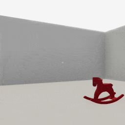

##### Keyboard and Mouse

# The `FirstPersonAvatar`

The [`FirstPersonAvatar`](../../python/add_ons/first_person_avatar.md) creates an [avatar](../core_concepts/avatars.md) with a simple physical embodiment that can be guided by keyboard and mouse user input.

This add-on is a subclass of [`Mouse`](mouse.md); it is not necessary to add a `Mouse` if you're adding a `FirstPersonCamera`. Likewise, it is not necessary to add a `ThirdPersonCamera`, which will just create a separate, static, third-person camera.

This is a minimal example of how to add a `FirstPersonAvatar` to the scene:

```python
from tdw.controller import Controller
from tdw.tdw_utils import TDWUtils
from tdw.add_ons.first_person_avatar import FirstPersonAvatar

"""
A minimal example of a first-person avatar.
"""

c = Controller()
a = FirstPersonAvatar()
c.add_ons.append(a)
c.communicate([TDWUtils.create_empty_room(12, 12),
               Controller.get_add_object(model_name="rh10",
                                         position={"x": 2, "y": 0, "z": 2},
                                         object_id=Controller.get_unique_id())])
done = False
while not done:
    c.communicate([])
    if a.mouse_is_over_object and a.left_button_pressed:
        print(a.mouse_over_object_id)
    if a.right_button_pressed:
        done = True
c.communicate({"$type": "terminate"})
```

Result:



Output:

```
12700384
```

## Mouse input

As a subclass of `Mouse`, `FirstPersonAvatar` has all of the fields that `Mouse` does. [Read this for more information.](mouse.md)

## Keyboard input

Move forward and backward with the W/S keys or up/down arrow keys. Move laterally with the A/D keys or left/right arrow keys.

## Avatar data

`first_person_avatar.transform` contains [`Transform`](../../python/object_data/transform.md) data for the avatar. For example, to get the current position of the avatar: `first_person_avatar.transform.position`.

## `FirstPersonAvatar` and avatars

`FirstPersonAvatar` *is* an avatar, just like `ThirdPersonCamera`. If you add an [`ImageCapture`](../../python/add_ons/image_capture.md), it will capture images from the camera of the `FirstPersonAvatar`. Other avatar commands likewise will work with the `FirstPersonCamera`,  though in practice you won't want to use most of them.

## Embodiment

`FirstPersonAvatar` uses a [CharacterController](https://docs.unity3d.com/ScriptReference/CharacterController.html) to give the avatar embodiment without adding colliders or a rigidbody. This means that collision handling is relatively limited but tends to glitch far less often than rigidbody collisions.

## Optional parameters

`FirstPersonAvatar` has many optional parameters in the constructor. [Read the API document for a complete description.](../../python/add_ons/first_person_avatar.md)

- `position` and `rotation` set the initial position and rotation of the avatar.
- `field_of_view` sets the camera field of view.
- `framerate` should almost always be set to 60; this affects the overall speed of the avatar.
- `reticule_size` sets the pixel size of the reticule at the center of the screen.
- All other parameters affect the size and speed of the avatar.

## Reset

Call `first_person_avatar.reset(position, rotation, field_of_view)` to reset the `FirstPersonAvatar` whenever you reset a scene.

## Low-level description

`FirstPersonAvatar` calls [`create_avatar`](../../api/command_api.md#create_avatar) to create an `A_First_Person` avatar. It sets the parameters of the first-person avatar via [`set_first_person_avatar`](../../api/command_api.md#set_first_person_avatar). It sets the position of the avatar via [`teleport_avatar_to`](../../api/command_api.md#teleport_avatar_to), the rotation via [`rotate_avatar_to_euler_angles`](../../api/command_api.md#rotate_avatar_to_euler_angles), and the field of view via [`set_field_of_view`](../../api/command_api.md#set_field_of_view). To ensure that this is the camera rendered on the screen, it sends [`set_render_order`](../../api/command_api.md#set_render_order). 

`FirstPersonAvatar` sends [`send_avatars`](../../api/command_api.md#send_avatars), [`send_mouse`](../../api/command_api.md#send_mouse), and [`send_mouse_raycast`](../../api/command_api.md#send_mouse_raycast) to receive [`AvatarKinematic`](../../api/output_data.md#AvatarKinematic), [`Mouse`](../../api/output_data.md#Mouse), and [`Raycast`](../../api/output_data.md#Raycast) output data. `AvatarKinematic` sets `self.transform`. `Mouse` and `Raycast` set [mouse-related fields](mouse.md).

***

**Next: [Keyboard input](keyboard.md)**

[Return to the README](../../../README.md)

***

Example controllers:

- [first_person_controls.py](https://github.com/threedworld-mit/tdw/blob/master/Python/example_controllers/keyboard_and_mouse/first_person_controls.py) Minimal `FirstPersonAvatar` example.

Python API:

- [`FirstPersonAvatar`](../../python/add_ons/first_person_avatar.md)
- [`Mouse`](../../python/add_ons/mouse.md)
- [`ThirdPersonCamera`](../../python/add_ons/third_person_camera.md)
- [`ImageCapture`](../../python/add_ons/image_capture.md)
- [`Transform`](../../python/object_data/transform.md) 

Command API:

- [`create_avatar`](../../api/command_api.md#create_avatar)
- [`set_first_person_avatar`](../../api/command_api.md#set_first_person_avatar)
- [`teleport_avatar_to`](../../api/command_api.md#teleport_avatar_to)
- [`rotate_avatar_to_euler_angles`](../../api/command_api.md#rotate_avatar_to_euler_angles)
- [`set_field_of_view`](../../api/command_api.md#set_field_of_view)
- [`set_render_order`](../../api/command_api.md#set_render_order)
- [`send_avatars`](../../api/command_api.md#send_avatars)
- [`send_mouse`](../../api/command_api.md#send_mouse)
- [`send_mouse_raycast`](../../api/command_api.md#send_mouse_raycast)

Output Data:

- [`AvatarKinematic`](../../api/output_data.md#AvatarKinematic)
- [`Mouse`](../../api/output_data.md#Mouse)
- [`Raycast`](../../api/output_data.md#Raycast)