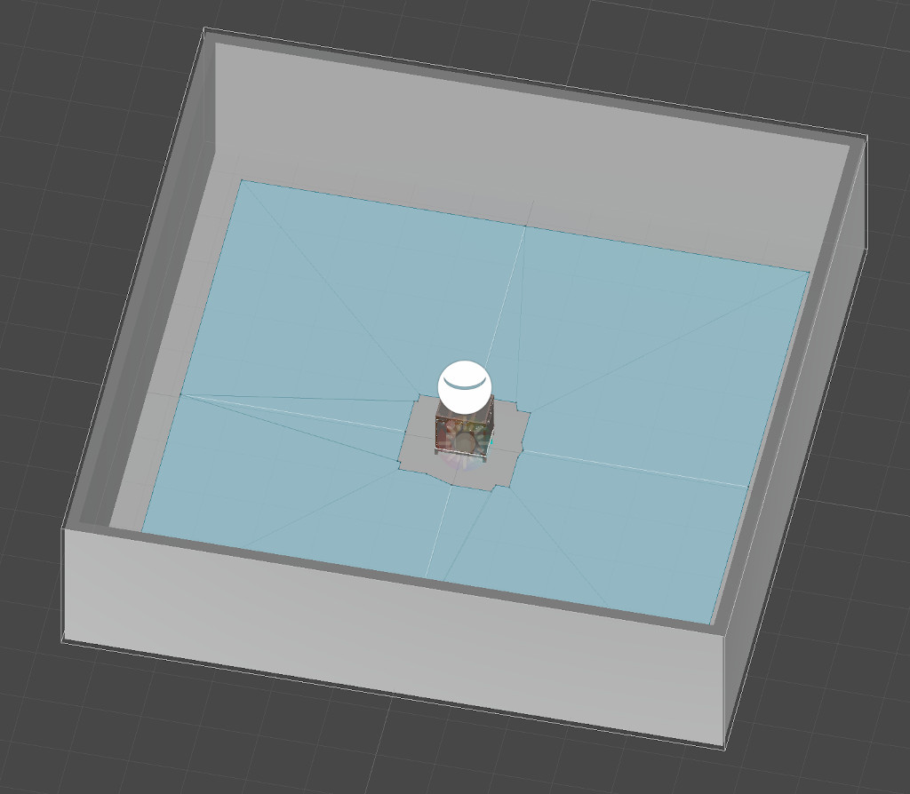
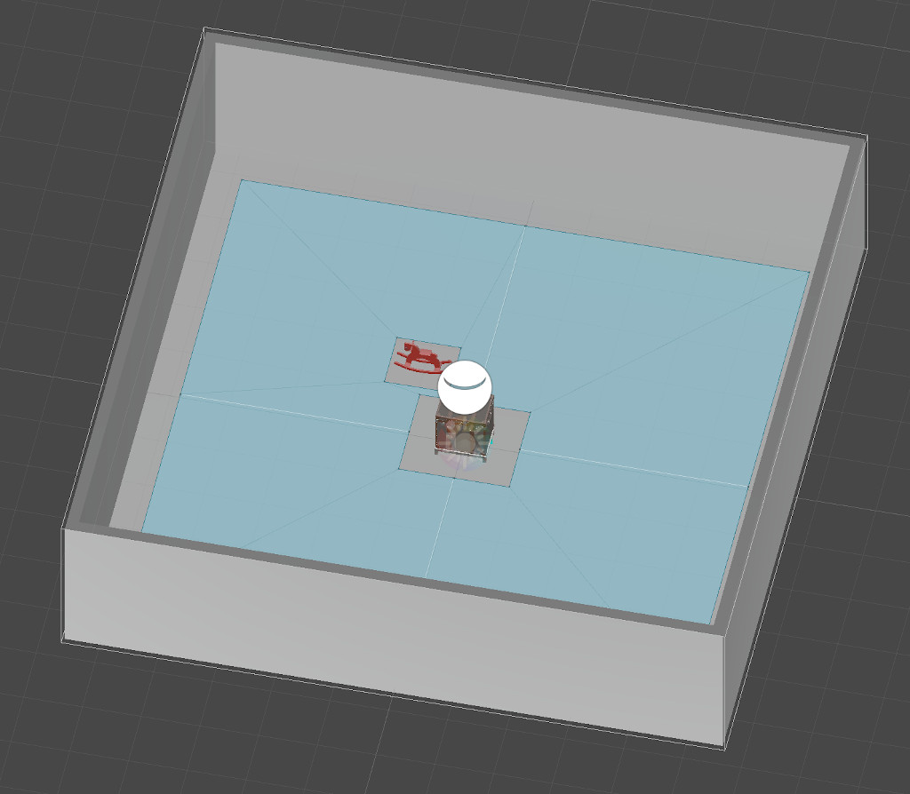
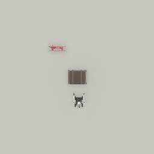

##### Navigation

# NavMesh pathfinding

A [NavMesh](https://docs.unity3d.com/Manual/nav-BuildingNavMesh.html) is a feature of the underlying Unity Engine that can generate basic pathfinding data for agents. In TDW, if a scene has a NavMesh you can receive path data, where a path is a list of (x, y, z) positions.

## Baking a NavMesh

A NavMesh is a static data object in a Unity scene. It must be *baked* in order to be used for navigation. It isn't possible to view the NavMesh in TDW; however, this is what it looks like in the Unity Editor (the software used to develop Unity projects):


If you are using a [streamed scene](../core_concepts/scenes.md), there is already a baked NavMesh. 

If you are using a [proc-gen room](../objects_and_scenes/proc_gen_room.md), you must bake the NavMesh by sending [`bake_nav_mesh`](../../api/command_api.md#bake_nav_mesh):

```python
from tdw.tdw_utils import TDWUtils
from tdw.controller import Controller

c = Controller()
c.communicate([TDWUtils.create_empty_room(12, 12),
               {"$type": "bake_nav_mesh"}])
```

Result:

 

## NavMesh obstacles

If there are objects in the scene, `bake_nav_mesh` will make them NavMesh obstacles:

```python
from tdw.tdw_utils import TDWUtils
from tdw.controller import Controller

c = Controller()
c.communicate([TDWUtils.create_empty_room(12, 12),
               c.get_add_object(model_name="trunck",
                                object_id=0,
                                position={"x": 0, "y": 0, "z": 0}),
               {"$type": "bake_nav_mesh"}])
```

Result:



If you add objects *after* baking the NavMesh, they will be ignored. This can allow you to manually set NavMesh obstacles by sending [`make_nav_mesh_obstacle`](../../api/command_api.md#make_nav_mesh_obstacle). For example, you might want some objects to carve wider areas than others.

```python
from tdw.tdw_utils import TDWUtils
from tdw.controller import Controller

c = Controller()
c.communicate([TDWUtils.create_empty_room(12, 12),
               {"$type": "bake_nav_mesh"},
               c.get_add_object(model_name="trunck",
                                object_id=0,
                                position={"x": 0, "y": 0, "z": 0}),
               {"$type": "make_nav_mesh_obstacle",
                "id": 0,
                "carve_type": "stationary",
                "scale": 1,
                "shape": "box"},
               c.get_add_object(model_name="rh10",
                                object_id=1,
                                position={"x": -1, "y": 0, "z": 1.5}),
               {"$type": "make_nav_mesh_obstacle",
                "id": 1,
                "carve_type": "all",
                "scale": 1,
                "shape": "box"}])
```

Result:



## `NavMeshPath` output data

After initializing the NavMesh and the NavMesh obstacles, you can request [`NavMeshPath`](../../api/output_data.md#NavMeshPath) output data by sending [`send_nav_mesh_path`](../../api/command_api.md#send_nav_mesh_path). `NavMeshPath` includes a path (a numpy array of `[x, y, z]` coordinates) and a state (complete, partial, or invalid).

In this example, we'll create a scene with a NavMesh and find a path between two points:

```python
from tdw.tdw_utils import TDWUtils
from tdw.controller import Controller
from tdw.output_data import OutputData, NavMeshPath

c = Controller()
resp = c.communicate([TDWUtils.create_empty_room(12, 12),
                      {"$type": "bake_nav_mesh"},
                      c.get_add_object(model_name="trunck",
                                       object_id=0,
                                       position={"x": 0, "y": 0, "z": 0}),
                      {"$type": "make_nav_mesh_obstacle",
                       "id": 0,
                       "carve_type": "stationary",
                       "scale": 1,
                       "shape": "box"},
                      c.get_add_object(model_name="rh10",
                                       object_id=1,
                                       position={"x": -1, "y": 0, "z": 1.5}),
                      {"$type": "make_nav_mesh_obstacle",
                       "id": 1,
                       "carve_type": "all",
                       "scale": 1,
                       "shape": "box"},
                      {"$type": "send_nav_mesh_path",
                       "origin": {"x": 0.1, "y": 0, "z": -1.3},
                       "destination": {"x": -0.13, "y": 0, "z": 4}}])
for i in range(len(resp) - 1):
    r_id = OutputData.get_data_type_id(resp[i])
    if r_id == "path":
        nav_mesh_path = NavMeshPath(resp[i])
        print(nav_mesh_path.get_state())
        for point in nav_mesh_path.get_path():
            print(point)
c.communicate({"$type": "terminate"})
```

Output:

```
complete
[ 0.1         0.08333325 -1.3       ]
[-0.9404912   0.08333325 -0.844499  ]
[-0.9404912   0.08333325  0.83449864]
[-0.13        0.08333325  4.        ]
```

An agent can then use this data to pathfind. In this example, we'll use a [Magnebot](https://github.com/alters-mit/magnebot) agent:

```python
from tdw.tdw_utils import TDWUtils
from tdw.controller import Controller
from tdw.output_data import OutputData, NavMeshPath
from tdw.add_ons.third_person_camera import ThirdPersonCamera
from tdw.add_ons.image_capture import ImageCapture
from tdw.backend.paths import EXAMPLE_CONTROLLER_OUTPUT_PATH
from magnebot import Magnebot, ActionStatus

c = Controller()
magnebot = Magnebot(position={"x": 0.1, "y": 0, "z": -1.3},
                    robot_id=c.get_unique_id())
magnebot.collision_detection.objects = False
camera = ThirdPersonCamera(position={"x": 0, "y": 8, "z": 0},
                           look_at={"x": 0, "y": 0, "z": 0},
                           avatar_id="c")
path = EXAMPLE_CONTROLLER_OUTPUT_PATH.joinpath("nav_mesh")
print(f"Images will be saved to: {path}")
capture = ImageCapture(avatar_ids=["c"], path=path)
c.add_ons.extend([magnebot, camera, capture])
resp = c.communicate([TDWUtils.create_empty_room(12, 12),
                      {"$type": "bake_nav_mesh"},
                      c.get_add_object(model_name="trunck",
                                       object_id=0,
                                       position={"x": 0, "y": 0, "z": 0}),
                      {"$type": "make_nav_mesh_obstacle",
                       "id": 0,
                       "carve_type": "stationary",
                       "scale": 1,
                       "shape": "box"},
                      c.get_add_object(model_name="rh10",
                                       object_id=1,
                                       position={"x": -1, "y": 0, "z": 1.5}),
                      {"$type": "make_nav_mesh_obstacle",
                       "id": 1,
                       "carve_type": "all",
                       "scale": 1,
                       "shape": "box"},
                      {"$type": "send_nav_mesh_path",
                       "origin": {"x": 0.1, "y": 0, "z": -1.3},
                       "destination": {"x": -2, "y": 0, "z": 4}}])
path = []
for i in range(len(resp) - 1):
    r_id = OutputData.get_data_type_id(resp[i])
    if r_id == "path":
        nav_mesh_path = NavMeshPath(resp[i])
        path = nav_mesh_path.get_path()
        break
for point in path[1:]:
    p = TDWUtils.array_to_vector3(point)
    p["y"] = 0
    magnebot.move_to(target=p)
    while magnebot.action.status == ActionStatus.ongoing:
        c.communicate([])
    c.communicate([])
c.communicate({"$type": "terminate"})
```

Result:



***

**Next: [Occupancy maps](occupancy_maps.md)**

[Return to the README](../../../README.md)

***

External APIs:

- [Magnebot](https://github.com/alters-mit/magnebot)

Example controllers:

- [nav_mesh.py](https://github.com/threedworld-mit/tdw/blob/master/Python/example_controllers/navigation/nav_mesh.py) Add a Magnebot to the scene and navigate using a NavMesh.

Command API:

- [`bake_nav_mesh`](../../api/command_api.md#bake_nav_mesh)
- [`make_nav_mesh_obstacle`](../../api/command_api.md#make_nav_mesh_obstacle)
- [`send_nav_mesh`](../../api/command_api.md#send_nav_mesh)

Output Data:

- [`NavMeshPath`](../../api/output_data.md#NavMeshPath)
