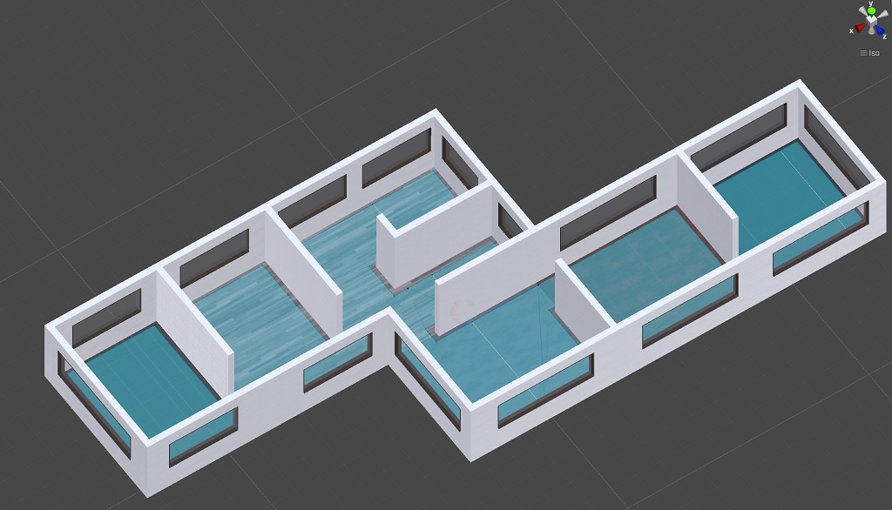

##### Navigation

# NavMesh pathfinding

A [NavMesh](https://docs.unity3d.com/Manual/nav-BuildingNavMesh.html) is a feature of the underlying Unity Engine that can generate basic pathfinding data for agents. In TDW, if a scene has a NavMesh you can receive path data, where a path is a list of (x, y, z) positions.

A NavMesh is a static data object in a Unity scene. It must be *baked* in order to be used for navigation. It isn't possible to view the NavMesh in TDW; however, this is what it looks like in the Unity Editor (the software used to develop Unity projects):



TDW objects can optionally receive a NavMeshObstacle Unity component. If added, they will carve a hole in the NavMesh:


## The `NavMesh` add-on

The [`NavMesh`](../../python/add_ons/nav_mesh.md) add-on simplifies the process of baking a NavMesh and adding NavMeshObstacles:

```python
from tdw.tdw_utils import TDWUtils
from tdw.controller import Controller
from tdw.add_ons.nav_mesh import NavMesh

c = Controller()
c.add_ons.append(NavMesh())
c.communicate([TDWUtils.create_empty_room(12, 12)])
c.communicate([])
```

Result:

 

**Notice that the `NavMesh` add-on requires *two* communicate() calls to initialize:**

1. In the first communicate() call, the `NavMesh` add-on requests output data: [`StaticRigidbodies`](../../api/output_data.md#StaticRigidbodies) to determine which objects are kinematic, [`Bounds`](../../api/output_data.md#Bounds) to get the size and position of each object, and [`StaticRobot`](../../api/output_data.md#StaticRobot) to get robot IDs (robots are ignored when baking the NavMesh).
2. In the second communicate() call, the `NavMesh` add-on parses the output data. Depending on the size  and position of each object, the add-on makes the object a NavMeshObstacle via [`make_nav_mesh_obstacle`](../../api/command_api.md#make_nav_mesh_obstacle) and then bakes the NavMesh via [`bake_nav_mesh`](../../api/command_api.md#bake_nav_mesh).

In this example, two objects carve holes in the NavMesh:

```python
from tdw.tdw_utils import TDWUtils
from tdw.controller import Controller
from tdw.add_ons.nav_mesh import NavMesh

c = Controller()
c.add_ons.append(NavMesh())
c.communicate([TDWUtils.create_empty_room(12, 12),
               c.get_add_object(model_name="trunck",
                                object_id=0,
                                position={"x": 0, "y": 0, "z": 0}),
               c.get_add_object(model_name="rh10",
                                object_id=1,
                                position={"x": -1, "y": 0, "z": 1.5})])
c.communicate([])
```

Result:


## NavMesh obstacles

In the above example, the two objects have NavMeshObstacle components. The `NavMesh` add-on includes many optional constructor parameters that will help you adjust which objects receive NavMeshObstacle components, the size of each NavMeshObstacle, etc. For example, `exclude_objects` is an optional list of object IDs for objects if you want certain objects to not be NavMeshObstacles.

[Read the API documentation for a full list of optional constructor parameters.](../../python/add_ons/nav_mesh.md)

## `NavMeshPath` output data

After initializing the `NavMesh` add-on, you can request [`NavMeshPath`](../../api/output_data.md#NavMeshPath) output data by sending [`send_nav_mesh_path`](../../api/command_api.md#send_nav_mesh_path). `NavMeshPath` includes a path (a numpy array of `[x, y, z]` coordinates) and a state (complete, partial, or invalid).

In this example, we'll create a scene with a NavMesh and find a path between two points. Notice that we send `send_nav_mesh_path` *after* the scene is created because the `NavMesh` add-on requires two communicate() calls to initialize.

```python
from tdw.tdw_utils import TDWUtils
from tdw.controller import Controller
from tdw.output_data import OutputData, NavMeshPath
from tdw.add_ons.nav_mesh import NavMesh

c = Controller()
c.add_ons.append(NavMesh())
c.communicate([TDWUtils.create_empty_room(12, 12),
               c.get_add_object(model_name="trunck",
                                object_id=0,
                                position={"x": 0, "y": 0, "z": 0}),
               c.get_add_object(model_name="rh10",
                                object_id=1,
                                position={"x": -1, "y": 0, "z": 1.5})])
resp = c.communicate({"$type": "send_nav_mesh_path",
                       "origin": {"x": 0.1, "y": 0, "z": -1.3},
                       "destination": {"x": -0.13, "y": 0, "z": 4}})
for i in range(len(resp) - 1):
    r_id = OutputData.get_data_type_id(resp[i])
    if r_id == "path":
        nav_mesh_path = NavMeshPath(resp[i])
        print(nav_mesh_path.get_state())
        for point in nav_mesh_path.get_path():
            print(point)
c.communicate({"$type": "terminate"})
```

Output:

```
complete
[ 0.1         0.08333325 -1.3       ]
[-0.9404912   0.08333325 -0.844499  ]
[-0.9404912   0.08333325  0.83449864]
[-0.13        0.08333325  4.        ]
```

An agent can then use this data to pathfind. In this example, we'll use a [Magnebot](https://github.com/alters-mit/magnebot) agent:

```python
from tdw.tdw_utils import TDWUtils
from tdw.controller import Controller
from tdw.output_data import OutputData, NavMeshPath
from tdw.add_ons.third_person_camera import ThirdPersonCamera
from tdw.add_ons.image_capture import ImageCapture
from tdw.add_ons.nav_mesh import NavMesh
from tdw.backend.paths import EXAMPLE_CONTROLLER_OUTPUT_PATH
from magnebot import Magnebot, ActionStatus

c = Controller()
magnebot = Magnebot(position={"x": 0.1, "y": 0, "z": -1.3},
                    robot_id=c.get_unique_id())
magnebot.collision_detection.objects = False
camera = ThirdPersonCamera(position={"x": 0, "y": 8, "z": 0},
                           look_at={"x": 0, "y": 0, "z": 0},
                           avatar_id="c")
path = EXAMPLE_CONTROLLER_OUTPUT_PATH.joinpath("nav_mesh")
print(f"Images will be saved to: {path}")
capture = ImageCapture(avatar_ids=["c"], path=path)
nav_mesh = NavMesh(exclude_objects=[magnebot.robot_id])
c.add_ons.extend([magnebot, camera, capture, nav_mesh])
# Create the scene and add an object. This will also tell the NavMesh add-on to request the output data it needs.
c.communicate([TDWUtils.create_empty_room(12, 12),
               c.get_add_object(model_name="trunck",
                                object_id=0,
                                position={"x": 0, "y": 0, "z": 0}),
               c.get_add_object(model_name="rh10",
                                object_id=1,
                                position={"x": -1, "y": 0, "z": 1.5})])
# Add NavMeshObstacles, bake the NavMesh, and request a path.
resp = c.communicate({"$type": "send_nav_mesh_path",
                      "origin": {"x": 0.1, "y": 0, "z": -1.3},
                      "destination": {"x": -2, "y": 0, "z": 4}})
path = []
for i in range(len(resp) - 1):
    r_id = OutputData.get_data_type_id(resp[i])
    if r_id == "path":
        nav_mesh_path = NavMeshPath(resp[i])
        path = nav_mesh_path.get_path()
        break
for point in path[1:]:
    p = TDWUtils.array_to_vector3(point)
    p["y"] = 0
    magnebot.move_to(target=p)
    while magnebot.action.status == ActionStatus.ongoing:
        c.communicate([])
    c.communicate([])
c.communicate({"$type": "terminate"})
```

Result:


***

**Next: [Occupancy maps](occupancy_maps.md)**

[Return to the README](../../../README.md)

***

External APIs:

- [Magnebot](https://github.com/alters-mit/magnebot)

Example controllers:

- [nav_mesh.py](https://github.com/threedworld-mit/tdw/blob/master/Python/example_controllers/navigation/nav_mesh.py) Add a Magnebot to the scene and navigate using a NavMesh.

Python API:

- [`NavMesh`](../../python/add_ons/nav_mesh.md) The NavMesh add-on.

Command API:

- [`bake_nav_mesh`](../../api/command_api.md#bake_nav_mesh)
- [`make_nav_mesh_obstacle`](../../api/command_api.md#make_nav_mesh_obstacle)
- [`send_nav_mesh`](../../api/command_api.md#send_nav_mesh)

Output Data:

- [`NavMeshPath`](../../api/output_data.md#NavMeshPath)
- [`StaticRigidbodies`](../../api/output_data.md#StaticRigidbodies) 
- [`Bounds`](../../api/output_data.md#Bounds) 
- [`StaticRobot`](../../api/output_data.md#StaticRobot)
