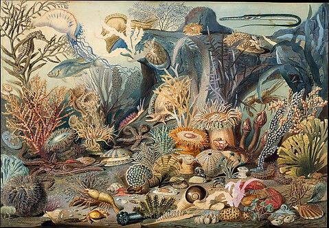
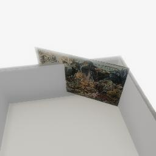

##### Non-physics objects

# Textured quads

**Textured quads** are simple rectangular objects that exist in 3D space and be set to any given [texture](../objects_and_scenes/materials_textures_colors.md). These 3D "quads" can be positioned and set to an image located on your computer. 

Textured quads can be used to visualize areas in a scene, add paintings to walls, increase overall scene variability, and so on.

To add a textured quad to the scene, we must first load the source image. We will use this image:



We'll load it like any other binary file in Python. To send it to TDW, the bytes need to be converted to a base 64 string:

```python
from base64 import b64encode

input_image_path = "DT4897.jpg"
# Open the image and encode it to base 64.
with open(input_image_path, "rb") as f:
    image = b64encode(f.read()).decode("utf-8")
```

We will also need the pixel size of the image. For that, we'll load the image into PIL:

```python
from PIL.Image import Image
from base64 import b64encode

input_image_path = "DT4897.jpg"
# Open the image and encode it to base 64.
with open(input_image_path, "rb") as f:
    image = b64encode(f.read()).decode("utf-8")
# Get the image size.
size = Image.open(input_image_path).size
```

Then we'll add and set a textured quad.

- [`create_textured_quad`](../../api/command_api.md#create_textured_quad) creates an *empty* quad (without a texture).
- [`set_texture_quad`](../../api/command_api.md#set_texture_quad) sets the texture of the quad. You can send this more than once for the same quad. Note that we need to send the base 64 string of the image, not the image bytes.

```python
from base64 import b64encode
from PIL import Image
from tdw.controller import Controller
from tdw.tdw_utils import TDWUtils
from tdw.add_ons.third_person_camera import ThirdPersonCamera
from tdw.add_ons.image_capture import ImageCapture
from tdw.backend.paths import EXAMPLE_CONTROLLER_OUTPUT_PATH

"""
Add a textured quad to the scene.
"""

input_image_path = "DT4897.jpg"
# Open the image and encode it to base 64.
with open(input_image_path, "rb") as f:
    image = b64encode(f.read()).decode("utf-8")
# Get the image size.
size = Image.open(input_image_path).size
quad_position = {"x": 1, "y": 2, "z": 3}
# Add a camera and enable image capture.
camera = ThirdPersonCamera(avatar_id="a",
                           position={"x": 0, "y": 8, "z": -3},
                           look_at=quad_position)
path = EXAMPLE_CONTROLLER_OUTPUT_PATH.joinpath("textured_quad")
print(f"Images will be saved to: {path}")
capture = ImageCapture(avatar_ids=["a"], path=path)
# Start the controller.
c = Controller()
c.add_ons.extend([camera, capture])
quad_id = c.get_unique_id()
c.communicate([TDWUtils.create_empty_room(8, 8),
               {"$type": "create_textured_quad",
                "position": quad_position,
                "size": {"x": 5, "y": 3},
                "euler_angles": {"x": 0, "y": 30, "z": 0},
                "id": quad_id},
               {"$type": "set_textured_quad",
                "id": quad_id,
                "dimensions": {"x": size[0], "y": size[1]},
                "image": image}])
c.communicate({"$type": "terminate"})
```

Result:



## Other textured quad commands

| Command                                                      | Description                                                  |
| ------------------------------------------------------------ | ------------------------------------------------------------ |
| [`destroy_textured_quad`](../../api/command_api.md#destroy_textured_quad) | Destroy a textured quad.                                     |
| [`rotate_textured_quad_by`](../../api/command_api.md#rotate_textured_quad_by) | Rotate a textured quad by an angle in degrees around an axis. |
| [`scale_textured_quad`](../../api/command_api.md#scale_textured_quad) | Scale a textured quad by a factor.                           |
| [`show_textured_quad`](../../api/command_api.md#show_textured_quad) | Show or hide a textured quad.                                |
| [`teleport_textured_quad`](../../api/command_api.md#teleport_textured_quad) | Set the position of a textured quad.                         |
| [`rotate_textured_quad_to`](../../api/command_api.md#rotate_textured_quad_to) | Set the rotation of a textured quad.                         |
| [`parent_textured_quad_to_object`](../../api/command_api.md#parent_textured_quad_to_object) | Parent a textured quad to an object in the scene. The textured quad will always be at a fixed local position and rotation relative to the object. |
| [`unparent_textured_quad`](../../api/command_api.md#unparent_textured_quad) | Unparent a textured quad from an object.                     |

## Command API and output data

Textured quad commands aren't [TDW objects](../core_concepts/objects.md). None of the object commands such as `teleport_object` or `rotate_object_by` will work with textured quads. Only the textured quad commands, listed above, will work with textured quads.

Likewise, textured quads won't appear in any output data except in the `_img` pass of `Images`.

***

**Next: [User Interface (the `UI` add-on)](ui.md)**

[Return to the README](../../../README.md)

***

Example controllers:

- [textured_quad.py](https://github.com/threedworld-mit/tdw/blob/master/Python/example_controllers/non_physics/textured_quad.py)  Add a textured quad to the scene.

Command API:

- [`create_textured_quad`](../../api/command_api.md#create_textured_quad)
- [`set_texture_quad`](../../api/command_api.md#set_texture_quad)
- [`destroy_textured_quad`](../../api/command_api.md#destroy_textured_quad)
- [`rotate_textured_quad_by`](../../api/command_api.md#rotate_textured_quad_by)
- [`scale_textured_quad`](../../api/command_api.md#scale_textured_quad)
- [`show_textured_quad`](../../api/command_api.md#show_textured_quad)
- [`teleport_textured_quad`](../../api/command_api.md#teleport_textured_quad)
- [`rotate_textured_quad_to`](../../api/command_api.md#rotate_textured_quad_to)
- [`parent_textured_quad_to_object`](../../api/command_api.md#parent_textured_quad_to_object)
- [`unparent_textured_quad`](../../api/command_api.md#unparent_textured_quad)