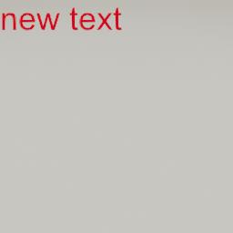
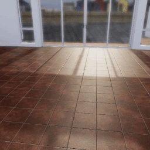

##### Non-physics objects

# User Interface (the `UI` add-on)

TDW includes an API for setting up a basic user interface (UI). Unlike [textured quads](textured_quads.md), UI elements will appear on the screen, look at the camera, and move when the camera moves. UI elements are positioned using screen-space parameters rather than worldspace coordinates.

The easiest way to set UI in TDW is via the [`UI`](../../python/add_ons/ui.md) add-on:

```python
from tdw.controller import Controller
from tdw.tdw_utils import TDWUtils
from tdw.add_ons.third_person_camera import ThirdPersonCamera
from tdw.add_ons.image_capture import ImageCapture
from tdw.add_ons.ui import UI
from tdw.backend.paths import EXAMPLE_CONTROLLER_OUTPUT_PATH

c = Controller()
camera = ThirdPersonCamera(avatar_id="a",
                           position={"x": 1, "y": 2.5, "z": 0},
                           look_at={"x": 0, "y": 0, "z": 0})
path = EXAMPLE_CONTROLLER_OUTPUT_PATH.joinpath("ui")
print(f"Images will be saved to: {path}")
capture = ImageCapture(path=path, avatar_ids=["a"])
ui = UI()
c.add_ons.extend([camera, capture, ui])
c.communicate(TDWUtils.create_empty_room(12, 12))
ui.attach_canvas_to_avatar(avatar_id="a")
ui.add_text(text="hello world",
            position={"x": 0, "y": 0},
            font_size=36)
c.communicate({"$type": "terminate"})

```

Result:


## Limitations

TDW's UI API is deliberately limited. Unity has a powerful UI API, but it is notoriously difficult to use. TDW's implementation of the Unity UI API has only as subset of the full functionality; it is not designed for a good-looking video game-like interface, and more for displaying rudimentary metrics or messages. There is also no user input such as button presses, although this may be implemented in the future.

## Canvases, avatars, and VR rigs

In Unity, UI elements ("RectTransforms") must be attached to a **canvas**. There can be more than one canvas in the scene.

In TDW, the `UI` add on has an optional `canvas_id` in its constructor (default value is 0). When the add-on initializes, it automatically sends [`add_ui_canvas`](../../api/command_api.md#add_ui_canvas). The `UI` add-on will then automatically append its canvas ID to all subsequent commands.

To add multiple canvases to the scene, simply add multiple `UI` add-ons:

```python
from tdw.add_ons.ui import UI
from tdw.controller import Controller

ui_0 = UI(canvas_id=0)
ui_1 = UI(canvas_id=1)
c = Controller()
c.add_ons.extend([ui_0, ui_1])
```

In practice, the only reason to add multiple UI canvases is if there are multiple [avatars](../core_concepts/avatars.md) in the scene.

By default, a canvas is in "overlay" mode. It is rendered separately from TDW's camera passes. In order for the canvas to actually appear in [image output data](../core_concepts/images.md) it must be "attached" to an avatar. To do this, create an avatar (i.e. `ThirdPersonCamera`) and then call `ui.attach_canvas_to_avatar(avatar_id)`. This function automatically sends [`attach_ui_canvas_to_avatar`](../../api/command_api.md#attach_ui_canvas_to_avatar).

`ui.attach_canvas_to_avatar()` also has an additional optional parameter `focus_distance`. This should be set to the default (2.5) or higher, otherwise the UI will look blurry.

For [VR rigs](../vr/overview.md), call `ui.attach_canvas_to_vr_rig()` instead of `ui.attach_canvas_to_avatar()`.

## Anchors, pivots, and positions

UI elements are positioned using *local screen space positions*, parameterized as Vector2 objects, e.g. `{"x": 0, "y": 0}`. `"x"` is the horizontal value, and `"y"` is the vertical value.

Positions can reflect the "true" screen position but it is often convenient to apply offsets using *anchors* and *pivots*.

An *anchor* is position offset factor Vector2 where each value is between 0 and 1. By default, the anchor of all UI elements is `{"x": 0.5, "y": 0.5}`, meaning that there is no offset; position `{"x": 0, "y": 0}` is in the center of the screen. But, if the anchor is `{"x": 0, "y": 1}`, then position `{"x": 0, "y": 0}` is actually the top-left corner of the screen.

A *pivot* is the UI element's pivot point as a Vector2 factor where each value is between 0 and 1. By default, the pivot of all UI elements is `{"x": 0.5, "y": 0.5}` meaning that the pivot is in the center of the object.

You can set the anchor, pivot, and position of a UI element to easily snap it to sides or corners of the screen without actually knowing the dimensions of the screen.

In this example, we'll add text to the top-left corner of the screen. Note that in both this example and the previous "hello world" world example, `position={"x": 0, "y": 0}` but we've adjusted the anchor and pivot such that the top-left corner of the text will be moved to the top-left corner of the screen.

```python
from tdw.controller import Controller
from tdw.tdw_utils import TDWUtils
from tdw.add_ons.third_person_camera import ThirdPersonCamera
from tdw.add_ons.image_capture import ImageCapture
from tdw.add_ons.ui import UI
from tdw.backend.paths import EXAMPLE_CONTROLLER_OUTPUT_PATH

c = Controller()
camera = ThirdPersonCamera(avatar_id="a",
                           position={"x": 1, "y": 2.5, "z": 0},
                           look_at={"x": 0, "y": 0, "z": 0})
path = EXAMPLE_CONTROLLER_OUTPUT_PATH.joinpath("anchors_and_pivots")
print(f"Images will be saved to: {path}")
capture = ImageCapture(path=path, avatar_ids=["a"])
ui = UI()
c.add_ons.extend([camera, capture, ui])
c.communicate(TDWUtils.create_empty_room(12, 12))
ui.attach_canvas_to_avatar(avatar_id="a")
ui.add_text(text="hello world",
            position={"x": 0, "y": 0},
            anchor={"x": 0, "y": 1},
            pivot={"x": 0, "y": 1},
            font_size=36)
c.communicate({"$type": "terminate"})
```


## Text

Add text to the screen via `ui.add_text(text)`, which sends [`add_ui_text`](../../api/command_api.md#add_ui_text). See above for some minimal examples. 

Set the color of the text with the optional `color` parameter:

```python
from tdw.controller import Controller
from tdw.tdw_utils import TDWUtils
from tdw.add_ons.third_person_camera import ThirdPersonCamera
from tdw.add_ons.image_capture import ImageCapture
from tdw.add_ons.ui import UI
from tdw.backend.paths import EXAMPLE_CONTROLLER_OUTPUT_PATH

c = Controller()
camera = ThirdPersonCamera(avatar_id="a",
                           position={"x": 1, "y": 2.5, "z": 0},
                           look_at={"x": 0, "y": 0, "z": 0})
path = EXAMPLE_CONTROLLER_OUTPUT_PATH.joinpath("text_color")
print(f"Images will be saved to: {path}")
capture = ImageCapture(path=path, avatar_ids=["a"])
ui = UI()
c.add_ons.extend([camera, capture, ui])
c.communicate(TDWUtils.create_empty_room(12, 12))
ui.attach_canvas_to_avatar(avatar_id="a")
ui.add_text(text="hello world",
            position={"x": 0, "y": 0},
            anchor={"x": 0, "y": 1},
            pivot={"x": 0, "y": 1},
            font_size=36,
            color={"r": 1, "g": 0, "b": 0, "a": 1})
c.communicate({"$type": "terminate"})
```

Result:


`ui.add_text()` returns the ID of the UI text element.

Dynamically set the text of an existing UI element by calling `ui.set_text(ui_id, text)`:

```python
from tdw.controller import Controller
from tdw.tdw_utils import TDWUtils
from tdw.add_ons.third_person_camera import ThirdPersonCamera
from tdw.add_ons.image_capture import ImageCapture
from tdw.add_ons.ui import UI
from tdw.backend.paths import EXAMPLE_CONTROLLER_OUTPUT_PATH

c = Controller(launch_build=False)
camera = ThirdPersonCamera(avatar_id="a",
                           position={"x": 1, "y": 2.5, "z": 0},
                           look_at={"x": 0, "y": 0, "z": 0})
path = EXAMPLE_CONTROLLER_OUTPUT_PATH.joinpath("set_text")
print(f"Images will be saved to: {path}")
capture = ImageCapture(path=path, avatar_ids=["a"])
ui = UI()
c.add_ons.extend([camera, capture, ui])
c.communicate(TDWUtils.create_empty_room(12, 12))
ui.attach_canvas_to_avatar(avatar_id="a")
ui_id = ui.add_text(text="hello world",
                    position={"x": 0, "y": 0},
                    anchor={"x": 0, "y": 1},
                    pivot={"x": 0, "y": 1},
                    font_size=36,
                    color={"r": 1, "g": 0, "b": 0, "a": 1})
c.communicate([])
ui.set_text(ui_id=ui_id, text="new text")
c.communicate({"$type": "terminate"})
```

Result:

 

## Images

Add UI images via `ui.add_image(image, position, size)`, which sends [`add_ui_image`](../../api/command_api.md#add_ui_image). 

Mandatory parameters:

- The `image` parameter can be a string (a filepath), a `Path` object (a filepath), or bytes (the image byte data).
- The `position` parameter is the position of the image; see above for how to set this.
- The `size` parameter is the actual pixel size of the images as a Vector2.

Optional parameters:

- The `rgba` parameter tells the build whether to expect RGBA data or RGB data.
- The `scale_factor` parameter can be set to resize the image.
- See above for how `anchor` and `pivot` work.
- `color` is the same as in text; an RGBA dictionary with values ranging from 0 to 1. `color` will tint an image; by default, it is white (no tint).

You can dynamically resize an image (or text, though it's less useful) via `ui.set_size(ui_id, size)`, which sends [`set_ui_element_size`](../../api/command_api.md#set_ui_element_size).

This example combines images and text to create a progress bar:

```python
from tdw.controller import Controller
from tdw.add_ons.third_person_camera import ThirdPersonCamera
from tdw.add_ons.image_capture import ImageCapture
from tdw.add_ons.ui import UI
from tdw.backend.paths import EXAMPLE_CONTROLLER_OUTPUT_PATH

c = Controller()
c.communicate({"$type": "set_target_framerate",
               "framerate": 30})
camera = ThirdPersonCamera(position={"x": -3.75, "y": 1.5, "z": -0.5},
                           look_at={"x": 0, "y": 0, "z": 0},
                           avatar_id="a")
ui = UI()
path = EXAMPLE_CONTROLLER_OUTPUT_PATH.joinpath("progress_bar")
print(f"Images will be saved to: {path}")
capture = ImageCapture(path=path, avatar_ids=["a"])
c.add_ons.extend([camera, capture, ui])
c.communicate(Controller.get_add_scene(scene_name="tdw_room"))
ui.attach_canvas_to_avatar(avatar_id="a")
# Get the image.
image = "white.png"
# Set the dimensions of the progress bar.
progress_bar_position = {"x": 16, "y": -16}
progress_bar_size = {"x": 16, "y": 16}
progress_bar_scale = {"x": 10, "y": 2}
progress_bar_anchor = {"x": 0, "y": 1}
progress_bar_pivot = {"x": 0, "y": 1}
# Add the background sprite.
ui.add_image(image=image,
             position=progress_bar_position,
             size=progress_bar_size,
             anchor=progress_bar_anchor,
             pivot=progress_bar_pivot,
             color={"r": 0, "g": 0, "b": 0, "a": 1},
             scale_factor=progress_bar_scale,
             rgba=False)
# Add the foreground sprite.
progress_width = 0
bar_id = ui.add_image(image=image,
                      position=progress_bar_position,
                      size=progress_bar_size,
                      anchor=progress_bar_anchor,
                      pivot=progress_bar_pivot,
                      color={"r": 1, "g": 0, "b": 0, "a": 1},
                      scale_factor={"x": 0, "y": progress_bar_scale["y"]},
                      rgba=False)
# Add some text.
text_id = ui.add_text(text="Progress: 0%",
                      position=progress_bar_position,
                      anchor=progress_bar_anchor,
                      pivot=progress_bar_pivot,
                      font_size=18)
# Initialize the UI.
c.communicate([])
progress = 0
for i in range(100):
    progress += 1
    progress_width += 0.01
    # Update the text.
    ui.set_text(ui_id=text_id,
                text=f"Progress: {progress}%",)
    # Update the bar.
    ui.set_size(ui_id=bar_id,
                size={"x": int(progress_bar_size["x"] * progress_bar_scale["x"] * progress_width),
                      "y": int(progress_bar_size["y"] * progress_bar_scale["y"])})
    # Advance one frame.
    c.communicate([])
c.communicate({"$type": "terminate"})
```

Result:



Some notes about this example:

- This isn't a true progress bar because it isn't really tracking any progress. For the sake of the demo, we've sent [`set_target_framerate`](../../api/command_api.md#set_target_framerate) to maintain a good animation framerate; in an actual use-case, this command doesn't need  to be sent.
- Subsequent UI elements will stack on top of each other. Therefore, the UI elements are added in the following order: Background sprite, foreground sprite, text.
- The `size` parameter of `ui.set_size()` is a Vector2 of integers. In pseudo-code, the `"x"` value is: `bar_size * bar_scale * progress` where `bar_size` is the size of the actual image (16x16), `bar_scale` is the resize factor (10), and `progress` is the amount of "progress" (a value between 0 and 1). 

## Destroy UI elements

Destroy a specific UI element via `ui.destroy(ui_id)`, which sends [`destroy_ui_element`](../../api/command_api.md#destroy_ui_element).

Destroy all UI elements, and optionally the canvas, via `ui.destroy_all()`.

If the canvas is attached to the avatar and you're resetting a scene and/or destroying the avatar, call `ui.destroy_all(destroy_canvas=True)` which tells the add-on to send [`destroy_ui_canvas`](../../api/command_api.md#destroy_ui_canvas).

***

**Next: [Compass rose](compass_rose.md)**

[Return to the README](../../../README.md)

***

Example controllers:

- [hello_world_ui.py](https://github.com/threedworld-mit/tdw/blob/master/Python/example_controllers/non_physics/hello_world_ui.py) Minimal UI example.
- [anchors_and_pivots.py](https://github.com/threedworld-mit/tdw/blob/master/Python/example_controllers/non_physics/anchors_and_pivots.py) Anchor text to the top-left corner of the screen.
- [progress_bar.py](https://github.com/threedworld-mit/tdw/blob/master/Python/example_controllers/non_physics/progress_bar.py) Create a "progress bar" using UI elements.

Python API:

- [`UI`](../../python/add_ons/ui.md)

Command API:

- [`add_ui_canvas`](../../api/command_api.md#add_ui_canvas)
- [`attach_ui_canvas_to_avatar`](../../api/command_api.md#attach_ui_canvas_to_avatar)
- [`add_ui_text`](../../api/command_api.md#add_ui_text)
- [`add_ui_image`](../../api/command_api.md#add_ui_image)
- [`set_ui_element_size`](../../api/command_api.md#set_ui_element_size)
- [`set_target_framerate`](../../api/command_api.md#set_target_framerate)
- [`destroy_ui_element`](../../api/command_api.md#destroy_ui_element)
- [`destroy_ui_canvas`](../../api/command_api.md#destroy_ui_canvas)