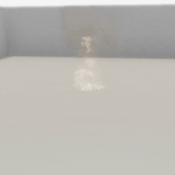

##### Non-physics objects

# Visual Effects

A **visual effect** in TDW is a specialized object that can be visually rendered but is not physically embodied. Visual effects don't have colliders and won't respond to physics events. Visual effects are "objects" in that they have a position, rotation, and scale, but they aren't standard physically embodied TDW objects, which means that commands such as `add_object` or `teleport_object` won't work for a visual effect.

## How to add a visual effect to a scene

Visual effects are stored as asset bundles, just like [standard TDW objects](../core_concepts/objects.md). 

You can add a visual effect via the [`add_visual_effect`](../../api/command_api.md#add_visual_effect) command, or via the wrapper function `Controller.get_add_visual_effect(name, effect_id, position, rotation, library)`:

```python
from tdw.controller import Controller
from tdw.tdw_utils import TDWUtils
from tdw.add_ons.third_person_camera import ThirdPersonCamera
from tdw.add_ons.image_capture import ImageCapture
from tdw.backend.paths import EXAMPLE_CONTROLLER_OUTPUT_PATH

c = Controller()
camera = ThirdPersonCamera(position={"x": 0.5, "y": 1.6, "z": -4.6},
                           look_at={"x": 0, "y": 0, "z": 0},
                           avatar_id="a")
path = EXAMPLE_CONTROLLER_OUTPUT_PATH.joinpath("visual_effects")
print(f"Images will be saved to: {path}")
capture = ImageCapture(avatar_ids=["a"], path=path)
c.add_ons.extend([camera, capture])
c.communicate([TDWUtils.create_empty_room(12, 12),
               {"$type": "set_screen_size",
                "width": 512,
                "height": 512},
               c.get_add_visual_effect(name="fire",
                                       position={"x": 0, "y": 0, "z": 0},
                                       effect_id=Controller.get_unique_id()),
               c.get_add_visual_effect(name="smoke",
                                       position={"x": 0, "y": 0, "z": 0},
                                       effect_id=Controller.get_unique_id())])
for i in range(200):
    c.communicate([])
c.communicate({"$type": "terminate"})
```

Result:



## Audio and the `VisualEffectLibrarian`

Metadata for visual effects is stored in a [`VisualEffectLibrarian`](../../python/librarian/visual_effect_librarian.md). Each `VisualEffectRecord` stores the effect's name, the asset bundle URLs, and whether it includes audio.

To print the names of all visual effects:

```python
from tdw.librarian import VisualEffectLibrarian

lib = VisualEffectLibrarian()
for record in lib.records:
    print(record.name)
```

In the previous example, the fire visual effect has optional audio, so the controller [initializes audio](../audio/initialize_audio.md).  You can determine whether a visual effect has audio by checking the metadata:

```python
from tdw.librarian import VisualEffectLibrarian

lib = VisualEffectLibrarian()
record = lib.get_record("fire")
print(record.audio)  # True
```

## How to adjust a visual effect

In TDW's backend C# code, visual effects share some common code with [line renderers](line_renderers.md), [position markers](position_markers.md), and [textured quads](textured_quads.md). However, you can only use visual effect commands:

- [`destroy_visual_effect`](../../api/command_api.md#destroy_visual_effect)
- [`scale_visual_effect`](../../api/command_api.md#scale_visual_effect)
- [`parent_visual_effect_to_object`](../../api/command_api.md#parent_visual_effect_to_object)
- [`unparent_visual_effect`](../../api/command_api.md#unparent_visual_effect)
- [`teleport_visual_effect`](../../api/command_api.md#teleport_visual_effect)
- [`rotate_visual_effect_by`](../../api/command_api.md#rotate_visual_effect_by)
- [`rotate_visual_effect_to`](../../api/command_api.md#rotate_visual_effect_to)

***

**This is the last document in the "Non-physics objects" tutorial.**

[Return to the README](../../../README.md)

***

Example controllers:

- [visual_effects.py](https://github.com/threedworld-mit/tdw/blob/master/Python/example_controllers/non_physics/visual_effects.py)  Add non-physical visual effects to the scene.

Python API:

- [`VisualEffectLibrarian`](../../python/librarian/visual_effect_librarian.md)

Command API:

- [`add_visual_effect`](../../api/command_api.md#add_visual_effect)
- [`destroy_visual_effect`](../../api/command_api.md#destroy_visual_effect)
- [`scale_visual_effect`](../../api/command_api.md#scale_visual_effect)
- [`parent_visual_effect_to_object`](../../api/command_api.md#parent_visual_effect_to_object)
- [`unparent_visual_effect`](../../api/command_api.md#unparent_visual_effect)
- [`teleport_visual_effect`](../../api/command_api.md#teleport_visual_effect)
- [`rotate_visual_effect_by`](../../api/command_api.md#rotate_visual_effect_by)
- [`rotate_visual_effect_to`](../../api/command_api.md#rotate_visual_effect_to)