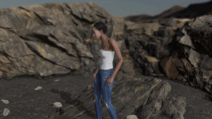

##### Non-physics humanoids

# Overview

Non-physics humanoids are photorealistic 3D character models (male and female) in both business and casual attire. They are fully "rigged", i.e. they have skeletons and can be driven by motion-capture animations. They are non-physics in that they don't have mass or colliders; if allowed, they will walk through other objects without interacting with them.

## Add a non-physics humanoid to the scene

Like [objects](../core_concepts/objects.md) and [scenes](../core_concepts/scenes.md), non-physics humanoids are **asset bundles** stored on a remote S3 server that must be downloaded before they can be added to the scene. Add a non-physics humanoid the scene with the [`add_humanoid`](../../api/command_api.md#add_humanoid) command or the wrapper function [`Controller.get_add_humanoid()`](../../Python/controller.md):

```python
from tdw.controller import Controller
from tdw.tdw_utils import TDWUtils
from tdw.add_ons.third_person_camera import ThirdPersonCamera
from tdw.add_ons.image_capture import ImageCapture
from tdw.backend.paths import EXAMPLE_CONTROLLER_OUTPUT_PATH

# Add a camera and enable image capture.
camera = ThirdPersonCamera(avatar_id="a",
                           position={"x": 0, "y": 1.5, "z": 1.6},
                           look_at={"x": 0, "y": 1.0, "z": -1})
path = EXAMPLE_CONTROLLER_OUTPUT_PATH.joinpath("humanoid_minimal")
print(f"Images will be saved to: {path}")
capture = ImageCapture(avatar_ids=["a"], path=path)
# Start the controller.
c = Controller()
c.add_ons.extend([camera, capture])
# Create a scene and add a humanoid.
humanoid_id = c.get_unique_id()
c.communicate([TDWUtils.create_empty_room(8, 8),
               c.get_add_humanoid(humanoid_name="man_suit",
                                  object_id=humanoid_id,
                                  position={"x": 0, "y": 0, "z": -1})])
c.communicate({"$type": "terminate"})
```

Result:


This controller does the exact same thing of the previous controller but uses the `add_humanoid` command without the wrapper function:

```python
from tdw.add_ons.image_capture import ImageCapture
from tdw.backend.paths import EXAMPLE_CONTROLLER_OUTPUT_PATH

# Add a camera and enable image capture.
camera = ThirdPersonCamera(avatar_id="a",
                           position={"x": 0, "y": 1.5, "z": 1.6},
                           look_at={"x": 0, "y": 1.0, "z": -1})
path = EXAMPLE_CONTROLLER_OUTPUT_PATH.joinpath("humanoid_minimal")
print(f"Images will be saved to: {path}")
capture = ImageCapture(avatar_ids=["a"], path=path)
# Start the controller.
c = Controller()
c.add_ons.extend([camera, capture])
# Create a scene and add a humanoid.
humanoid_id = c.get_unique_id()
c.communicate([TDWUtils.create_empty_room(8, 8),
               {'$type': 'add_humanoid',
                'name': 'man_suit', 
                'url': 'https://tdw-public.s3.amazonaws.com/humanoids/linux/2019.2/man_suit',
                'position': {'x': 0, 'y': 0, 'z': -1},
                'rotation': {'x': 0, 'y': 0, 'z': 0},
                'id': 4337102}])
c.communicate({"$type": "terminate"})
```

## Select a non-physics humanoid

Non-physics humanoid metadata records are stored in a [`HumanoidLibrarian`](../../python/librarian/humanoid_librarian.md):

```python
from tdw.librarian import HumanoidLibrarian

lib = HumanoidLibrarian()
for record in lib.records:
    print(record.name)
```

Output:

```
man_casual_1
man_suit
woman_business_1
woman_business_2
woman_casual_1
```

To fetch a specific record:

```python
from tdw.librarian import HumanoidLibrarian

lib = HumanoidLibrarian()
record = lib.get_record("man_casual_1")
```

## Animate a non-physics humanoid

Non-physics humanoid animations are *also* asset bundles. Humanoid animations were recorded at varying framerates, have varying play lengths. Additionally, some animations are designed to loop and some are not.

All of this means that prior to adding an animation to the scene, you need to have its metadata. Humanoid animation metadata is stored in the [`HumanoidAnimationLibrarian`](../../python/librarian/humanoid_animation_librarian.md):

```python
from tdw.librarian import HumanoidAnimationLibrarian

lib = HumanoidAnimationLibrarian()
for record in lib.records:
    print(record.name)
```

To fetch a specific record:

```python
from tdw.librarian import HumanoidAnimationLibrarian

lib = HumanoidAnimationLibrarian()
record = lib.get_record("walking_1")
print(record.name, record.framerate, record.get_num_frames(), record.loop)
```

Output:

```
walking_1 30 69 True
```

There are additional animations extracted from [SMPL](https://smpl.is.tue.mpg.de) in a separate librarian that can be used by any humanoid:

```python
from tdw.librarian import HumanoidAnimationLibrarian

lib = HumanoidAnimationLibrarian("smpl_animations.json")
for record in lib.records:
    print(record.name)
```

To start an animation, you must first send [`add_humanoid_animation`](../../api/command_api.md#add_humanoid_animation). This will download the animation asset bundle and load it into memory. After doing this, you don't need to send `add_humanoid_animation` for that animation again. For example, if you want to play a walk animation *n* times in a row, you only need to send `add_humanoid_animation` once.

You can also call [`Controller.get_add_humanoid_animation()`](../../Python/controller.md). This returns a *tuple*: an `add_humanoid_animation` command and a metadata record.

This will add the `walking_1` animation to this scene:

```python
from tdw.controller import Controller

c = Controller()
animation_command, animation_record = c.get_add_humanoid_animation("walking_1")
c.communicate(animation_command)
```

This example does the same thing, but without the wrapper function:

```python
from tdw.controller import Controller

c = Controller()
c.communicate({'$type': 'add_humanoid_animation', 
               'name': 'walking_1',
               'url': 'https://tdw-public.s3.amazonaws.com/humanoid_animations/linux/2019.2/walking_1'})
```

To play the animation, send  [`play_humanoid_animation`](../../api/command_api.md#play_humanoid_animation). Then call `communicate()` for the number of frames in the animation.

This example adds a non-physics humanoid, adds an animation, and then plays the animation for 2 loops:

```python
from tdw.controller import Controller
from tdw.tdw_utils import TDWUtils
from tdw.add_ons.third_person_camera import ThirdPersonCamera
from tdw.add_ons.image_capture import ImageCapture
from tdw.backend.paths import EXAMPLE_CONTROLLER_OUTPUT_PATH

"""
Minimal example of an animated non-physics humanoid.
"""

# Add a camera and enable image capture.
camera = ThirdPersonCamera(avatar_id="a",
                           position={"x": -5.5, "y": 5, "z": -2},
                           look_at={"x": 0, "y": 1.0, "z": -1})
path = EXAMPLE_CONTROLLER_OUTPUT_PATH.joinpath("humanoid_minimal")
print(f"Images will be saved to: {path}")
capture = ImageCapture(avatar_ids=["a"], path=path)
# Start the controller.
c = Controller()
c.add_ons.extend([camera, capture])
# Create a scene and add a humanoid.
humanoid_id = c.get_unique_id()
commands = [TDWUtils.create_empty_room(36, 36),
            c.get_add_humanoid(humanoid_name="man_suit",
                               object_id=humanoid_id,
                               position={'x': 0, 'y': 0, 'z': -1})]
# Add an animation.
animation_name = "walking_1"
animation_command, animation_record = c.get_add_humanoid_animation(humanoid_animation_name=animation_name)
num_frames = animation_record.get_num_frames()
commands.extend([animation_command,
                 {"$type": "play_humanoid_animation",
                  "name": animation_name,
                  "id": humanoid_id}])
# Set the framerate.
commands.append({"$type": "set_target_framerate",
                 "framerate": animation_record.framerate})
# Send the commands.
c.communicate(commands)
# Play some loops.
for i in range(2):
    # Play the animation.
    for j in range(num_frames):
        c.communicate([])
    # Start the next loop.
    c.communicate({"$type": "play_humanoid_animation",
                   "name": animation_name,
                   "id": humanoid_id})
c.communicate({"$type": "terminate"})
```

Result:


## Command API and output data

Unlike position markers and textured quads, humanoids *are* a sub-category of TDW objects. Non-physics TDW object commands will work with humanoids. In the above example, the camera looks at the humanoid using the [`look_at`](../../api/command_api.md#look_at). This command is normally used with objects, but if we set `"object_id"` to the humanoid's ID, it works. Conversely, commands such as `set_mass` or `apply_force_to_object` *won't* work with non-physics humanoids.

Non-physics humanoids [receive segmentation color](../visual_perception/id.md). They don't appear in object data. You can, however, send [`send_humanoids`](../../api/command_api.md#send_humanoids), which returns a [`Transforms`](../../api/output_data.md#transforms) that contains transform data only for the non-physics humanoids in the scene.

## Other commands

| Command                                                      | Description                |
| ------------------------------------------------------------ | -------------------------- |
| [`destroy_humanoid`](../../api/command_api.md#destroy_humanoid) | Destroy a humanoid.        |
| [`stop_humanoid_animation`](../../api/command_api.md#stop_humanoid_animation) | Stop playing an animation. |

## `humanoid_video.py` example controller

The [humanoid_video.py](https://github.com/threedworld-mit/tdw/blob/master/Python/example_controllers/non_physics_humanoids/humanoid_video/humanoid_video.py) example controller generates a dataset of humanoid animation videos.



Usage:

```bash
python3 humanoid_video.py --dir
```

where `--dir` is the output directory.

`humanoid_video.py` utilizes a config file located in the same directory to set up each animation: `animation_scene_matrix.json`. This file includes:

- Which animations can be played in which scenes (some animations cover too much distance for smaller scenes)
- Where the humanoid should initially be placed in the scene.

The controller then parses each valid animation/scene pair and generates a video per humanoid such that the total number of videos is: `number of humanoids * number of animation/scene combinations`.

Videos are generated by receiving images from the build and saving each set to a different directory. The images can be later stitched together into video with ffmpeg. If the animation runs faster than 30 FPS, the build will drop frames to create videos with the same framerate.

`images_to_video.py` (located in the same directory as `humanoid_video.py`) is a simple script that repeatedly calls ffmpeg to convert each folder of images into .mp4 videos.

***

**Next: [SMPL humanoids](smpl.md)**

[Return to the README](../../../README.md)

***

Example controllers:

- [humanoid_video.py](https://github.com/threedworld-mit/tdw/blob/master/Python/example_controllers/non_physics_humanoids/humanoid_video/humanoid_video.py) Generate a dataset of humanoid videos.
- [humanoid_minimal.py](https://github.com/threedworld-mit/tdw/blob/master/Python/example_controllers/non_physics_humanoids/humanoid_minimal.py) Minimal example of an animated non-physics humanoid.

Python API:

- [`Controller.get_add_humanoid()`](../../Python/controller.md)
- [`Controller.get_add_humanoid_animation()`](../../Python/controller.md)
- [`HumanoidLibrarian`](../../python/librarian/humanoid_librarian.md)
- [`HumanoidAnimationLibrarian`](../../python/librarian/humanoid_animation_librarian.md)

Command API:

- [`add_humanoid`](../../api/command_api.md#add_humanoid)
- [`add_humanoid_animation`](../../api/command_api.md#add_humanoid_animation)
- [`play_humanoid_animation`](../../api/command_api.md#play_humanoid_animation)
- [`look_at`](../../api/command_api.md#look_at)
- [`send_humanoids`](../../api/command_api.md#send_humanoids)
- [`destroy_humanoid`](../../api/command_api.md#destroy_humanoid)
- [`stop_humanoid_animation`](../../api/command_api.md#stop_humanoid_animation)

Output Data:

- [`Transforms`](../../api/output_data.md#transforms)
