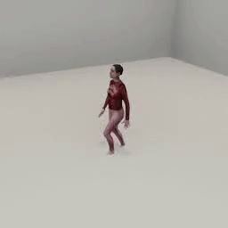

##### Non-physics humanoids

# SMPL humanoids

 [SMPL humanoids](https://smpl.is.tue.mpg.de) have parameterized body shapes.

To review the SMPL models available, load the SMPL humanoid librarian and iterate through the records:

```python
from tdw.librarian import HumanoidLibrarian

lib = HumanoidLibrarian("smpl_humanoids.json")
for record in lib.records:
    print(record.name)
```

Output:

```
humanoid_smpl_f
humanoid_smpl_m
```

To fetch a specific record:

```python
from tdw.librarian import HumanoidLibrarian

lib = HumanoidLibrarian("smpl_humanoids.json")
record = lib.get_record("humanoid_smpl_f")
```

To add a SMPL humanoid, send [`add_smpl_humanoid`](../../api/command_api.md#add_smpl_humanoid):

```python
import random
from tdw.controller import Controller
from tdw.tdw_utils import TDWUtils
from tdw.add_ons.third_person_camera import ThirdPersonCamera
from tdw.add_ons.image_capture import ImageCapture
from tdw.backend.paths import EXAMPLE_CONTROLLER_OUTPUT_PATH
from tdw.librarian import HumanoidLibrarian

"""
Add and animate a SMPL humanoid.
"""

# Add a camera and enable image capture.
humanoid_id = Controller.get_unique_id()
camera = ThirdPersonCamera(avatar_id="a",
                           position={"x": -3, "y": 2.5, "z": 1.6},
                           look_at=humanoid_id)
path = EXAMPLE_CONTROLLER_OUTPUT_PATH.joinpath("smpl")
print(f"Images will be saved to: {path}")
capture = ImageCapture(avatar_ids=["a"], path=path)
# Start the controller.
c = Controller()
c.add_ons.extend([camera, capture])
# Get the record for the SMPL humanoid and for the animation.
c.humanoid_librarian = HumanoidLibrarian("smpl_humanoids.json")
humanoid_record = c.humanoid_librarian.get_record("humanoid_smpl_f")
animation_command, animation_record = c.get_add_humanoid_animation("walking_1")
commands = [TDWUtils.create_empty_room(12, 12),
            {"$type": "add_smpl_humanoid",
             "id": humanoid_id,
             "name": humanoid_record.name,
             "url": humanoid_record.get_url(),
             "position": {"x": 0, "y": 0, "z": 0},
             "rotation": {"x": 0, "y": 0, "z": 0},
             "height": random.uniform(-1, 1),
             "weight": random.uniform(-1, 1),
             "torso_height_and_shoulder_width": random.uniform(-1, 1),
             "chest_breadth_and_neck_height": random.uniform(-1, 1),
             "upper_lower_back_ratio": random.uniform(-1, 1),
             "pelvis_width": random.uniform(-1, 1),
             "hips_curve": random.uniform(-1, 1),
             "torso_height": random.uniform(-1, 1),
             "left_right_symmetry": random.uniform(-1, 1),
             "shoulder_and_torso_width": random.uniform(-1, 1)},
            animation_command,
            {"$type": "play_humanoid_animation",
             "name": animation_record.name,
             "id": humanoid_id},
            {"$type": "set_target_framerate",
             "framerate": animation_record.framerate}]
c.communicate(commands)
frames = animation_record.get_num_frames()
for i in range(frames):
    c.communicate({"$type": "look_at",
                   "object_id": humanoid_id})
c.communicate({"$type": "terminate"})
```

Result:



***

**This is the last document in the "Non-physics objects" tutorial.**

[Return to the README](../../../README.md)

***

Example controllers:

- [smpl.py](https://github.com/threedworld-mit/tdw/blob/master/Python/example_controllers/non_physics_humanoids/smpl.py) Minimal example of an animated non-physics SMPL humanoid.

Python API:

- [`Controller.get_add_humanoid()`](../../Python/controller.md)
- [`Controller.get_add_humanoid_animation()`](../../Python/controller.md)
- [`HumanoidLibrarian`](../../python/librarian/humanoid_librarian.md)
- [`HumanoidAnimationLibrarian`](../../python/librarian/humanoid_animation_librarian.md)

Command API:

- [`play_humanoid_animation`](../../api/command_api.md#play_humanoid_animation)
- [`look_at`](../../api/command_api.md#look_at)
- [`add_smpl_humanoid`](../../api/command_api.md#add_smpl_humanoid)