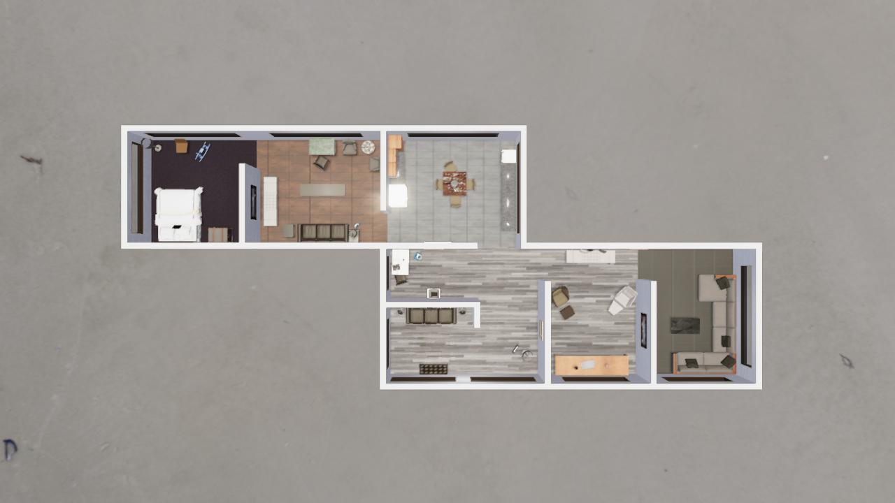

##### Objects and Scenes

# Scripted object placement (floorplan layouts)

TDW includes a number of predefined **"floorplan layouts"**. These are interior scenes with multiple rooms. Each scene has several "variants" which are purely cosmetic (such as changing what the floors look like) and three "layouts". Each layout is a list of objects and their positions, masses, and so on.

To access the floorplan layouts, use a [`FloorplanController`](../../python/floorplan_controller.md), a subclass of `Controller`. The following example will load a scene and populate it with a layout. This controller also sends [`set_floorplan_roof`](../../api/command_api.md#set_floorplan_roof) to hide the roof of the house so that we can see the interior:

```python
from tdw.floorplan_controller import FloorplanController
from tdw.tdw_utils import TDWUtils
from tdw.add_ons.image_capture import ImageCapture
from tdw.backend.paths import EXAMPLE_CONTROLLER_OUTPUT_PATH

c = FloorplanController()
path = EXAMPLE_CONTROLLER_OUTPUT_PATH.joinpath("floorplan_controller")
print(f"Images will be saved to: {path}")
capture = ImageCapture(avatar_ids=["a"], pass_masks=["_img"], path=path)
c.add_ons.append(capture)
# Get commands to load the scene and populate it with objects.
commands = c.get_scene_init_commands(scene="1a", layout=0, audio=True)
commands.extend(TDWUtils.create_avatar(position={"x": 0, "y": 40, "z": 0},
                                       look_at={"x": 0, "y": 0, "z": 0},
                                       avatar_id="a"))
# Make the image 720p and hide the roof.
commands.extend([{"$type": "set_screen_size",
                  "width": 1280,
                  "height": 720},
                 {"$type": "set_floorplan_roof",
                 "show": False}])
c.communicate(commands)
c.communicate({"$type": "terminate"})

```

Result:



## Valid scene+layout combinations

In the `scene` parameter, the number (1, 2, 4, or 5) defines the geometry of the house and the letter (a, b, or c) defines the visual variant of that house . The `layout` parameter sets which list of objects to load.

| `scene` | `layout` |
| --- | --- |
| 1a, 1b, or 1c | 0, 1, or 2 |
| 2a, 2b, or 2c | 0, 1, or 2 |
| 4a, 4b, or 4c | 0, 1, or 2 |
| 5a, 5b, or 5c | 0, 1, or 2 |

## Images of every scene+layout combination

[**Images of every scene+layout combination can be found here.**](https://github.com/threedworld-mit/tdw/blob/master/Documentation/lessons/objects_and_scenes/images/floorplans) 

***

**Next: [Visual materials, textures, and colors](materials_textures_colors.md)**

Example controllers:

- [floorplan.py](https://github.com/threedworld-mit/tdw/blob/master/Python/example_controllers/objects_and_scenes/floorplan.py) Initialize a floorplan scene and populate it with objects.

Python API:

- [`FloorplanController`](../../python/floorplan_controller.md)

Command API:

- [`set_screen_size`](../../api/command_api.md#set_screen_size)
- [`set_floorplan_roof`](../../api/command_api.md#set_floorplan_roof)

[Return to the README](../../README.md)