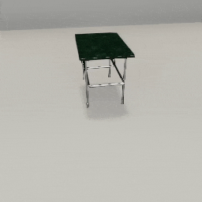
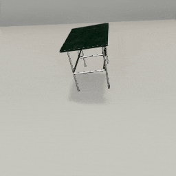
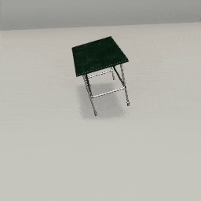

##### Physics

# Apply forces to objects

So far, this tutorial has covered examples of physical interactions that occur due to gravitational force. It is also possible to programmatically apply additional forces to objects.

## Apply forces and torques

The simplest way to do this is by sending [`apply_force_to_object`](../../api/command_api.md#apply_force_to_object). The `"force"` parameter is the force vector in Newtons. The force is applied instantly as an impulse.

```python
from tdw.controller import Controller
from tdw.tdw_utils import TDWUtils
from tdw.add_ons.third_person_camera import ThirdPersonCamera
from tdw.add_ons.object_manager import ObjectManager

c = Controller()
camera = ThirdPersonCamera(position={"x": -3, "y": 2.1, "z": 0.5},
                           look_at={"x": 0, "y": 0, "z": 0})
object_manager = ObjectManager(rigidbodies=True)
c.add_ons.extend([object_manager, camera])
object_id = c.get_unique_id()
commands = [TDWUtils.create_empty_room(12, 12)]
commands.extend(c.get_add_physics_object(model_name="small_table_green_marble",
                                         object_id=object_id))

# Apply a force.
commands.append({"$type": "apply_force_to_object",
                 "id": object_id,
                 "force": {"x": -8, "y": 700, "z": 5}})

c.communicate(commands)

while not object_manager.rigidbodies[object_id].sleeping:
    c.communicate([])
c.communicate({"$type": "terminate"})
```

Result:



You can add a torque by sending [`apply_torque_to_object`](../../api/command_api.md#apply_torque_to_object):

```python
from tdw.controller import Controller
from tdw.tdw_utils import TDWUtils
from tdw.add_ons.third_person_camera import ThirdPersonCamera
from tdw.add_ons.object_manager import ObjectManager

c = Controller()
camera = ThirdPersonCamera(position={"x": -3, "y": 2.1, "z": 0.5},
                           look_at={"x": 0, "y": 0, "z": 0})
object_manager = ObjectManager(rigidbodies=True)
c.add_ons.extend([object_manager, camera])
object_id = c.get_unique_id()
commands = [TDWUtils.create_empty_room(12, 12)]
commands.extend(c.get_add_physics_object(model_name="small_table_green_marble",
                                         object_id=object_id))

# Apply a force and a torque.
commands.extend([{"$type": "apply_force_to_object",
                  "id": object_id,
                  "force": {"x": -8, "y": 700, "z": 5}},
                 {"$type": "apply_torque_to_object",
                  "id": object_id,
                  "torque": {"x": 50, "y": 120, "z": 1}}])

c.communicate(commands)

while not object_manager.rigidbodies[object_id].sleeping:
    c.communicate([])
c.communicate({"$type": "terminate"})
```

Result:



To apply a directional force at a specific position, send  [`apply_force_at_position`](../../api/command_api.md#apply_force_at_position):

```python
from tdw.controller import Controller
from tdw.tdw_utils import TDWUtils
from tdw.add_ons.third_person_camera import ThirdPersonCamera
from tdw.add_ons.object_manager import ObjectManager

c = Controller()
camera = ThirdPersonCamera(position={"x": -3, "y": 2.1, "z": 0.5},
                           look_at={"x": 0, "y": 0, "z": 0})
object_manager = ObjectManager(rigidbodies=True)
c.add_ons.extend([object_manager, camera])
object_id = c.get_unique_id()
commands = [TDWUtils.create_empty_room(12, 12)]
commands.extend(c.get_add_physics_object(model_name="small_table_green_marble",
                                         object_id=object_id))

# Apply a force at a position.
commands.append({"$type": "apply_force_at_position",
                 "id": object_id,
                 "force": {"x": 0, "y": 110, "z": 0},
                 "position": {"x": 0, "y": 0.2, "z": -0.5}})

c.communicate(commands)

while not object_manager.rigidbodies[object_id].sleeping:
    c.communicate([])
c.communicate({"$type": "terminate"})
```

Result:



**TODO: force magnitude**

**TODO: Scene**

## Apply constant forces and torques

You can apply a *constant* directional force and torque to an object with [`add_constant_force`](../../api/command_api.md#add_constant_force). Unlike other force commands, the physics engine will continuously apply force per physics step:

