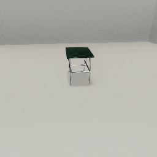
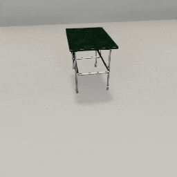

##### Physics (PhysX)

# Apply forces to objects

So far, this tutorial has covered examples of physical interactions that occur due to gravitational force. It is also possible to programmatically apply additional forces to objects.

## Apply forces and torques

The simplest way to do this is by sending [`apply_force_to_object`](../../api/command_api.md#apply_force_to_object). The `"force"` parameter is the force vector in Newtons. The force is applied instantly as an impulse.

```python
from tdw.controller import Controller
from tdw.tdw_utils import TDWUtils
from tdw.add_ons.third_person_camera import ThirdPersonCamera
from tdw.add_ons.object_manager import ObjectManager

c = Controller()
camera = ThirdPersonCamera(position={"x": -3, "y": 2.1, "z": 0.5},
                           look_at={"x": 0, "y": 0, "z": 0})
object_manager = ObjectManager(rigidbodies=True)
c.add_ons.extend([object_manager, camera])
object_id = c.get_unique_id()
commands = [TDWUtils.create_empty_room(12, 12)]
commands.extend(c.get_add_physics_object(model_name="small_table_green_marble",
                                         object_id=object_id))

# Apply a force.
commands.append({"$type": "apply_force_to_object",
                 "id": object_id,
                 "force": {"x": -8, "y": 700, "z": 5}})

c.communicate(commands)

while not object_manager.rigidbodies[object_id].sleeping:
    c.communicate([])
c.communicate({"$type": "terminate"})
```

Result:


You can add a torque by sending [`apply_torque_to_object`](../../api/command_api.md#apply_torque_to_object):

```python
from tdw.controller import Controller
from tdw.tdw_utils import TDWUtils
from tdw.add_ons.third_person_camera import ThirdPersonCamera
from tdw.add_ons.object_manager import ObjectManager

c = Controller()
camera = ThirdPersonCamera(position={"x": -3, "y": 2.1, "z": 0.5},
                           look_at={"x": 0, "y": 0, "z": 0})
object_manager = ObjectManager(rigidbodies=True)
c.add_ons.extend([object_manager, camera])
object_id = c.get_unique_id()
commands = [TDWUtils.create_empty_room(12, 12)]
commands.extend(c.get_add_physics_object(model_name="small_table_green_marble",
                                         object_id=object_id))

# Apply a force and a torque.
commands.extend([{"$type": "apply_force_to_object",
                  "id": object_id,
                  "force": {"x": -8, "y": 700, "z": 5}},
                 {"$type": "apply_torque_to_object",
                  "id": object_id,
                  "torque": {"x": 50, "y": 120, "z": 1}}])

c.communicate(commands)

while not object_manager.rigidbodies[object_id].sleeping:
    c.communicate([])
c.communicate({"$type": "terminate"})
```

Result:


To apply a directional force at a specific position, send  [`apply_force_at_position`](../../api/command_api.md#apply_force_at_position):

```python
from tdw.controller import Controller
from tdw.tdw_utils import TDWUtils
from tdw.add_ons.third_person_camera import ThirdPersonCamera
from tdw.add_ons.object_manager import ObjectManager

c = Controller()
camera = ThirdPersonCamera(position={"x": -3, "y": 2.1, "z": 0.5},
                           look_at={"x": 0, "y": 0, "z": 0})
object_manager = ObjectManager(rigidbodies=True)
c.add_ons.extend([object_manager, camera])
object_id = c.get_unique_id()
commands = [TDWUtils.create_empty_room(12, 12)]
commands.extend(c.get_add_physics_object(model_name="small_table_green_marble",
                                         object_id=object_id))

# Apply a force at a position.
commands.append({"$type": "apply_force_at_position",
                 "id": object_id,
                 "force": {"x": 0, "y": 110, "z": 0},
                 "position": {"x": 0, "y": 0.2, "z": -0.5}})

c.communicate(commands)

while not object_manager.rigidbodies[object_id].sleeping:
    c.communicate([])
c.communicate({"$type": "terminate"})
```

Result:


## Apply a force along a forward directional vector

Send  [`apply_force_magnitude_to_object`](../../api/command_api.md#apply_force_magnitude_to_object) to apply a force of a given magnitude along an objects forward directional vector. This can be convenient for aiming an object at a position.

In this example, we'll add a table. Using an [`ObjectManager`](../../python/add_ons/object_manager.md), we'll get the bounds of the table and its top position. Then we'll add a ball; on the same frame that the ball is added, we'll orient the ball using the command [`object_look_at_position`](../../api/command_api.md#object_look_at_position) and apply a force using  [`apply_force_magnitude_to_object`](../../api/command_api.md#apply_force_magnitude_to_object).

The simulation ends when the ball stops moving. Note that we also need to re-initialize the `ObjectManager` in order to include the ball's rigidbody data because the ball was added after the `ObjectManager` was initialized.

```python
from tdw.controller import Controller
from tdw.tdw_utils import TDWUtils
from tdw.add_ons.third_person_camera import ThirdPersonCamera
from tdw.add_ons.object_manager import ObjectManager

c = Controller()
camera = ThirdPersonCamera(position={"x": -4.5, "y": 2.1, "z": 0.5},
                           look_at={"x": 0, "y": 0, "z": 0})
object_manager = ObjectManager(transforms=False, bounds=True, rigidbodies=True)
c.add_ons.extend([camera, object_manager])
table_id = c.get_unique_id()
commands = [TDWUtils.create_empty_room(12, 12)]
commands.extend(c.get_add_physics_object(model_name="small_table_green_marble",
                                         object_id=table_id))
c.communicate(commands)

# Get the top of the table.
table_top = object_manager.bounds[table_id].top

ball_id = c.get_unique_id()
# Add a ball. Note that this is from the models_special.json model library.
commands = c.get_add_physics_object(model_name="prim_sphere",
                                    library="models_special.json",
                                    position={"x": 0.5, "y": 4, "z": -1.3},
                                    scale_factor={"x": 0.2, "y": 0.2, "z": 0.2},
                                    default_physics_values=False,
                                    mass=10,
                                    dynamic_friction=0.3,
                                    static_friction=0.3,
                                    bounciness=0.7,
                                    object_id=ball_id)
# Orient the ball to look at the top of the table. Apply a force.
commands.extend([{"$type": "object_look_at_position",
                 "position": TDWUtils.array_to_vector3(table_top),
                 "id": ball_id},
                 {"$type": "apply_force_magnitude_to_object",
                  "magnitude": 60,
                  "id": ball_id}])
# Re-initialize the object manager.
object_manager.initialized = False
c.communicate(commands)

# Wait until the ball stops moving.
while not object_manager.rigidbodies[ball_id].sleeping:
    c.communicate([])
c.communicate({"$type": "terminate"})
```

Result:



## Apply constant forces and torques

You can apply a *constant* directional force and torque to an object with [`add_constant_force`](../../api/command_api.md#add_constant_force). Unlike other force commands, the physics engine will continuously apply force per physics step:

```python
from tdw.controller import Controller
from tdw.tdw_utils import TDWUtils
from tdw.add_ons.third_person_camera import ThirdPersonCamera

c = Controller()
camera = ThirdPersonCamera(position={"x": -3, "y": 2.1, "z": 0.5},
                           look_at={"x": 0, "y": 0, "z": 0})
c.add_ons.append(camera)
object_id = c.get_unique_id()
commands = [TDWUtils.create_empty_room(12, 12)]
commands.extend(c.get_add_physics_object(model_name="small_table_green_marble",
                                         object_id=object_id))

# Apply a constant force.
commands.append({"$type": "add_constant_force",
                 "id": object_id,
                 "force": {"x": 0, "y": 0, "z": 0},
                 "relative_force": {"x": 0, "y": 1200, "z": 0},
                 "torque": {"x": 0, "y": 0, "z": 0},
                 "relative_torque": {"x": 0, "y": 0, "z": 0}})

c.communicate(commands)

for i in range(200):
    c.communicate([])
c.communicate({"$type": "terminate"})
```

Result:



***

**Next: [Skip physics frames](step_physics.md)**

[Return to the README](../../../README.md)

***

Example controllers:

- [ball_bounce.py](https://github.com/threedworld-mit/tdw/blob/master/Python/example_controllers/physics/ball_bounce.py) Bounce a ball on a table.
- [collision_and_friction.py](https://github.com/threedworld-mit/tdw/blob/master/Python/example_controllers/physics/collision_and_friction.py) Collide an object with another with varying physics values.
- [forcefield.py](https://github.com/threedworld-mit/tdw/blob/master/Python/example_controllers/physics/forcefield.py) Simulate a "forcefield" that objects will bounce off of.

Python API

- [`ObjectManager`](../../python/add_ons/object_manager.md)

Command API:

- [`apply_force_to_object`](../../api/command_api.md#apply_force_to_object)
- [`apply_torque_to_object`](../../api/command_api.md#apply_torque_to_object)
- [`apply_force_at_position`](../../api/command_api.md#apply_force_at_position)
-  [`apply_force_magnitude_to_object`](../../api/command_api.md#apply_force_magnitude_to_object)
- [`object_look_at_position`](../../api/command_api.md#object_look_at_position)
- [`add_constant_force`](../../api/command_api.md#add_constant_force)