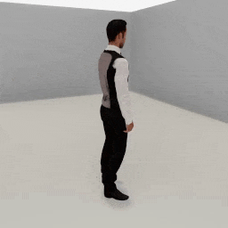

##### Replicants

# Actions

The `Replicant` has a pre-defined action space, divided into separate function calls. Calling one of these action functions will *start* the action but won't actually *do* the action. This means that Replicants can move concurrently in a [multi-agent simulation](../multi_agent/overview.md).

This example doesn't actually do anything:

```python
from tdw.controller import Controller
from tdw.tdw_utils import TDWUtils
from tdw.add_ons.replicant import Replicant

c = Controller()
replicant = Replicant()
c.add_ons.append(replicant)
c.communicate(TDWUtils.create_empty_room(12, 12))

# This doesn't do anything!
replicant.move_by(2)
```

All actions require multiple `communicate()` calls to complete.

In this example, we'll tell the Replicant to walk 2 meters forward. We'll also add a [camera](../core_concepts/add_ons/md) to the scene and enable [image capture](../core_concepts/images.md). Note that this example is *not* an optimal way to use a Replicant and that subsequent examples will fix some naïve assumptions we're making. 

```python
from tdw.controller import Controller
from tdw.tdw_utils import TDWUtils
from tdw.add_ons.replicant import Replicant
from tdw.add_ons.third_person_camera import ThirdPersonCamera
from tdw.add_ons.image_capture import ImageCapture
from tdw.backend.paths import EXAMPLE_CONTROLLER_OUTPUT_PATH

c = Controller()
replicant = Replicant(position={"x": 0, "y": 0, "z": 2})
camera = ThirdPersonCamera(position={"x": 2, "y": 1.6, "z": 1},
                           look_at=replicant.replicant_id,
                           avatar_id="a")
path = EXAMPLE_CONTROLLER_OUTPUT_PATH.joinpath("move_by")
print(f"Images will be saved to: {path}")
capture = ImageCapture(avatar_ids=["a"],
                       path=path)
# Note the order in which the add-ons are added. The replicant needs to be first so that the camera can look at it.
c.add_ons.extend([replicant, camera, capture])
# Create the scene.
c.communicate(TDWUtils.create_empty_room(12, 12))
# Start walking.
replicant.move_by(2)
# Loop for a while.
for i in range(100):
    c.communicate([])
c.communicate({"$type": "terminate"})
```

Result:



## Framerate

This first "problem" with the above example is that the framerate is fast (it's been slowed down in the .gif). This is desirable in the context of machine learning, where the simulation *should* be faster than realtime, but for the sake of a video, we might want to slow time by sending [`set_target_framerate`](../../api/command_api.md#set_target_framerate):

```python
from tdw.controller import Controller
from tdw.tdw_utils import TDWUtils
from tdw.add_ons.replicant import Replicant
from tdw.add_ons.third_person_camera import ThirdPersonCamera
from tdw.add_ons.image_capture import ImageCapture
from tdw.backend.paths import EXAMPLE_CONTROLLER_OUTPUT_PATH

c = Controller()
replicant = Replicant(position={"x": 0, "y": 0, "z": 2})
camera = ThirdPersonCamera(position={"x": 2, "y": 1.6, "z": 1},
                           look_at=replicant.replicant_id,
                           avatar_id="a")
path = EXAMPLE_CONTROLLER_OUTPUT_PATH.joinpath("move_by")
print(f"Images will be saved to: {path}")
capture = ImageCapture(avatar_ids=["a"],
                       path=path)
# Note the order in which the add-ons are added. The replicant needs to be first so that the camera can look at it.
c.add_ons.extend([replicant, camera, capture])
# Create the scene. Set the framerate.
c.communicate([TDWUtils.create_empty_room(12, 12),
               {"$type": "set_target_framerate",
                "framerate": 60}])
# Start walking.
replicant.move_by(2)
# Loop for a while.
for i in range(100):
    c.communicate([])
c.communicate({"$type": "terminate"})
```

The rest of the tutorial will assume that you want to use the Replicant in machine-learning context, as opposed to a video-generation context, and therefore the example code will omit the `set_target_framerate` command.

## Action Status

A more significant problem with the initial action is the loop we're using; we're not checking for when the action actually ends, or if it succeeds.

In the case of `move_by(distance)`, the action can end in success (the Replicant walked the target distance), or failure ([a collision or near-collision](movement.md)).

Within the add-on, every action is a data object: `replicant.action`. This is a subclass of [`Action`](../../python/replicant/actions/action.md).

When we call `replicant.move_by(distance)`, we actually set the `replicant.action` field, like this:

```
        self.action = MoveBy(distance=distance,
                             dynamic=self.dynamic,
                             collision_detection=self.collision_detection,
                             previous=self._previous_action,
                             reset_arms=reset_arms,
                             reset_arms_duration=reset_arms_duration,
                             arrived_at=arrived_at,
                             max_walk_cycles=max_walk_cycles)
```

The [`Action`](../../python/replicant/actions/action.md) (in this case, a [`MoveBy`](../../python/replicant/actions/move_by.md) action), has a `status` field. While the action is ongoing, `action.status == ActionStatus.ongoing`. If it is ever something else, we know that the action is done.

This example replaces the `for i in range(100):` loop with a `while` loop that continuously checks the action's status for completion. Note that there is an additional, `c.communicate([])` call at the end; this is to send commands that end the action.

```python
from tdw.controller import Controller
from tdw.tdw_utils import TDWUtils
from tdw.add_ons.replicant import Replicant
from tdw.add_ons.third_person_camera import ThirdPersonCamera
from tdw.add_ons.image_capture import ImageCapture
from tdw.backend.paths import EXAMPLE_CONTROLLER_OUTPUT_PATH
from tdw.replicant.action_status import ActionStatus

c = Controller()
replicant = Replicant(position={"x": 0, "y": 0, "z": 2})
camera = ThirdPersonCamera(position={"x": 2, "y": 1.6, "z": 1},
                           look_at=replicant.replicant_id,
                           avatar_id="a")
path = EXAMPLE_CONTROLLER_OUTPUT_PATH.joinpath("move_by")
print(f"Images will be saved to: {path}")
capture = ImageCapture(avatar_ids=["a"],
                       path=path)
# Note the order in which the add-ons are added. The replicant needs to be first so that the camera can look at it.
c.add_ons.extend([replicant, camera, capture])
# Create the scene. Set the framerate.
c.communicate(TDWUtils.create_empty_room(12, 12))
# Start walking.
replicant.move_by(2)
# Continue walking until the action ends.
while replicant.action.status == ActionStatus.ongoing:
    c.communicate([])
# End the action.
c.communicate([])
print(replicant.action.status)
c.communicate({"$type": "terminate"})
```

Result:

```
ActionStatus.success
```

It is *not* necessary to wrap all Replicant actions in a loop like this. For example, in the context of a multi-agent simulation you won't want to loop like this because you'll want to be checking multiple agent actions at the same time. For the sake of subsequent example code, we know we have only one agent, so this simple loop is good enough for showcasing the rest of the Replicant's behavior.

***

**Next: [Output data](output_data.md)**

[Return to the README](../../../README.md)

***

Example controllers:

- [move_by.py](https://github.com/threedworld-mit/tdw/blob/master/Python/example_controllers/replicant/move_by.py) Move a Replicant by a target distance and print its status.

Commands API:

- [`set_target_framerate`](../../api/command_api.md#set_target_framerate)

Python API:

- [`Replicant`](../../python/add_ons/replicant.md)
-  [`Action`](../../python/replicant/actions/action.md)
-  [`MoveBy`](../../python/replicant/actions/move_by.md)