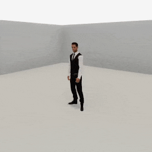
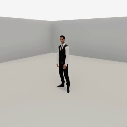

##### Replicants

# Grasp and drop objects

The Replicant can grasp and drop objects. Each hand can grasp exactly one object at a time.

## The `grasp(target, arm)` action

`grasp(target, arm)` will tell the Replicant to grasp an object. **This is a non-physics, non-motion. The Replicant WILL NOT bend its arm towards the target.** To properly grasp, first call [`reach_for(target, arm)`](arm_articulation.md), *then* `grasp(target, arm)`.

When a Replicant grasps an object, the object becomes kinematic and continuously tracks the Replicant's hand. If the object [contains other objects](../semantic_states/containment.md), those objects will also become kinematic and will be parented to the root grasped object:

```python
from tdw.controller import Controller
from tdw.tdw_utils import TDWUtils
from tdw.add_ons.replicant import Replicant
from tdw.add_ons.third_person_camera import ThirdPersonCamera
from tdw.add_ons.image_capture import ImageCapture
from tdw.replicant.action_status import ActionStatus
from tdw.replicant.arm import Arm
from tdw.backend.paths import EXAMPLE_CONTROLLER_OUTPUT_PATH


def do_action():
    """
    A helper function to handle the basic Replicant action loop.
    """

    while replicant.action.status == ActionStatus.ongoing:
        c.communicate([])
    c.communicate([])


c = Controller()
replicant = Replicant()
camera = ThirdPersonCamera(position={"x": -2.4, "y": 2, "z": 3.2},
                           look_at=replicant.replicant_id,
                           avatar_id="a")
path = EXAMPLE_CONTROLLER_OUTPUT_PATH.joinpath("replicant_grasp_basket_with_object")
print(f"Images will be saved to: {path}")
capture = ImageCapture(avatar_ids=[camera.avatar_id], path=path)
c.add_ons.extend([replicant, camera, capture])
object_id = Controller.get_unique_id()
commands = [TDWUtils.create_empty_room(12, 12)]
commands.extend(Controller.get_add_physics_object(model_name="basket_18inx18inx12iin_wicker",
                                                  object_id=object_id,
                                                  position={"x": -2, "y": 0, "z": 2}))
commands.extend(Controller.get_add_physics_object(model_name="vase_02",
                                                  object_id=Controller.get_unique_id(),
                                                  position={"x": -2, "y": 0.1, "z": 2}))
c.communicate(commands)
replicant.move_to(target=object_id)
do_action()
replicant.reach_for(target=object_id, arm=Arm.right)
do_action()
replicant.grasp(target=object_id, arm=Arm.right)
do_action()
replicant.reach_for(target={"x": 0.4, "y": 1.1, "z": 0.4}, arm=Arm.right, absolute=False)
do_action()
c.communicate({"$type": "terminate"})
```

Result:


### The target position

The Replicant will grasp the target at a position defined by the build using affordance points and bounds positions. This is identical to the system used for `reach_for(target, arm)`, which you can read about [here](arm_articulation.md).

### Grasp an object with both hands

The grasped object tracks exactly one hand, as defined by the `arm` parameter. Grasping an object with *both* hands is more of an apparent motion than a real one; you can set the offhand to follow the hand holding the object by setting `reach_for(target, arm, offhand_follows=True)`:

```python
from tdw.controller import Controller
from tdw.tdw_utils import TDWUtils
from tdw.add_ons.replicant import Replicant
from tdw.add_ons.third_person_camera import ThirdPersonCamera
from tdw.add_ons.image_capture import ImageCapture
from tdw.replicant.action_status import ActionStatus
from tdw.replicant.arm import Arm
from tdw.backend.paths import EXAMPLE_CONTROLLER_OUTPUT_PATH


def do_action():
    """
    A helper function to handle the basic Replicant action loop.
    """

    while replicant.action.status == ActionStatus.ongoing:
        c.communicate([])
    c.communicate([])


c = Controller()
replicant = Replicant()
camera = ThirdPersonCamera(position={"x": -2.4, "y": 2, "z": 3.2},
                           look_at=replicant.replicant_id,
                           avatar_id="a")
path = EXAMPLE_CONTROLLER_OUTPUT_PATH.joinpath("replicant_grasp_basket_with_object_both_hands")
print(f"Images will be saved to: {path}")
capture = ImageCapture(avatar_ids=[camera.avatar_id], path=path)
c.add_ons.extend([replicant, camera, capture])
object_id = Controller.get_unique_id()
commands = [TDWUtils.create_empty_room(12, 12)]
commands.extend(Controller.get_add_physics_object(model_name="basket_18inx18inx12iin_wicker",
                                                  object_id=object_id,
                                                  position={"x": -2, "y": 0, "z": 2}))
commands.extend(Controller.get_add_physics_object(model_name="vase_02",
                                                  object_id=Controller.get_unique_id(),
                                                  position={"x": -2, "y": 0.1, "z": 2}))
c.communicate(commands)
replicant.move_to(target=object_id)
do_action()
# Reach with both hands.
replicant.reach_for(target=object_id, arm=[Arm.right, Arm.left])
do_action()
# Grasp with the right hand.
replicant.grasp(target=object_id, arm=Arm.right)
do_action()
# Reach for a target position with the right hand; the left hand will follow.
replicant.reach_for(target={"x": 0, "y": 1.1, "z": 0.4}, arm=Arm.right, absolute=False, offhand_follows=True)
do_action()
c.communicate({"$type": "terminate"})
```

Result:


### The `angle` and `axis` parameters

A grasped object will continuously rotate relative to the hand grasping it. By default, the rotation is 90 degrees along the relative pitch axis.

The optional `angle` parameter controls the angle and the optional `axis` parameter controls the axis. The `axis` parameter is a string: `"pitch"`, `"yaw"`, or `"roll"`.

This example sets the basket to continuously rotate 45 degrees along the roll axis:

```python
from tdw.controller import Controller
from tdw.tdw_utils import TDWUtils
from tdw.add_ons.replicant import Replicant
from tdw.add_ons.third_person_camera import ThirdPersonCamera
from tdw.add_ons.image_capture import ImageCapture
from tdw.replicant.action_status import ActionStatus
from tdw.replicant.arm import Arm
from tdw.backend.paths import EXAMPLE_CONTROLLER_OUTPUT_PATH


def do_action():
    """
    A helper function to handle the basic Replicant action loop.
    """

    while replicant.action.status == ActionStatus.ongoing:
        c.communicate([])
    c.communicate([])


c = Controller()
replicant = Replicant()
camera = ThirdPersonCamera(position={"x": -2.4, "y": 2, "z": 3.2},
                           look_at=replicant.replicant_id,
                           avatar_id="a")
path = EXAMPLE_CONTROLLER_OUTPUT_PATH.joinpath("replicant_grasp_basket_with_object_roll")
print(f"Images will be saved to: {path}")
capture = ImageCapture(avatar_ids=[camera.avatar_id], path=path)
c.add_ons.extend([replicant, camera, capture])
object_id = Controller.get_unique_id()
commands = [TDWUtils.create_empty_room(12, 12)]
commands.extend(Controller.get_add_physics_object(model_name="basket_18inx18inx12iin_wicker",
                                                  object_id=object_id,
                                                  position={"x": -2, "y": 0, "z": 2}))
commands.extend(Controller.get_add_physics_object(model_name="vase_02",
                                                  object_id=Controller.get_unique_id(),
                                                  position={"x": -2, "y": 0.1, "z": 2}))
c.communicate(commands)
replicant.move_to(target=object_id)
do_action()
replicant.reach_for(target=object_id, arm=Arm.right)
do_action()
replicant.grasp(target=object_id,
                arm=Arm.right,
                angle=45,
                axis="yaw")
do_action()
replicant.reach_for(target={"x": 0.4, "y": 1.1, "z": 0.4}, arm=Arm.right, absolute=False)
do_action()
c.communicate({"$type": "terminate"})
```

Result:



If you set either `angle` *or* `axis` to None, the object will maintain its initial rotation even as the hand rotates:

```python
from tdw.controller import Controller
from tdw.tdw_utils import TDWUtils
from tdw.add_ons.replicant import Replicant
from tdw.add_ons.third_person_camera import ThirdPersonCamera
from tdw.add_ons.image_capture import ImageCapture
from tdw.replicant.action_status import ActionStatus
from tdw.replicant.arm import Arm
from tdw.backend.paths import EXAMPLE_CONTROLLER_OUTPUT_PATH

"""
Grasp a basket containing an object.
"""


def do_action():
    """
    A helper function to handle the basic Replicant action loop.
    """

    while replicant.action.status == ActionStatus.ongoing:
        c.communicate([])
    c.communicate([])


c = Controller()
replicant = Replicant()
camera = ThirdPersonCamera(position={"x": -2.4, "y": 2, "z": 3.2},
                           look_at=replicant.replicant_id,
                           avatar_id="a")
path = EXAMPLE_CONTROLLER_OUTPUT_PATH.joinpath("replicant_grasp_basket_with_object_no_rotate")
print(f"Images will be saved to: {path}")
capture = ImageCapture(avatar_ids=[camera.avatar_id], path=path)
c.add_ons.extend([replicant, camera, capture])
object_id = Controller.get_unique_id()
commands = [TDWUtils.create_empty_room(12, 12)]
commands.extend(Controller.get_add_physics_object(model_name="basket_18inx18inx12iin_wicker",
                                                  object_id=object_id,
                                                  position={"x": -2, "y": 0, "z": 2}))
commands.extend(Controller.get_add_physics_object(model_name="vase_02",
                                                  object_id=Controller.get_unique_id(),
                                                  position={"x": -2, "y": 0.1, "z": 2}))
c.communicate(commands)
replicant.move_to(target=object_id)
do_action()
replicant.reach_for(target=object_id, arm=Arm.right)
do_action()
replicant.grasp(target=object_id,
                arm=Arm.right,
                angle=None)
do_action()
replicant.reach_for(target={"x": 0.4, "y": 1.1, "z": 0.4}, arm=Arm.right, absolute=False)
do_action()
c.communicate({"$type": "terminate"})
```

Result:



### Low-level description

`replicant.grasp(target, arm)` sets `replicant.action` to a [`Grasp`](../../python/replicant/actions/grasp.md) action. 

In addition to [the usual `Action` initialization commands](actions.md), `Grasp` sends [`replicant_grasp_object`](../../api/command_api.md#replicant_grasp_object). An object can be grasped only if it has a non-kinematic Rigidbody that isn't held by another Replicant. If grasped, the object will become kinematic. The action additionally reads [`Containment`](../../api/output_data.md#Containment) for any objects [contained by the target object](../semantic_states/containment.md). Every contained object is parented to the grasped object via [`parent_object_to_object`](../../api/command_api.md#parent_object_to_object) and made kinematic via [`set_kinematic_state`](../../api/command_api.md#set_kinematic_state). If `angle` is not None and `axis` is not None, the action initializes object rotation via [`replicant_set_grasped_object_rotation`](../../api/command_api.md#replicant_set_grasped_object_rotation).

Assuming that the object can be grasped, the `Grasp` action always succeeds (i.e. there is no physics-related failure state).

A grasped object is *not* parented to its hand or connected to the object in any way. This is do to how the underlying FinalIK system updates per frame vs. how TDW updates per frame. Instead, the grasped object moves and rotates itself to the Replicant's hand per `communicate()` call.

## The `drop(arm)` action

`drop(arm)` will drop any object held by the hand corresponding to `arm`:

