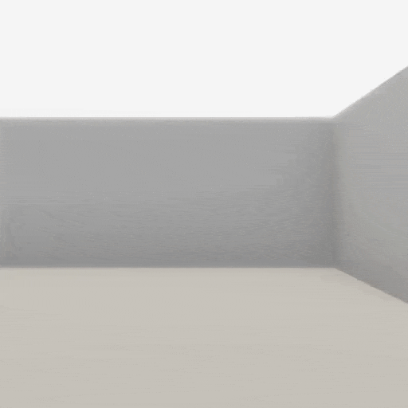

##### Replicants

# Overview

A **Replicant** is a human-like [agent](../agents/overview.md).

Replicants move via a combination of inverse kinematics (IK) for actions such as reaching for an object; the combined joint movement is fluid and plausible. Replicants can also perform arbitrary pre-recorded animations, meaning that specific complex actions are far easier to achieve than in a robotics simulation.

Replicants are visually similar to [non-physics humanoids](../non_physics_humanoids/overview.md) but *do* exist in a physics context. Replicants are massless but will respond to physics. If a Replicant walks into an object, it will push the object aside. Non-physics humanoids, on the other hand, will move through objects without interacting with them.



Replicants differ from [robots](../robots/overview.md) in that they aren't *entirely* physics-driven. In addition  to being massless, Replicant joints aren't defined as motorized drives. Joint velocity, momentum, etc. aren't concepts that exist in the context of a Replicant.

Replicants are thus a compromise on realism: It is far easier to achieve complex behavior with a Replicant than with a robot. On the other hand, the Replicant's motion itself isn't driven by physics to the extent that a robot's would be.

Like robots, Replicants are agents but are *not* [avatars](../core_concepts/avatars.md) in TDW. Avatar commands won't work with robots.

## The `Replicant` add-on

Like robots, Replicants are best controlled via the [`Replicant`](../../python/add_ons/replicant.md) add-on. Like all other add-ons, the `Replicant` add-on decomposes into low-level TDW commands but, given the complexity of the agent, we recommend that you *always* use the `Replicant` add-on rather than directly manipulating the agent with low-level commands.

Adding a Replicant to a scene is simple:

```python
from tdw.controller import Controller
from tdw.tdw_utils import TDWUtils
from tdw.add_ons.replicant import Replicant

c = Controller()
replicant = Replicant()
c.add_ons.append(replicant)
c.communicate(TDWUtils.create_empty_room(12, 12))
```

You can set the initial position and rotation of the Replicant in the constructor:

```python
from tdw.controller import Controller
from tdw.tdw_utils import TDWUtils
from tdw.add_ons.replicant import Replicant

c = Controller()
replicant = Replicant(position={"x": 1, "y": 0, "z": -2},
                      rotation={"x": 0, "y": 30, "z": 0})
c.add_ons.append(replicant)
c.communicate(TDWUtils.create_empty_room(12, 12))
```

There are additional constructor parameters that will be covered in subsequent documents.

## Replicant asset bundles

Like [objects](../core_concepts/objects.md) and [scenes](../core_concepts/scenes.md), Replicants are **asset bundles** stored on a remote S3 server that must be downloaded before they can be added to the scene. This means that when you first add a Replicant to the scene, there will be a brief pause while it is downloaded and loaded into memory. For subsequent scene resets, the Replicant will already in memory and will appear immediately.

## Future development

**The Replicant is usable but unfinished.** This version of the Replicant can be thought of as "Phase 1" and there are known limitations to it. These include:

- The Replicant's pose won't blend between [animations](animations.md), meaning that it will always snap back to a neutral pose at the start of an animation. 
- The Replicant's [turn action](movement.md) doesn't have an animation.
- The Replicant can't bend its fingers to achieve a realistic grasp action.

**All of these limitations will be resolved in future phases of Replicant development.** Additionally, more features will be added to the Replicant over time.

***

**Next: [Actions](actions.md)**

[Return to the README](../../../README.md)

***

Python API:

- [`Replicant`](../../python/add_ons/replicant.md)