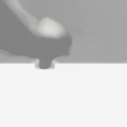

##### Robotics

# Add a camera to a robot

[As noted earlier,](overview.md) robots are not avatars. This means that avatar commands aren't compatible with robots and that robots don't have cameras.

That said, it's possible to add a third-person camera avatar to the scene and "attach" the avatar to a robot.

In this example, we'll will add an avatar and a robot to the scene:

```python
from tdw.controller import Controller
from tdw.tdw_utils import TDWUtils
from tdw.add_ons.robot import Robot

c = Controller()
robot_id = c.get_unique_id()
robot = Robot(name="ur5", robot_id=robot_id)
c.add_ons.append(robot)
commands = [TDWUtils.create_empty_room(12, 12)]
commands.extend(TDWUtils.create_avatar(avatar_id="avatar"))
c.communicate(commands)
```

In the backend, the object hierarchy looks like this:

```
ur5
....shoulder_link
........upper_arm_link
............forearm_link
................wrist_1_link
....................wrist_2_link
........................wrist_3_link
avatar
```

If we send [`parent_avatar_to_robot`](../../api/command_api.md#parent_avatar_to_robot), the avatar will be attached to a specified joint or body part:

```python
from tdw.controller import Controller
from tdw.tdw_utils import TDWUtils
from tdw.add_ons.robot import Robot

c = Controller()
robot_id = c.get_unique_id()
robot = Robot(name="ur5", robot_id=robot_id)
c.add_ons.append(robot)
commands = [TDWUtils.create_empty_room(12, 12)]
commands.extend(TDWUtils.create_avatar(avatar_id="avatar"))
c.communicate(commands)

joint_id = robot.static.joint_ids_by_name["wrist_3_link"]
joint_position = robot.dynamic.joints[joint_id].position
c.communicate({"$type": "parent_avatar_to_robot",
               "position": {"x": 0, "y": 0, "z": 0},
               "body_part_id": joint_id,
               "avatar_id": "avatar",
               "id": robot_id})
```

Now, the backend hierarchy looks like this:

```
ur5
....shoulder_link
........upper_arm_link
............forearm_link
................wrist_1_link
....................wrist_2_link
........................wrist_3_link
............................avatar
```

If we move the arm joints, the camera will move with the joints:

```python
from tdw.controller import Controller
from tdw.tdw_utils import TDWUtils
from tdw.add_ons.robot import Robot
from tdw.add_ons.image_capture import ImageCapture
from tdw.backend.paths import EXAMPLE_CONTROLLER_OUTPUT_PATH

c = Controller()
robot_id = c.get_unique_id()
robot = Robot(name="ur5", robot_id=robot_id)
path = EXAMPLE_CONTROLLER_OUTPUT_PATH.joinpath("parent_robot_to_avatar")
print(f"Images will be saved to: {path}")
capture = ImageCapture(avatar_ids=["avatar"], path=path)
c.add_ons.extend([robot, capture])
commands = [TDWUtils.create_empty_room(12, 12)]
commands.extend(TDWUtils.create_avatar(avatar_id="avatar"))
c.communicate(commands)

joint_id = robot.static.joint_ids_by_name["wrist_3_link"]
joint_position = robot.dynamic.joints[joint_id].position
robot.set_joint_targets(targets={robot.static.joint_ids_by_name["shoulder_link"]: -70,
                                 robot.static.joint_ids_by_name["forearm_link"]: -55,
                                 robot.static.joint_ids_by_name["wrist_3_link"]: 60})
c.communicate({"$type": "parent_avatar_to_robot",
               "position": {"x": 0, "y": 0, "z": 0},
               "body_part_id": joint_id,
               "avatar_id": "avatar",
               "id": robot_id})
while robot.joints_are_moving():
    c.communicate([])
c.communicate({"$type": "terminate"})
```

Result:



***

**Next: [Add multiple robots](multi_robot.md)**

[Return to the README](../../../README.md)

***

Example controllers:

- [robot_camera.py](https://github.com/threedworld-mit/tdw/blob/master/Python/example_controllers/robotics/robot_camera.py) Add a camera to a UR5 robot.

Python API:

- [`Robot`](../../python/add_ons/robot.md)

Command API:

- [`parent_avatar_to_robot`](../../api/command_api.md#parent_avatar_to_robot)