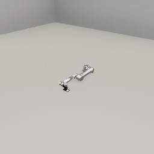

##### Robotics

# The `Robot` add-on

The `Robot` add-on is a high-level add-on for adding and controlling a robot in TDW.

Robots have unique integer IDs (just like objects).

```python
from tdw.controller import Controller
from tdw.tdw_utils import TDWUtils
from tdw.add_ons.robot import Robot
from tdw.add_ons.third_person_camera import ThirdPersonCamera
from tdw.add_ons.image_capture import ImageCapture
from tdw.backend.paths import EXAMPLE_CONTROLLER_OUTPUT_PATH

c = Controller()

# Add a robot.
robot_id = c.get_unique_id()
robot = Robot(name="ur5",
              position={"x": 1, "y": 0, "z": -2},
              rotation={"x": 0, "y": 0, "z": 0},
              robot_id=robot_id)

# Add a camera and enable image capture.
camera = ThirdPersonCamera(avatar_id="a",
                           position={"x": -0.7, "y": 1.7, "z": 0.5},
                           look_at=robot_id)
path = EXAMPLE_CONTROLLER_OUTPUT_PATH.joinpath("robot_add_on")
print(f"Images will be saved to: {path}")
capture = ImageCapture(avatar_ids=["a"], path=path)

c.add_ons.extend([robot, camera, capture])

c.communicate(TDWUtils.create_empty_room(12, 12))

c.communicate({"$type": "terminate"})
```

Result:



## Articulation bodies, collisions, initial joint targets

Robot joints are handled via [ArticulationBodies](https://docs.unity3d.com/2020.1/Documentation/ScriptReference/ArticulationBody.html). ArticulationBodies are very stable when used correctly but brittle when used incorrectly. 

In Unity, if two objects with rigidbodies intersect each other, Unity will try to resolve the issue, sometimes with glitchy behavior. If an object with an ArticulationBody intersects with an object with a Rigibody, the build will likely *crash*. Be careful where you position your robots!

If [collision detection is enabled](../physx/collisions.md) while a robot is intersecting with an object or the floor, the build will crash.

Some robots, such as `ur5` and `ur10`, intersect with the floor when they are first added to the scene. To resolve this, they have initial joint targets that are automatically set by the `Robot` add-on.

To ensure that collision detection can be enabled, wait for the robot to reach its initial targets:

```python
from tdw.controller import Controller
from tdw.tdw_utils import TDWUtils
from tdw.add_ons.robot import Robot
from tdw.add_ons.collision_manager import CollisionManager

c = Controller()
robot = Robot(name="ur5",
              position={"x": 1, "y": 0, "z": -2},
              rotation={"x": 0, "y": 0, "z": 0},
              robot_id=c.get_unique_id())
c.add_ons.append(robot)
c.communicate(TDWUtils.create_empty_room(12, 12))

while robot.joints_are_moving():
    c.communicate([])

# The robot has moved to its initial pose. Enable collision detection.
collision_manager = CollisionManager()
c.add_ons.append(collision_manager)
c.communicate([])

c.communicate({"$type": "terminate"})
```

## Static robot output data

Static robot data includes static data that doesn't change once the robot is created. It is stored in the `Robot` object as `self.static`, a [`RobotStatic`](../../python/robot_data/robot_static.md) data object.

This will add a robot to the scene and print its ID and whether the robot is immovable:

```python
from tdw.controller import Controller
from tdw.tdw_utils import TDWUtils
from tdw.add_ons.robot import Robot

c = Controller()
robot = Robot(name="ur5",
              position={"x": 1, "y": 0, "z": -2},
              rotation={"x": 0, "y": 0, "z": 0},
              robot_id=c.get_unique_id())
c.add_ons.append(robot)
c.communicate(TDWUtils.create_empty_room(12, 12))

print(robot.static.robot_id)
print(robot.static.immovable)

c.communicate({"$type": "terminate"})
```

### Static joint data

Static data for each joint in the robot is stored in the dictionary `RobotStatic.joints`. Key = joint ID (an integer); value = [`JointStatic`](../../python/robot_data/joint_static.md) data.

Each joint has a unique ID and [segmentation color](../visual_perception/id.md) as well as other properties such as mass.

Each joint has a [`JointType`](../../python/robot_data/joint_type.md) expressed as an enum value. There are four types of joints: revolute, prismatic, spherical, and fixed.

```python
from tdw.controller import Controller
from tdw.tdw_utils import TDWUtils
from tdw.add_ons.robot import Robot

c = Controller()
robot = Robot(name="ur5",
              position={"x": 1, "y": 0, "z": -2},
              rotation={"x": 0, "y": 0, "z": 0},
              robot_id=c.get_unique_id())
c.add_ons.append(robot)
c.communicate(TDWUtils.create_empty_room(12, 12))

for joint_id in robot.static.joints:
    joint_name = robot.static.joints[joint_id].name
    joint_mass = robot.static.joints[joint_id].mass
    joint_segmentation_color = robot.static.joints[joint_id].segmentation_color
    joint_type = robot.static.joints[joint_id].joint_type
    print(joint_name, joint_mass, joint_segmentation_color, joint_type)

c.communicate({"$type": "terminate"})
```

Each [joint](../../python/robot_data/joint_static.md) has 0-3 *drives* which are stored in the dictionary `JointStatic.drives`. Key = the drive axis (`"x"`, `"y"`, or `"z"`) and value = a [`Drive`](../../python/robot_data/drive.md). A `Drive` object stores static physics values such as the force limit:

```python
from tdw.controller import Controller
from tdw.tdw_utils import TDWUtils
from tdw.add_ons.robot import Robot

c = Controller()
robot = Robot(name="ur5",
              position={"x": 1, "y": 0, "z": -2},
              rotation={"x": 0, "y": 0, "z": 0},
              robot_id=c.get_unique_id())
c.add_ons.append(robot)
c.communicate(TDWUtils.create_empty_room(12, 12))

for joint_id in robot.static.joints:
    for axis in robot.static.joints[joint_id].drives:
        drive = robot.static.joints[joint_id].drives[axis]
        print(joint_id, drive.axis, drive.damping, drive.stiffness, drive.limits, drive.force_limit)

c.communicate({"$type": "terminate"})
```

`RobotStatic` also stores  dictionary of names and joint IDs for convenience: `joint_ids_by_name`: 

```python
from tdw.controller import Controller
from tdw.tdw_utils import TDWUtils
from tdw.add_ons.robot import Robot

c = Controller()
robot = Robot(name="ur5",
              position={"x": 1, "y": 0, "z": -2},
              rotation={"x": 0, "y": 0, "z": 0},
              robot_id=c.get_unique_id())
c.add_ons.append(robot)
c.communicate(TDWUtils.create_empty_room(12, 12))

for joint_name in robot.static.joint_ids_by_name:
    joint_id = robot.static.joint_ids_by_name
    print(joint_name, joint_id)

c.communicate({"$type": "terminate"})
```

### Static data for non-moving body parts

A robot might have non-moving body parts in addition to joints. Static data for these body parts is stored in `RobotStatic.non_moving`. Key = body part ID. Value = [`NonMoving`](../.../python/robot_data/non_moving.md) data (name, ID, and segmentation color). Note that `NonMoving` objects *do* have segmentation colors, but they're massless.

To get a flat list of all body part and joint IDs in a robot, read `RobotStatic.body_parts` (a list of IDs).

```python
from tdw.controller import Controller
from tdw.tdw_utils import TDWUtils
from tdw.add_ons.robot import Robot

c = Controller()
robot = Robot(name="ur5",
              position={"x": 1, "y": 0, "z": -2},
              rotation={"x": 0, "y": 0, "z": 0},
              robot_id=c.get_unique_id())
c.add_ons.append(robot)
c.communicate(TDWUtils.create_empty_room(12, 12))

for body_part_id in robot.static.non_moving:
    name = robot.static.non_moving[body_part_id]
    segmentation_color = robot.static.non_moving[body_part_id]
    print(body_part_id, name, segmentation_color)

print(robot.static.body_parts)

c.communicate({"$type": "terminate"})
```


## Dynamic robot output data

Dynamic robot data includes data that is updated per-frame. It is stored in the `Robot` object as `self.dynamic`, a [`RobotDynamic`](../../python/robot_data/robot_dynamic.md) data object. 

`RobotDynamic` includes whether the robot's current [`Transform`](../../python/object_data/transform.md) data (position, forward directional vector, and rotation, each expressed as a numpy array):

```python
from tdw.controller import Controller
from tdw.tdw_utils import TDWUtils
from tdw.add_ons.robot import Robot

c = Controller()
robot = Robot(name="ur5",
              position={"x": 1, "y": 0, "z": -2},
              rotation={"x": 0, "y": 0, "z": 0},
              robot_id=c.get_unique_id())
c.add_ons.append(robot)
c.communicate(TDWUtils.create_empty_room(12, 12))

print(robot.dynamic.transform.position,
      robot.dynamic.transform.forward,
      robot.dynamic.transform.rotation)
c.communicate({"$type": "terminate"})
```

#### Dynamic joint data

Dynamic joint data is stored in `self.dynamic.joints`, a dictionary. Key = Joint ID. Value = A [`JointDynamic`](../../python/robot_data/joint_dynamic.md) data object.

```python
from tdw.controller import Controller
from tdw.tdw_utils import TDWUtils
from tdw.add_ons.robot import Robot

c = Controller()
robot = Robot(name="ur5",
              position={"x": 1, "y": 0, "z": -2},
              rotation={"x": 0, "y": 0, "z": 0},
              robot_id=c.get_unique_id())
c.add_ons.append(robot)
c.communicate(TDWUtils.create_empty_room(12, 12))
for joint_id in robot.dynamic.joints:
    print(joint_id,
          robot.dynamic.joints[joint_id].position,
          robot.dynamic.joints[joint_id].moving,
          robot.dynamic.joints[joint_id].angles)
c.communicate({"$type": "terminate"})
```

## Set joint targets

You can manipulate a robot by calling `self.set_joint_targets(targets)`. The `targets` parameter is a dictionary: Key = joint ID, Value = target.

| [`JointType`](../../python/robot_data/joint_type.md) | Target type                   | Target units |
| ---------------------------------------------------- | ----------------------------- | ------------ |
| `revolute`                                           | float                         | degrees      |
| `prismatic`                                          | float                         | meters       |
| `spherical`                                          | dictionary (keys are x, y, z) | degrees      |
| `fixed`                                              | N/A                           | N/A          |

While the joints are moving, `self.joints_are_moving()` will return True. To wait until a robot is done moving, call `communicate()` until `self.joints_are_moving() == False`:

```python
from tdw.controller import Controller
from tdw.tdw_utils import TDWUtils
from tdw.add_ons.robot import Robot
from tdw.add_ons.third_person_camera import ThirdPersonCamera
from tdw.add_ons.image_capture import ImageCapture
from tdw.backend.paths import EXAMPLE_CONTROLLER_OUTPUT_PATH

c = Controller()
robot_id = c.get_unique_id()
robot = Robot(name="ur5",
              position={"x": 1, "y": 0, "z": -2},
              rotation={"x": 0, "y": 0, "z": 0},
              robot_id=robot_id)
# Add a camera and enable image capture.
camera = ThirdPersonCamera(avatar_id="a",
                           position={"x": -0.1, "y": 1.7, "z": 0.1},
                           look_at=robot_id)
path = EXAMPLE_CONTROLLER_OUTPUT_PATH.joinpath("set_joint_targets")
print(f"Images will be saved to: {path}")
capture = ImageCapture(avatar_ids=["a"], path=path)
c.add_ons.extend([robot, camera, capture])
c.communicate(TDWUtils.create_empty_room(12, 12))

# Set the initial pose.
while robot.joints_are_moving():
    c.communicate([])

# Strike a cool pose.
robot.set_joint_targets(targets={robot.static.joint_ids_by_name["shoulder_link"]: 50,
                                 robot.static.joint_ids_by_name["forearm_link"]: -60})

# Wait for the joints to stop moving.
while robot.joints_are_moving():
    c.communicate([])

c.communicate({"$type": "terminate"})
```


## Set joint forces

It is also possible to directly apply forces and torques to joints via `self.add_joint_forces(forces)`. The `forces` parameter is a dictionary: Key = joint ID, value = the force or torque (measured in Newtons):

```python
from tdw.controller import Controller
from tdw.tdw_utils import TDWUtils
from tdw.add_ons.robot import Robot
from tdw.add_ons.third_person_camera import ThirdPersonCamera
from tdw.add_ons.image_capture import ImageCapture
from tdw.backend.paths import EXAMPLE_CONTROLLER_OUTPUT_PATH

c = Controller()
robot_id = c.get_unique_id()
robot = Robot(name="ur5",
              position={"x": 1, "y": 0, "z": -2},
              rotation={"x": 0, "y": 0, "z": 0},
              robot_id=robot_id)
# Add a camera and enable image capture.
camera = ThirdPersonCamera(avatar_id="a",
                           position={"x": -0.1, "y": 1.7, "z": 0.1},
                           look_at=robot_id)
path = EXAMPLE_CONTROLLER_OUTPUT_PATH.joinpath("add_joint_forces")
print(f"Images will be saved to: {path}")
capture = ImageCapture(avatar_ids=["a"], path=path)
c.add_ons.extend([robot, camera, capture])
c.communicate(TDWUtils.create_empty_room(12, 12))

# Set the initial pose.
while robot.joints_are_moving():
    c.communicate([])

# Strike a cool pose.
robot.add_joint_forces(forces={robot.static.joint_ids_by_name["shoulder_link"]: 500,
                               robot.static.joint_ids_by_name["forearm_link"]: -600})

# Wait for the joints to stop moving.
while robot.joints_are_moving():
    c.communicate([])

c.communicate({"$type": "terminate"})
```

## Stop joints

Stop joints in mid-motion by calling `self.stop_joints()`. You can optionally set the `joint_ids` parameter to stop specific joints.

 In this controller, the shoulder link will start to rotate to 70 degrees but will be stopped at 30 degrees:

```python
from tdw.controller import Controller
from tdw.tdw_utils import TDWUtils
from tdw.add_ons.robot import Robot

c = Controller()
robot_id = c.get_unique_id()
robot = Robot(name="ur5",
              position={"x": 1, "y": 0, "z": -2},
              rotation={"x": 0, "y": 0, "z": 0},
              robot_id=robot_id)
c.add_ons.append(robot)
c.communicate(TDWUtils.create_empty_room(12, 12))

while robot.joints_are_moving():
    c.communicate([])

shoulder_id = robot.static.joint_ids_by_name["shoulder_link"]
robot.set_joint_targets(targets={shoulder_id: 70})

while robot.joints_are_moving() and robot.dynamic.joints[shoulder_id].angles[0] < 30:
    c.communicate([])

robot.stop_joints(joint_ids=[shoulder_id])

c.communicate({"$type": "terminate"})
```

## Robot metadata records and the `RobotLibrarian`

Robots are handled in TDW very similarly to [objects](../core_concepts.md). The robots are asset bundles stored on a remote S3 server. There is a corresponding `RobotLibrarian` collection of metadata records.

This will print the name of each robot that is included by default in TDW:

```python
from tdw.librarian import RobotLibrarian

lib = RobotLibrarian()
for record in lib.records:
    print(record.name)
```

***

**Next: [The `RobotLibrarian`](robot_librarian.md)**

[Return to the README](../../../README.md)

***

Example controllers:

- [set_joint_targets.py](https://github.com/threedworld-mit/tdw/blob/master/Python/example_controllers/robotics/set_joint_targets.py) Set the joint targets of a UR5 robot.

Python API:

- [`Robot`](../../python/add_ons/robot.md)
- [`RobotSatic`](../../python/robot_data/joint_static.md)
  - [`JointStatic`](../../python/robot_data/joint_static.md)
    - [`JointType`](../../python/robot_data/joint_type.md)
    - [`Drive`](../../python/robot_data/drive.md)
    - [`NonMoving`](../../python/robot_data/non_moving.md)
- [`RobotDynamic`](../../python/robot_data/robot_dynamic.md)
  - [`JointDynamic`](../../python/robot_data/joint_dynamic.md)
- [`Transform`](../../python/object_data/transform.md)

