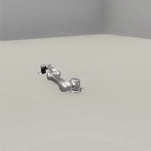

##### Robots

# Robot arm add-ons

[`RobotArm`](../../python/add_ons/robot_arm.md) is an abstract class that extends `Robot`. The main difference is that it adds an inverse kinematics (IK) solver and a `reach_for(target)` function. If you call this function, the robot will set its joint targets to reach for the target position.

Internally, each robot arm requires its own IK chain. This chain is derived from a .urdf file but is often not the *same* as the data in the .urdf file. Reasons include differences between how ROS and Unity handle local coordinate systems and differences between the robot in TDW (which is sometimes missing fixed joints for the sake of simplicity) and the original robot.

Therefore, each robot arm needs to extend the `RobotArm` class. At present, TDW includes a [`UR5`](../../python/add_ons/ur5.md) robot arm:

```python
import numpy as np
from tdw.controller import Controller
from tdw.tdw_utils import TDWUtils
from tdw.add_ons.ur5 import UR5
from tdw.add_ons.third_person_camera import ThirdPersonCamera
from tdw.add_ons.image_capture import ImageCapture
from tdw.backend.paths import EXAMPLE_CONTROLLER_OUTPUT_PATH

c = Controller()
ur5 = UR5(robot_id=0)
camera = ThirdPersonCamera(avatar_id="a",
                           position={"x": -0.881, "y": 0.836, "z": -1.396},
                           look_at={"x": 0, "y": 0.2, "z": 0})
path = EXAMPLE_CONTROLLER_OUTPUT_PATH.joinpath("ur5_ik")
print(f"Images will be saved to: {path}")
capture = ImageCapture(avatar_ids=["a"], path=path)
c.add_ons.extend([ur5, camera, capture])
c.communicate(TDWUtils.create_empty_room(12, 12))

# Reach for a target position.
target_position = np.array([0.3, 0.7, 0.3])
ur5.reach_for(target=target_position)
while ur5.joints_are_moving():
    c.communicate([])

# Calculate the distance from the end effector to the target position.
end_effector_position = ur5.dynamic.joints[ur5.static.joint_ids_by_name["wrist_3_link"]].position
print(np.linalg.norm(target_position - end_effector_position))
c.communicate({"$type": "terminate"})
```

Output: 

```
0.023655123974454323
```



## Define your own robot arm

To define a robot arm that can use IK, create a new subclass of `RobotArm` and define these functions:

```python
import numpy as np
from ikpy.link import OriginLink, URDFLink, Link
from typing import List
from tdw.add_ons.robot_arm import RobotArm


class MyRobotArm(RobotArm):
    def _get_name(self) -> str:
        # Your code here.

    def _get_joint_order(self) -> List[str]:
        # Your code here.

    def _get_links(self) -> List[Link]:
        # Your code here.
```

- `_get_name()` returns a string, such as `"ur5"`
- `_get_joint_order()` returns a list of joint names. This is the order of joint names as they'll appear in the IK joint chain.
- `_get_links()` returns a list of IK links. See the code for `ur5.py` for an example of how to accurately convert from a .urdf file to a TDW link chain.

***

**Next: [Robot collision detection](collision_detection.md)**

[Return to the README](../../../README.md)

***

Example controllers:

- [ur5_ik.py](https://github.com/threedworld-mit/tdw/blob/master/Python/example_controllers/robots/ur5_ik.py) Control a UR5 robot arm with inverse kinematics (IK).

Python API:

- [`RobotArm`](../../python/add_ons/robot_arm.md)
- [`UR5`](../../python/add_ons/ur5.md)