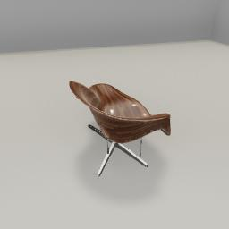
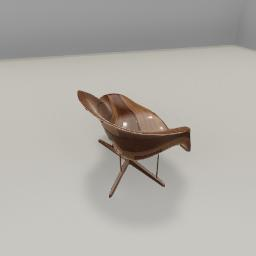

##### Objects and Scenes

# Visual materials, textures, and colors

Unity differentiates between _visual materials_ and _textures_ and _colors_; these three terms are _not_ interchangeable. This document will give an overview of some of the fundamental differences.

- Every model in TDW is composed of *n*  **meshes**. Multiple meshes *does not* mean that a model has joints or affordances. Many of TDW's models were purchased from a third party and whether or not there are multiple "sub-meshes" is entirely dependent on how the original artist designed it.
- In TDW,  a **substructure** is a metadata list of and object's meshes plus each mesh's visual material(s).
- A **visual material** (often abbreviated to "material") is a binary file containing an initialized _shader_. A shader is a tiny program that is used to render a 3D object. The material shader might contain info such the *texture*, *color*, and what happens when light hits the material (i.e. its shininess, bumpiness, and so on). Every mesh in a TDW model has at least one material but may have more.
- A **texture**  is a .jpg or .png file. It is one of many aspects of a material. In computer graphics, the term _texture_ is often used interchangeably with _map_. In TDW, most most materials have one albedo texture. There can be other textures as well, such as a normal map, which can adjust what happens when light hits a model (for example, by creating grooves or bumps even if the underlying mesh is smooth).
- A material's albedo texture can be tinted by a **color**. Set the color of a model with [`set_color`](../../api/command_api.md#set_color); see [this document](../core_concepts/objects.md) for example implementation.

## Material asset bundles

TDW includes hundreds of visual materials. These materials are stored as asset bundles, just like [models](../core_concepts/objects.md).

The metadata for each material is stored in a [`MaterialLibrarian`](../../python/librarian/material_librarian.md):

```python
from tdw.librarian import MaterialLibrarian

librarian = MaterialLibrarian()
record = librarian.records[0]
print(record.name)  # 3d_mesh_technical_fabric
```

The default materials of each model don't have semantic classification, but the material asset bundles do:

```python
from tdw.librarian import MaterialLibrarian

librarian = MaterialLibrarian()
record = librarian.records[0]
print(record.name, record.type)  # 3d_mesh_technical_fabric Metal
```

You can sort materials by their semantic type:

```python
from tdw.librarian import MaterialLibrarian

librarian = MaterialLibrarian()
for material_type in librarian.get_material_types():
    print(material_type)
    for record in librarian.get_all_materials_of_type(material_type):
        print("    " + record.name)
    print("")
```

Unlike TDW's Model Librarians which group models by broad categories (for example, free vs. non-free), the Material Librarians group materials by *quality*. Each material has three quality levels: "low", "med", and "high". Higher-quality materials will look slightly better but take longer to download and use more memory:

```python
from requests import head
from tdw.librarian import MaterialLibrarian

material = "3d_mesh_technical_fabric"
for librarian_name in MaterialLibrarian.get_library_filenames():
    librarian = MaterialLibrarian(librarian_name)
    record = librarian.get_record(material)
    size = head(record.get_url()).headers["Content-Length"]
    print(material, librarian_name, size)
```

Output:

```
3d_mesh_technical_fabric materials_med.json 4519259
3d_mesh_technical_fabric materials_low.json 1236628
3d_mesh_technical_fabric materials_high.json 16810082
```

## How to get images of every material in the library

The TDW repo includes [a controller that will create images of every material in the material library](https://github.com/threedworld-mit/tdw/blob/master/Python/screenshotter.py):

1. `cd path/to/tdw/Python` (replace `path/to` with the actual path)
2. `python3 screenshotter.py --type materials`
3. [Launch the build manually](../core_concepts/launch_build.md)

Images will be saved to `~/TDWImages` (where `~` is your home directory).

You can review the images with the [TDW Material Visualizer](https://github.com/threedworld-mit/tdw_visualizers).

## Set the visual material of an object

To set a visual material, you need to do at least the following steps:

1. Add an object to the scene.
2. Get the object's model substructure.
3. Get a material metadata record.
4. Add the material to the scene with the [`add_material` command ](../../api/command_api.md#add_material).
5. Set the visual material of one of the object's sub-mesh's materials with the [`set_visual_material` command](../../api/command_api.md#set_visual_material).

Metadata for an object's **substructure** (see the beginning of this document) is stored in [model records](../../python/librarian/model_librarian.md):

```python
from tdw.librarian import ModelLibrarian

librarian = ModelLibrarian()
record = librarian.get_record("034_vray")
print(record.substructure)
```

Output:

```
[{'materials': ['cgaxis_electronics_34_01'], 'name': 'cgaxis_electronics_34_01'}, {'materials': ['cgaxis_electronics_34_02'], 'name': 'cgaxis_electronics_34_02'}, {'materials': ['cgaxis_electronics_34_03'], 'name': 'cgaxis_electronics_34_03'}, {'materials': ['cgaxis_electronics_34_04'], 'name': 'cgaxis_electronics_34_04'}, {'materials': ['cgaxis_electronics_34_05'], 'name': 'cgaxis_electronics_34_05'}, {'materials': ['cgaxis_electronics_34_06'], 'name': 'cgaxis_electronics_34_06'}, {'materials': ['SolidTiles_Opaque'], 'name': 'cgaxis_electronics_34_07'}, {'materials': ['SolidTiles_Opaque'], 'name': 'cgaxis_electronics_34_08'}, {'materials': ['SolidTiles_Transparent'], 'name': 'cgaxis_electronics_34_09'}]
```

The low-level commands required for setting an object's visual material(s) are relatively complicated but TDW includes some wrapper functions to make it easier. For the sake of understanding how it works, we'll start with the low-level API calls and then explain the wrapper functions.

```python
from tdw.controller import Controller
from tdw.tdw_utils import TDWUtils
from tdw.add_ons.third_person_camera import ThirdPersonCamera
from tdw.add_ons.image_capture import ImageCapture
from tdw.librarian import ModelLibrarian, MaterialLibrarian
from tdw.backend.paths import EXAMPLE_CONTROLLER_OUTPUT_PATH

c = Controller()
object_id = c.get_unique_id()

material_record = MaterialLibrarian("materials_low.json").get_record("parquet_long_horizontal_clean")
model_record = ModelLibrarian().get_record("white_lounger_chair")
cam = ThirdPersonCamera(position={"x": 2, "y": 1.6, "z": -0.6},
                        look_at=object_id)
path = EXAMPLE_CONTROLLER_OUTPUT_PATH.joinpath("set_visual_material")
print(f"Images will be saved to: {path}")
cap = ImageCapture(avatar_ids=[cam.avatar_id], pass_masks=["_img"], path=path)
c.add_ons.extend([cam, cap])

# Create the scene, add the object, add a visual material, and set the visual material of one of the model's sub-meshes.
c.communicate([TDWUtils.create_empty_room(12, 12),
               {"$type": "add_object",
                "name": model_record.name,
                "url": model_record.get_url(),
                "scale_factor": model_record.scale_factor,
                "position": {"x": 0, "y": 0, "z": 0},
                "rotation": {"x": 0, "y": 0, "z": 0},
                "category": model_record.wcategory,
                "id": object_id},
               {"$type": "add_material",
                "name": material_record.name,
                "url": material_record.get_url()},
               {"$type": "set_visual_material",
                "material_index": 0,
                "material_name": material_record.name,
                "object_name": "Object017",
                "id": object_id}])
c.communicate({"$type": "terminate"})
```

Result:



Like the `add_object` command, which has a helpful wrapper function (`Controller.get_add_object()`) and the `add_scene` command which has a `Controller.get_add_scene()` wrapper function, `add_material` has a `Controller.get_add_material()` command which adds the material without needing to first fetching the record (the metadata is handled automatically by the function):

```python
from tdw.controller import Controller
from tdw.tdw_utils import TDWUtils
from tdw.add_ons.third_person_camera import ThirdPersonCamera
from tdw.add_ons.image_capture import ImageCapture
from tdw.librarian import ModelLibrarian
from tdw.backend.paths import EXAMPLE_CONTROLLER_OUTPUT_PATH

c = Controller()
object_id = c.get_unique_id()

model_record = ModelLibrarian().get_record("white_lounger_chair")
material_name = "parquet_long_horizontal_clean"
cam = ThirdPersonCamera(position={"x": 2, "y": 1.6, "z": -0.6},
                        look_at=object_id)
path = EXAMPLE_CONTROLLER_OUTPUT_PATH.joinpath("set_visual_material")
print(f"Images will be saved to: {path}")
cap = ImageCapture(avatar_ids=[cam.avatar_id], pass_masks=["_img"], path=path)
c.add_ons.extend([cam, cap])

c.communicate([TDWUtils.create_empty_room(12, 12),
               c.get_add_object(model_name=model_record.name,
                                object_id=object_id),
               c.get_add_material(material_name=material_name),
               {"$type": "set_visual_material",
                "material_index": 0,
                "material_name": material_name,
                "object_name": "Object017",
                "id": object_id}])
c.communicate({"$type": "terminate"})
```

You can see, though, that `set_visual_material` is still potentially difficult to use as it requires you to know ahead of time where each sub-object is, what its name is (in this case, Object017), and how many materials it has by default.

Unfortunately, TDW doesn't currently have a database of this information as creating one would require an huge amount of effort and time.

You can, however, set *all* of an object's visual materials at once with the wrapper function `TDWUtils.set_visual_material()`:

```python
from tdw.controller import Controller
from tdw.tdw_utils import TDWUtils
from tdw.add_ons.third_person_camera import ThirdPersonCamera
from tdw.add_ons.image_capture import ImageCapture
from tdw.librarian import ModelLibrarian
from tdw.backend.paths import EXAMPLE_CONTROLLER_OUTPUT_PATH

c = Controller()
object_id = c.get_unique_id()

model_record = ModelLibrarian().get_record("white_lounger_chair")
material_name = "parquet_long_horizontal_clean"
cam = ThirdPersonCamera(position={"x": 2, "y": 1.6, "z": -0.6},
                        look_at=object_id)
path = EXAMPLE_CONTROLLER_OUTPUT_PATH.joinpath("set_visual_material")
print(f"Images will be saved to: {path}")
cap = ImageCapture(avatar_ids=[cam.avatar_id], pass_masks=["_img"], path=path)
c.add_ons.extend([cam, cap])

commands = [TDWUtils.create_empty_room(12, 12),
            c.get_add_object(model_name=model_record.name,
                             object_id=object_id),
            c.get_add_material(material_name=material_name)]
# Set all of the object's visual materials.
commands.extend(TDWUtils.set_visual_material(c=c, substructure=model_record.substructure, material="parquet_long_horizontal_clean", object_id=object_id))
c.communicate(commands)
c.communicate({"$type": "terminate"})
```

Result:


Each of these properties is a _channel_.

Every mesh in Unity _must_ have at least 1 material (or it will appear as horrible pink). It is possible for a mesh to have more than 1 material, and those materials can interact in myriad ways. Just a few examples of possibilities:
-  Decals on a racecar; the car's paint and the decal could be handled as separate materials.)
-  A puddle in the dirt might be handled as two materials on a flat surface that are blended together.

Every model in the TDW model library is comprised of _n_ meshes, each of which have _m_ materials. You can switch any material of any mesh of any object by sending [`set_visual_material`](../../api/command_api.md#set_visual_material).

## Set the texture scale

It is possible to scale the textures of a material to make them appear larger or smaller with the [`set_texture_scale` command](../../api/command_api.md#set_texture_scale). By default, texture scales are always (1, 1) but this doesn't necessarily indicate an "actual" size in real-world units. Larger values mean that the texture will be *smaller* and repeat more often:

```python
from tdw.controller import Controller
from tdw.tdw_utils import TDWUtils
from tdw.add_ons.third_person_camera import ThirdPersonCamera
from tdw.add_ons.image_capture import ImageCapture
from tdw.librarian import ModelLibrarian
from tdw.backend.paths import EXAMPLE_CONTROLLER_OUTPUT_PATH

c = Controller()
object_id = c.get_unique_id()

model_record = ModelLibrarian().get_record("white_lounger_chair")
material_name = "parquet_long_horizontal_clean"
cam = ThirdPersonCamera(position={"x": 2, "y": 1.6, "z": -0.6},
                        look_at=object_id)
path = EXAMPLE_CONTROLLER_OUTPUT_PATH.joinpath("set_visual_material")
print(f"Images will be saved to: {path}")
cap = ImageCapture(avatar_ids=[cam.avatar_id], pass_masks=["_img"], path=path)
c.add_ons.extend([cam, cap])

commands = [TDWUtils.create_empty_room(12, 12),
            c.get_add_object(model_name=model_record.name,
                             object_id=object_id),
            c.get_add_material(material_name=material_name)]
commands.extend(TDWUtils.set_visual_material(c=c, substructure=model_record.substructure, material=material_name, object_id=object_id))
for sub_object in model_record.substructure:
    commands.append({"$type": "set_texture_scale",
                     "object_name": sub_object["name"],
                     "id": object_id,
                     "scale": {"x": 0.1, "y": 0.1}})
c.communicate(commands)
c.communicate({"$type": "terminate"})
```

Result:



## Visual materials and realism

Visual materials in TDW are realistic in the sense that many of them are derived directly from real world imagery data. However, in some cases it may not be possible to change the visual  material of an object and still have it look plausible. For example, a dog object's material might use a photographic texture, so using any  other material would look implausible.

Switching visual materials is most effective for use cases the primary goal is to increase image variability, differentiate between objects, or other situations in which realism isn't the primary goal.


***

**Next: [Procedural generation (scenes)](proc_gen_room.md)**

[Return to the README](../../../README.md)

***

Example controllers:

- [set_visual_material.py](https://github.com/threedworld-mit/tdw/blob/master/Python/example_controllers/objects_and_scenes/set_visual_material.py) Set an object's visual material.

Command API:

- [`set_color`](../../api/command_api.md#set_color)
- [`add_material`](../../api/command_api.md#add_material)
- [`set_visual_material`](../../api/command_api.md#set_visual_material)
- [`set_texture_scale`](../../api/command_api.md#set_texture_scale)

Python API:

- [`MaterialLibrarian`](../../python/librarian/material_librarian.md) Material librarian for metadata records.
- [`Controller.get_add_material(material_name, library)`](../../python/controller.md) Get a valid `add_material` command.
- [`TDWUtils.set_visual_material(controller, substructure, material, object_id)`](../../python/tdw_utils.md) Set the visual material for all materials.

Utility applications:

- [TDW Material Visualizer](https://github.com/threedworld-mit/tdw_visualizers)
