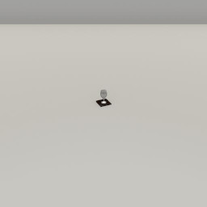
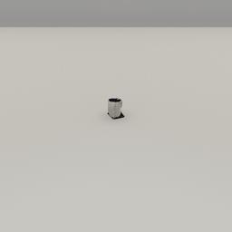
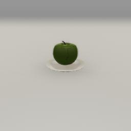
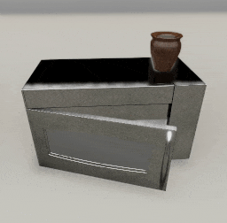
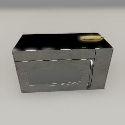

##### Scene Setup (High-Level APIs)

# Procedural object arrangements

In [`ProcGenKitchen`](proc_gen_kitchen.md), objects are grouped into pseudo-atomic "arrangements". Each arrangement is procedurally generated. For example, a single kitchen counter with objects on top of the counter and inside the cabinet is generated via a [`KitchenCounter`](../../python/proc_gen/arrangements/kitchen_counter.md) arrangement.

Arrangement data classes are similar to add-ons in that they accept parameters and generate commands, but they are meant to be used *within* an add-on in groups. In `ProcGenKitchen`, multiple kitchen counters, wall cabinets, etc. are placed alongside each other in the room.

Arrangements are procedurally generated. The models used are randomly selected from pre-categorized lists. Object positions, rotations, etc. are also randomized within various constraints.

## `Arrangement` class hierarchy

Arrangements are all data objects. Every type of arrangement is a subclass of [`Arrangement`](../../python/proc_gen/arrangements/arrangement.md). Some arrangement types may have intermediary abstract subclasses such as [`ArrangementWithRootObject`](../../python/proc_gen/arrangements/arrangement_with_root_object.md).

There are many `Arrangement` sub-classes; see the bottom of this document for a list. As adding example controller code to this document for every `Arrangement` would be so verbose as to make this document unreadable, only a few notable examples would be shown. For others, you should read the API documentation.

### Example A: `CupAndCoaster`

A [`CupAndCoaster`](../../python/proc_gen/arrangements/cup_and_coaster.md) is a subclass of [`Arrangement`](../../python/proc_gen/arrangements/arrangement.md). It creates either a cup or a wine glass. 50% of the time, there is a coaster under the cup or glass.

`CupAndCoaster` has the following constructor parameters:

- `position` sets the position of the arrangement (either the coaster or, if there is no coaster, the cup or wineglass).
- `rng` is optional and defaults to None. It is either a random seed (and integer) or a `numpy.random.RandomState` object. If None, a new `numpy.random.RandomState` object is created.

This example controller adds a `CupAndCoaster` to the scene:

```python
from tdw.controller import Controller
from tdw.tdw_utils import TDWUtils
from tdw.add_ons.image_capture import ImageCapture
from tdw.add_ons.third_person_camera import ThirdPersonCamera
from tdw.proc_gen.arrangements.cup_and_coaster import CupAndCoaster
from tdw.backend.paths import EXAMPLE_CONTROLLER_OUTPUT_PATH

# Add a camera and enable image capture.
path = EXAMPLE_CONTROLLER_OUTPUT_PATH.joinpath("cup_and_coaster")
print(f"Images will be saved to: {path}")
camera = ThirdPersonCamera(position={"x": -1.5, "y": 0.8, "z": 0},
                           look_at={"x": 0, "y": 0, "z": 0},
                           avatar_id="a")
capture = ImageCapture(avatar_ids=["a"], path=path, pass_masks=["_img"])
# Start the controller.
c = Controller()
c.add_ons.extend([camera, capture])
# Add a `CupAndCoaster` arrangement.
cup_and_coaster = CupAndCoaster(position={"x": 0, "y": 0, "z": 0},
                                rng=0)
# Create the scene.
commands = [TDWUtils.create_empty_room(12, 12)]
# Add commands to create the cup and coaster.
commands.extend(cup_and_coaster.get_commands())
# Send the commands.
c.communicate(commands)
c.communicate({"$type": "terminate"})
```

Result:



### Example B: `CupAndCoaster` and `MODEL_CATEGORIES`

`Arrangement.MODEL_CATEGORIES` is a dictionary of "proc-gen categories" and lists of model names. The categories and model names as a curated subset of models from `models_core.json`. Proc-gen categories overlap with, but are not the same as, `model_record.wcategory`.

This will print a list of all cups:

```python
from tdw.proc_gen.arrangements.arrangement import Arrangement

for model_name in Arrangement.MODEL_CATEGORIES["cup"]:
    print(model_name)
```

Output:

```
coffeecup004_fix
coffeemug
cup
```

An additional class variable, `CupAndCoaster.CUP_CATEGORIES`, controls which categories are considered "cups" for the purposes of this particular arrangement:

```python
from tdw.proc_gen.arrangements.cup_and_coaster import CupAndCoaster

for category in CupAndCoaster.CUP_CATEGORIES:
    print(category)
```

Output:

```
cup
wineglass
```

To force `CupAndCoaster` to use a specific cup or wineglass, we can set both `MODEL_CATEGORIES` and `CUP_CATEGORIES`:

```python
from tdw.controller import Controller
from tdw.tdw_utils import TDWUtils
from tdw.add_ons.image_capture import ImageCapture
from tdw.add_ons.third_person_camera import ThirdPersonCamera
from tdw.proc_gen.arrangements.cup_and_coaster import CupAndCoaster
from tdw.backend.paths import EXAMPLE_CONTROLLER_OUTPUT_PATH

# Add a camera and enable image capture.
path = EXAMPLE_CONTROLLER_OUTPUT_PATH.joinpath("cup_and_coaster")
print(f"Images will be saved to: {path}")
camera = ThirdPersonCamera(position={"x": -1.5, "y": 0.8, "z": 0},
                           look_at={"x": 0, "y": 0, "z": 0},
                           avatar_id="a")
capture = ImageCapture(avatar_ids=["a"], path=path, pass_masks=["_img"])
# Start the controller.
c = Controller()
c.add_ons.extend([camera, capture])
# Use only models from the category "cup".
CupAndCoaster.CUP_CATEGORIES = ["cup"]
# Use only the coffee mug model.
CupAndCoaster.MODEL_CATEGORIES["cup"] = ["coffeemug"]
# Add a `CupAndCoaster` arrangement.
cup_and_coaster = CupAndCoaster(position={"x": 0, "y": 0, "z": 0},
                                rng=0)
# Create the scene.
commands = [TDWUtils.create_empty_room(12, 12)]
# Add commands to create the cup and coaster.
commands.extend(cup_and_coaster.get_commands())
# Send the commands.
c.communicate(commands)
c.communicate({"$type": "terminate"})
```

Result:



### Example C: `Plate`

[`Plate`](../../python/proc_gen/arrangements/plate.md) is a subclass of [`ArrangementWithRootObject`](../../python/proc_gen/arrangements/arrangement_with_root_object.md). A plate may have food on top of it.

`Plate` has the following constructor parameters:

- `food_probability` is a float between 0 and 1 and defines the probability of adding food on top of the plate.
- `position` sets the position of the root object (the plate).
- `model` is optional and not shown in this example; set this to set the plate model. This can be either a string (a model name) or a `ModelRecord`.
- `rng` is optional and defaults to None. It is either a random seed (and integer) or a `numpy.random.RandomState` object. If None, a new `numpy.random.RandomState` object is created.

Additionally, `Plate` has a field, `root_object_id`, not found in `Arrangement` (and, by extension, not found in `CupAndCoaster`). `ArrangementWithRootObject` subclasses all have a "root object" and any number of "child objects". `root_object_id` is set after calling `get_commands()`.

This example controller adds a `Plate` to the scene. Note that in the `CupAndCoaster` example, we added the add-ons, then the `CupAndCoaster`, then called `cup_and_coaster.get_commands()`. In *this* example, the order is flipped. This is because we want the camera to look at the plate; to do this, we need to set `plate.root_object_id` which means that we need to call `plate.get_commands()` before creating the `ThirdPersonCamera`.

```python
from tdw.controller import Controller
from tdw.tdw_utils import TDWUtils
from tdw.add_ons.image_capture import ImageCapture
from tdw.add_ons.third_person_camera import ThirdPersonCamera
from tdw.proc_gen.arrangements.plate import Plate
from tdw.backend.paths import EXAMPLE_CONTROLLER_OUTPUT_PATH

# Add a `Plate` arrangement.
plate = Plate(position={"x": 0, "y": 0, "z": 0},
              rng=0,
              food_probability=1)
plate_commands = plate.get_commands()
# The object ID of the plate is the root ID of the arrangement.
plate_id = plate.root_object_id
# Add a camera and enable image capture. Look at the plate.
path = EXAMPLE_CONTROLLER_OUTPUT_PATH.joinpath("plate")
print(f"Images will be saved to: {path}")
camera = ThirdPersonCamera(position={"x": 0.5, "y": 0.2, "z": 0},
                           look_at=plate_id,
                           avatar_id="a")
capture = ImageCapture(avatar_ids=["a"], path=path, pass_masks=["_img"])
# Start the controller.
c = Controller()
c.add_ons.extend([camera, capture])
# Create the scene.
commands = [TDWUtils.create_empty_room(12, 12)]
# Add commands to create the arrangement.
commands.extend(plate_commands)
# Send the commands.
c.communicate(commands)
c.communicate({"$type": "terminate"})
```

Result:



### Example D: `Microwave`

Like the previous `Plate` example, [`Microwave`](../../python/proc_gen/arrangements/microwave.md) is a subclass of [`ArrangementWithRootObject`](../../python/proc_gen/arrangements/arrangement_with_root_object.md). Unlike `Plate`, `Microwave` can actually create a sub-`Arrangement`: in this case, it might add a `Plate` arrangement inside the microwave. A `Microwave` also has objects on top of it.

`Microwave` has the following constructor parameters:

- `plate_probability` is a float between 0 and 1 and defines the probability of adding a `Plate` arrangement.
- `food_probability` is a float between 0 and 1 and defines the probability of adding food on top of the plate.
- `wall` is a [`CardinalDirection`](../../python/cardinal_direction.md). This controls the rotation of the microwave and the rest of the arrangment.
- `position` sets the position of the root object (the microwave).
- `plate_model` is optional and can set the plate model; it can be either a string (the model name) or a `ModelRecord`.
- `model` is optional and can set the microwave model; it can be either a string (the model name) or a `ModelRecord`.
- `rng` is optional and defaults to None. It is either a random seed (and integer) or a `numpy.random.RandomState` object. If None, a new `numpy.random.RandomState` object is created.

All microwave models used by the `Microwave` arrangement are [composite objects](../semantic_states/composite_objects.md) with articulated doors.

This example controller adds a `Microwave` to the scene. We'll add a [`CompositeObjectManager`](../../python/add_ons/composite_object_manager.md) and use it to open the microwave door so that we can see the `Plate` arrangement. To open the door, we use some low-level API commands. In most controllers that use articulated objects, an [agent](../agents/overview.md) would open the door instead.

```python
from tdw.controller import Controller
from tdw.tdw_utils import TDWUtils
from tdw.add_ons.image_capture import ImageCapture
from tdw.add_ons.third_person_camera import ThirdPersonCamera
from tdw.add_ons.composite_object_manager import CompositeObjectManager
from tdw.proc_gen.arrangements.microwave import Microwave
from tdw.backend.paths import EXAMPLE_CONTROLLER_OUTPUT_PATH
from tdw.cardinal_direction import CardinalDirection

# Add a `Microwave` arrangement.
microwave = Microwave(position={"x": 0, "y": 0, "z": 0},
                      rng=2,
                      food_probability=0.6,
                      plate_probability=1,
                      wall=CardinalDirection.west)
microwave_commands = microwave.get_commands()
# The object ID of the microwave is the root ID of the arrangement.
microwave_id = microwave.root_object_id
# Add a camera and enable image capture. Look at the microwave.
path = EXAMPLE_CONTROLLER_OUTPUT_PATH.joinpath("microwave")
print(f"Images will be saved to: {path}")
camera = ThirdPersonCamera(position={"x": 1, "y": 0.8, "z": 0},
                           look_at=microwave_id,
                           avatar_id="a")
capture = ImageCapture(avatar_ids=["a"], path=path, pass_masks=["_img"])
# Add a composite object manager, which we'll use to open the microwave door.
composite_object_manager = CompositeObjectManager()
# Start the controller.
c = Controller()
c.add_ons.extend([camera, capture, composite_object_manager])
# Create the scene.
commands = [TDWUtils.create_empty_room(12, 12)]
# Add commands to create the arrangement.
commands.extend(microwave_commands)
# Send the commands.
c.communicate(commands)
# Start to open the door.
commands.clear()
for object_id in composite_object_manager.static:
    if object_id == microwave_id:
        for spring_id in composite_object_manager.static[object_id].springs:
            commands.extend([{"$type": "set_spring_force",
                              "spring_force": 50,
                              "id": spring_id},
                             {"$type": "set_spring_target_position",
                              "target_position": 90,
                              "id": spring_id}])
        break
c.communicate(commands)
# Open the door.
for i in range(50):
    c.communicate([])
c.communicate({"$type": "terminate"})
```

Result:



### Example E: Set the objects `ON_TOP_OF` the `Microwave`

`ArrangementWithRootObject` (and, by extension, `Microwave` as well as `Plate`) has three dictionaries defining which single (non-arrangement) *categories* (not models) can be placed with respect to the root object. In this case, `ON_TOP_OF["microwave"]` defines the categories of models that can be placed on the microwave. You can modify this list as needed, provided that the model is also listed somewhere in `MODEL_CATEGORIES` (see above).

This example forces the `Microwave` to add only bananas on top of it:

```python
from tdw.controller import Controller
from tdw.tdw_utils import TDWUtils
from tdw.add_ons.image_capture import ImageCapture
from tdw.add_ons.third_person_camera import ThirdPersonCamera
from tdw.proc_gen.arrangements.microwave import Microwave
from tdw.backend.paths import EXAMPLE_CONTROLLER_OUTPUT_PATH
from tdw.cardinal_direction import CardinalDirection

# Add a `Microwave` arrangement.
microwave = Microwave(position={"x": 0, "y": 0, "z": 0},
                      rng=2,
                      food_probability=0.6,
                      plate_probability=1,
                      wall=CardinalDirection.west)
# Only bananas can be on top of the microwave.
Microwave.ON_TOP_OF["microwave"] = ["banana"]
microwave_commands = microwave.get_commands()
# The object ID of the microwave is the root ID of the arrangement.
microwave_id = microwave.root_object_id
# Add a camera and enable image capture. Look at the microwave.
path = EXAMPLE_CONTROLLER_OUTPUT_PATH.joinpath("microwave")
print(f"Images will be saved to: {path}")
camera = ThirdPersonCamera(position={"x": 1, "y": 0.8, "z": 0},
                           look_at=microwave_id,
                           avatar_id="a")
capture = ImageCapture(avatar_ids=["a"], path=path, pass_masks=["_img"])
# Start the controller.
c = Controller()
c.add_ons.extend([camera, capture])
# Create the scene.
commands = [TDWUtils.create_empty_room(12, 12)]
# Add commands to create the arrangement.
commands.extend(microwave_commands)
# Send the commands.
c.communicate(commands)
c.communicate({"$type": "terminate"})
```

Result:



### Example F: `KitchenCounter`

[`KitchenCounter`](../../python/proc_gen/arrangements/kitchen_counter.md) is a subclass of [`KitchenCabinet`](../../python/proc_gen/arrangements/kitchen_cabinet.md), which is a subclass of [`ArrangementAlongWall`](../../python/proc_gen/arrangements/arrangement_along_wall.md), which is a subclass of  [`ArrangementWithRootObject`](../../python/proc_gen/arrangements/arrangement_with_root_object.md), which is a subclass of  [`Arrangement`](../../python/proc_gen/arrangements/arrangement.md). 

A `KitchenCounter` is positioned very differently than arrangements in previous examples in that it doesn't have an explicit `position` constructor parameter. Instead, a `KitchenCounter` is positioned in relationship to the room: a `distance` from a `corner` along a `wall`. 

A `KitchenCounter` may have objects inside its cabinet (which has an articulated door). On the counter top, there will either be random single objects or a `Microwave` arrangement (which in turn may have a `Plate` and objects on top of it). A kitchen counter may also create a [`WallCabinet`](../../python/proc_gen/arrangements/wall_cabinet.md) above it, which in turn may have its own objects or sub-arrangements.

`KitchenCounter` has the following constructor parameters:

- `cabinetry` defines the cabinetry set; this is used to make all kitchen cabinets, sinks, etc. in the scene look like they're part of the same set. `cabinetry` is of type [`Cabinetry`](../../python/proc_gen/arrangements/cabinetry/cabinetry.md). There are two pre-defined `Cabinetry` sets; see `tdw.proc_gen.arrangements.cabinetry.cabinetry.CABINETRY`, a dictionary where the key is a  [`CabinetryType`](../../python/proc_gen/arrangements/cabinetry/cabinetry_type.md) and the value is a pre-set [`Cabinetry`](../../python/proc_gen/arrangements/cabinetry/cabinetry.md).
- `corner` is an [`OrdinalDirection`](../../python/ordinal_direction.md) value describing the "starting corner" (this conceptually assumes that there are multiple kitchen counters, sinks, etc. along the wall, starting from `corner`). The value of `corner` must correspond to the value of `wall`;  for example, if `wall == CardinalDirection.north`, then the two valid values for `corner` are `OrdinalDirection.northwest` and `OrdinalDirection.northeast`.
- `wall` is a [`CardinalDirection`](../../python/cardinal_direction.md) value describing the location of the wall that the `KitchenCounter` abuts.
- `distance` is a float describing the kitchen counter's distance from the `corner` along the `wall`.
- `region` is the [`InteriorRegion`](../../python/scene_data/interior_region.md) that the wall, corner, and kitchen counter are located in. [Read this for more information.](rooms.md) In most cases, you can set this to `scene_record.rooms[0].main_region` (assuming that you've already defined `scene_record`).
- `allow_microwave` is an optional boolean. If True, the kitchen counter may have a microwave. This can be useful for controlling the total number of microwaves in a scene. It is optional and defaults to True.
- `microwave_plate_probability` is an optional float defining the probability of there being a [`Plate`](../../python/proc_gen/arrangements/plate.md) inside the microwave (if there is a microwave).
- `microwave_plate_food_probability`  is an optional float defining the probability of there being food on the plate (assuming there is both a microwave and a plate inside of it).
- `cabinet_is_empty_probability` is an optional float defining the probability of the kitchen cabinet being empty.
- `microwave_model` is an optional parameter. It can either a string (the name of a model), a `ModelRecord`, or None (in which case the microwave, if any, is chosen randomly).
- `plate_model` is an optional parameter that sets the model of the plate (if any) inside the microwave (if any). It can either a string (the name of a model) or a `ModelRecord`.
- `model` is either a string (the name of a model) or a `ModelRecord`. This is the root kitchen counter model.
- `wall_length` is the length of the wall. If None, it defaults to the actual length of the wall. This can be useful if you want to start calculating the `distance` at an offset.
- `rng` is optional and defaults to None. It is either a random seed (and integer) or a `numpy.random.RandomState` object. If None, a new `numpy.random.RandomState` object is created.

This example adds a kitchen counter to the scene:

```python
from tdw.controller import Controller
from tdw.add_ons.third_person_camera import ThirdPersonCamera
from tdw.add_ons.image_capture import ImageCapture
from tdw.proc_gen.arrangements.kitchen_counter import KitchenCounter
from tdw.proc_gen.arrangements.cabinetry.cabinetry import CABINETRY
from tdw.proc_gen.arrangements.cabinetry.cabinetry_type import CabinetryType
from tdw.backend.paths import EXAMPLE_CONTROLLER_OUTPUT_PATH
from tdw.ordinal_direction import OrdinalDirection
from tdw.cardinal_direction import CardinalDirection
from tdw.librarian import SceneLibrarian

# Get the scene name, record, and the region where the kitchen counter will be added.
scene_name = "mm_craftroom_2a"
scene_record = SceneLibrarian().get_record("mm_craftroom_2a")
region = scene_record.rooms[0].main_region
# Generate a kitchen counter.
kitchen_counter = KitchenCounter(cabinetry=CABINETRY[CabinetryType.beech_honey],
                                 corner=OrdinalDirection.northeast,
                                 wall=CardinalDirection.north,
                                 distance=0,
                                 region=region,
                                 rng=3)
# Add a camera and enable image capture.
path = EXAMPLE_CONTROLLER_OUTPUT_PATH.joinpath("kitchen_counter")
print(f"Images will be saved to: {path}")
# Look at the root object (the kitchen counter).
camera = ThirdPersonCamera(position={"x": 0, "y": 1.8, "z": 0},
                           look_at=kitchen_counter.root_object_id,
                           avatar_id="a")
capture = ImageCapture(avatar_ids=["a"], path=path, pass_masks=["_img"])
# Start the controller.
c = Controller()
# Append the add-ons.
c.add_ons = [camera, capture]
# Add the scene.
commands = [Controller.get_add_scene(scene_name=scene_name)]
# Add the kitchen counter's commands.
commands.extend(kitchen_counter.get_commands())
c.communicate(commands)
c.communicate({"$type": "terminate"})
```

Result:


## `Arrangement` parameters and `ProcGenKitchen`

By design, `ProcGenKitchen` hides and automates most of the parameters of its constituent `Arrangements`. `ProcGenKitchen` positions arrangements such that they appear kitchen-like; as such, only a fairly narrow range of preset parameter values will be valid. That said, you can still adjust most of the class variables, such as `Arrangement.MODEL_CATEGORIES`.

***

**Next: [Scripted object placement (floorplan layouts)](floorplans.md)**

[Return to the README](../../../README.md)

***

Example Controllers:

- [cup_and_coaster.py](https://github.com/threedworld-mit/tdw/blob/master/Python/example_controllers/scene_setup_high_level/cup_and_coaster.py) Create a cup and coaster.
- [plate.py](https://github.com/threedworld-mit/tdw/blob/master/Python/example_controllers/scene_setup_high_level/plate.py) Create a plate arrangement.
- [microwave.py](https://github.com/threedworld-mit/tdw/blob/master/Python/example_controllers/scene_setup_high_level/microwave.py) Create a microwave arrangement.
- [kitchen_counter.py](https://github.com/threedworld-mit/tdw/blob/master/Python/example_controllers/scene_setup_high_level/kitchen_counter.py) Create a kitchen counter arrangement.

Python API:

- Add-ons:
  - [`ProcGenKitchen`](../../python/add_ons/proc_gen_kitchen.md)
  - [`CompositeObjectManager`](../../python/add_ons/composite_object_manager.md)
- Arrangements:
  - [`Arrangement`](../../python/proc_gen/arrangements/arrangement.md)
  - [`ArrangementAlongWall`](../../python/proc_gen/arrangements/arrangement_along_wall.md)
  - [`ArrangementWithRootObject`](../../python/proc_gen/arrangements/arrangement_with_root_object.md)
  - [`Basket`](../../python/proc_gen/arrangements/basket.md)
  - [`CupAndCoaster`](../../python/proc_gen/arrangements/cup_and_coaster.md)
  - [`Dishwasher`](../../python/proc_gen/arrangements/dishwasher.md)
  - [`KitchenCabinet`](../../python/proc_gen/arrangements/kitchen_cabinet.md)
  - [`KitchenCounter`](../../python/proc_gen/arrangements/kitchen_counter.md)
  - [`KitchenCounterTop`](../../python/proc_gen/arrangements/kitchen_counter_top.md)
  - [`KitchenTable`](../../python/proc_gen/arrangements/kitchen_table.md)
  - [`Microwave`](../../python/proc_gen/arrangements/microwave.md)
  - [`Painting`](../../python/proc_gen/arrangements/painting.md)
  - [`Plate`](../../python/proc_gen/arrangements/plate.md)
  - [`Radiator`](../../python/proc_gen/arrangements/radiator.md)
  - [`Refrigerator`](../../python/proc_gen/arrangements/refrigerator.md)
  - [`Shelf`](../../python/proc_gen/arrangements/shelf.md)
  - [`SideTable`](../../python/proc_gen/arrangements/side_table.md)
  - [`Sink`](../../python/proc_gen/arrangements/sink.md)
  - [`StackOfPlates`](../../python/proc_gen/arrangements/stack_of_plates.md)
  - [`Stool`](../../python/proc_gen/arrangements/stool.md)
  - [`Stove`](../../python/proc_gen/arrangements/stove.md)
  - [`Suitcase`](../../python/proc_gen/arrangements/suitcase.md)
  - [`TableAndChairs`](../../python/proc_gen/arrangements/table_and_chairs.md)
  - [`TableSetting`](../../python/proc_gen/arrangements/table_setting.md)
  - [`Void`](../../python/proc_gen/arrangements/void.md)
  - [`WallCabinet`](../../python/proc_gen/arrangements/wall_cabinet.md)
- Cabinetry:
  - [`Cabinetry`](../../python/proc_gen/arrangements/cabinetrycabinetry.md)
  - [`CabinetryType`](../../python/proc_gen/arrangements/cabinetrycabinetry_type.md)
- Directions:
  - [`CardinalDirection`](../../python/cardinal_direction.md)
  - [`OrdinalDirection`](../../python/ordinal_direction.md)
- Scene Data:
  - [`InteriorRegion`](../../python/scene_data/interior_region.md)