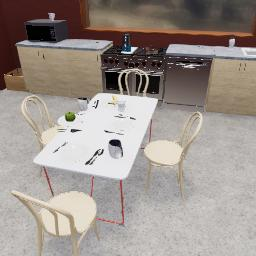
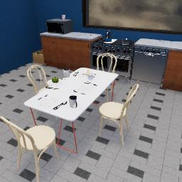
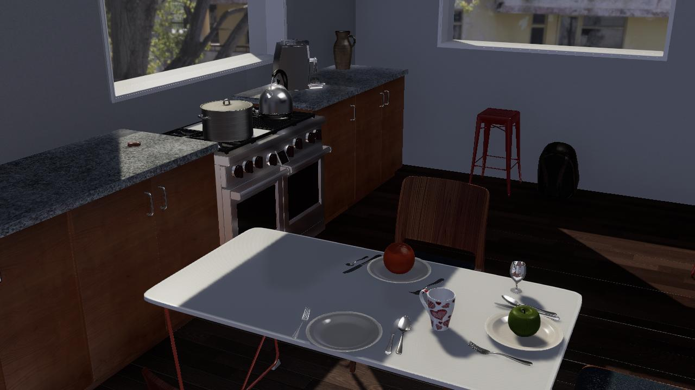

##### Scene Setup (High-Level APIs)

# Procedural Generation (the `ProcGenKitchen` add-on)

The [`ProcGenKitchen`](../../python/add_ons/proc_gen_kitchen.md) add-on is currently TDW's only high-level proc-gen scene setup implement. In the near future, we intend to add proc-gen add-ons for other types of rooms e.g. a `ProcGenBedroom`.

Create procedurally-generated kitchens by creating a `ProcGenKitchen`, adding it to `c.add_ons`, and then calling `proc_gen_kitchen.create()`:

```python
from tdw.controller import Controller
from tdw.add_ons.proc_gen_kitchen import ProcGenKitchen
from tdw.add_ons.third_person_camera import ThirdPersonCamera
from tdw.add_ons.image_capture import ImageCapture
from tdw.backend.paths import EXAMPLE_CONTROLLER_OUTPUT_PATH

path = EXAMPLE_CONTROLLER_OUTPUT_PATH.joinpath("proc_gen_kitchen_minimal")
print(f"Images will be saved to: {path}")
proc_gen_kitchen = ProcGenKitchen()
proc_gen_kitchen.create()
camera = ThirdPersonCamera(position={"x": 2, "y": 1.8, "z": -0.5},
                           look_at={"x": 0, "y": 0.6, "z": 0},
                           avatar_id="a")
capture = ImageCapture(avatar_ids=["a"], path=path, pass_masks=["_img"])
c = Controller()
c.add_ons.extend([proc_gen_kitchen, camera, capture])
c.communicate([])
c.communicate({"$type": "terminate"})
```

Result:


## How `ProcGenKitchen` works

Broadly speaking, `ProcGenKitchen` adds [arrangements of objects](arrangements.md) to the scene. These arrangements are tried as quasi-atomic groups of objects, meaning that `ProcGenKitchen` will position and rotate all objects belonging to an arrangement as if they were a single object. Object arrangements are thus positioned in the room to create the kitchen. For example, `ProcGenKitchen` will create *lateral arrangements* of arrangements of kitchen counters, sinks, refrigerators, and stoves.

**[A detailed explanation of how `ProcGenKitchen` works can be found in the API documentation.](../../python/add_ons/proc_gen_kitchen.md)**  When reading the API documentation, be sure to click through to the documentation for each `Arrangement` because most of the parameters controlling scene generation will be found in `Arrangement` and its subclasses, not `ProcGenKitchen`. [For an overview of how  `Arrangements` work, read this.](arrangements.md)

That said, you can set some optional parameters in `create()` and by adjusting `ProcGenKitchen` class variables, as described below:

##  `create()` optional parameters

### `rng`

If you try to run the previous example, you'll get a different image because every kitchen scene is randomly generated. `proc_gen_kitchen` includes an optional `rng` parameter that can be either an integer or a numpy RandomState object (for example: `rng=numpy.random.RandomState(0)`).

If you set the `rng` parameter, you'll recreate the same scene every time.

```python
from tdw.controller import Controller
from tdw.add_ons.proc_gen_kitchen import ProcGenKitchen
from tdw.add_ons.third_person_camera import ThirdPersonCamera
from tdw.add_ons.image_capture import ImageCapture
from tdw.backend.paths import EXAMPLE_CONTROLLER_OUTPUT_PATH

path = EXAMPLE_CONTROLLER_OUTPUT_PATH.joinpath("proc_gen_kitchen_random_seed")
print(f"Images will be saved to: {path}")
proc_gen_kitchen = ProcGenKitchen()
proc_gen_kitchen.create(rng=0)
camera = ThirdPersonCamera(position={"x": -2, "y": 1.8, "z": -0.5},
                           look_at={"x": 0, "y": 0.6, "z": 0},
                           avatar_id="a")
capture = ImageCapture(avatar_ids=["a"], path=path, pass_masks=["_img"])
c = Controller()
c.add_ons.extend([proc_gen_kitchen, camera, capture])
c.communicate([])
c.communicate({"$type": "terminate"})
```

Result:



### `scene`

Set the `scene` parameter to specify the [scene](../core_concepts/scenes.md). If None, a random *valid* scene will be selected.

Only certain scenes are valid for `ProcGenKitchen`. They must be single-room interior scenes with pre-set [room data](rooms.md). Although it is not a requirement per se, `ProcGenKitchen` does work best with smaller rooms.

If `scene` isn't set or is set to None, the scene is randomly selected. To review the list of possible scenes:

```python
from tdw.add_ons.proc_gen_kitchen import ProcGenKitchen

for scene_name in ProcGenKitchen.SCENE_NAMES:
    print(scene_name)
```

Output:

```
mm_craftroom_2a
mm_craftroom_2b
mm_craftroom_3a
mm_craftroom_3b
mm_kitchen_2a
mm_kitchen_2b
mm_kitchen_3a
mm_kitchen_3b
```

`scene` can alternatively be:

- A string, for example `"mm_craftroom_2a"`
- A [`SceneRecord`](../../python/librarian/scene_librarian.md), for example `SceneLibrarian().get_record("mm_craftroom_2a")`
- A [`Room`](rooms.md), in which case the add-on assumes that the actual scene has already been loaded.
- A list of strings and/or `SceneRecord`, in which case a random string or `SceneRecord` will be selected.

This example explicitly sets the `scene` parameter to a scene name. Notice that we're also setting the `rng` parameter; this is not necessary but it will be used for setting everything in the scene *except* for selecting the scene itself.

```python
from tdw.controller import Controller
from tdw.add_ons.proc_gen_kitchen import ProcGenKitchen
from tdw.add_ons.third_person_camera import ThirdPersonCamera
from tdw.add_ons.image_capture import ImageCapture
from tdw.backend.paths import EXAMPLE_CONTROLLER_OUTPUT_PATH

path = EXAMPLE_CONTROLLER_OUTPUT_PATH.joinpath("proc_gen_kitchen_scene")
print(f"Images will be saved to: {path}")
proc_gen_kitchen = ProcGenKitchen()
proc_gen_kitchen.create(scene="mm_kitchen_2b", rng=0)
camera = ThirdPersonCamera(position={"x": -2, "y": 1.8, "z": -1},
                           look_at={"x": 0, "y": 0.6, "z": 0},
                           avatar_id="a")
capture = ImageCapture(avatar_ids=["a"], path=path, pass_masks=["_img"])
c = Controller()
c.add_ons.extend([proc_gen_kitchen, camera, capture])
c.communicate([])
c.communicate({"$type": "terminate"})
```

Result:



### `room_index`

The `room_index` parameter is mostly for future-proofing `ProcGenKitchen` for a time when it can be used in a multi-room scene; this parameter should almost always be set to 0 (the default value).

### `cabinetry_type`

`cabinetry_type` is a [`CabinetryType`](../../python/proc_gen/arrangements/cabinetry/cabinetry_type.md) enum value that will determine which set of kitchen counters, sinks, and wall cabinets to add to the scene. By default, this value is None, meaning that the cabinetry set is chosen randomly.

## `ProcGenKitchen` class variables

### `TALL_ARRANGEMENTS`

`ProcGenKitchen.TALL_ARRANGEMENTS` A list of lowercase names of "tall" [Arrangements](arrangements):

```python
from tdw.add_ons.proc_gen_kitchen import ProcGenKitchen

for arrangement in ProcGenKitchen.TALL_ARRANGEMENTS:
    print(arrangement)
```

Output:

```
refrigerator
shelf
```

When adding arrangements along a wall with windows, `ProcGenKitchen` will swap tall arrangements for shorter arrangements (*which* shorter arrangement varies and is hardcoded; [read the API documentation](../../python/add_ons/proc_gen_kitchen.md)).

This example controller generates a kitchen that allows refrigerators and shelves to be placed along walls with windows:

```python
from tdw.controller import Controller
from tdw.add_ons.proc_gen_kitchen import ProcGenKitchen
from tdw.add_ons.third_person_camera import ThirdPersonCamera
from tdw.add_ons.image_capture import ImageCapture
from tdw.backend.paths import EXAMPLE_CONTROLLER_OUTPUT_PATH

ProcGenKitchen.TALL_ARRANGEMENTS = []
path = EXAMPLE_CONTROLLER_OUTPUT_PATH.joinpath("proc_gen_kitchen_tall")
print(f"Images will be saved to: {path}")
proc_gen_kitchen = ProcGenKitchen()
proc_gen_kitchen.create()
camera = ThirdPersonCamera(position={"x": 2, "y": 1.8, "z": -0.5},
                           look_at={"x": 0, "y": 0.6, "z": 0},
                           avatar_id="a")
capture = ImageCapture(avatar_ids=["a"], path=path, pass_masks=["_img"])
c = Controller()
c.add_ons.extend([proc_gen_kitchen, camera, capture])
c.communicate([])
c.communicate({"$type": "terminate"})
```

### `SECONDARY_ARRANGEMENTS`

"Secondary arrangements" are [arrangements](arrangements.md) that can be "appended" to a "main lateral arrangement" (for example, at the end of a span of kitchen counters), or added elsewhere in the room (such as an [alcove](rooms.md)). 

Secondary arrangements are stored in `ProcGenKitchen.SECONDARY_ARRANGEMENTS` as a dictionary. The dictionary has three keys that should never be adjusted. The values of the dictionary are dictionaries, where the key is a string representation of an arrangement and the value is an integer describing the probability of adding that arrangement.

This will print the likelihood of adding different arrangements to the end of a "main lateral arrangement":

```python
from tdw.add_ons.proc_gen_kitchen import ProcGenKitchen

print(ProcGenKitchen.SECONDARY_ARRANGEMENTS["main"])
```

Output:

```
{'side_table': 1, 'basket': 2, 'shelf': 2, 'painting': 4, 'void': 3, 'radiator': 1, 'stool': 2, 'suitcase': 1}
```

### `SCENE_NAMES`

`ProcGenKitchen.SCENE_NAMES` is a list of scene names. If the `scene` parameter in `create()` is None (the default value), the scene will be randomly selected from `ProcGenKitchen.SCENE_NAMES`.

This list contains only a subset of valid scenes. `ProcGenKitchen` tends to create more plausible kitchens in scenes with [only one room and one region](rooms.md); scenes with rooms that have alcoves have been excluded.

This example adds all [scenes with room data](rooms.md) to the list of possible scenes:

```python
from tdw.controller import Controller
from tdw.add_ons.proc_gen_kitchen import ProcGenKitchen
from tdw.add_ons.third_person_camera import ThirdPersonCamera
from tdw.add_ons.image_capture import ImageCapture
from tdw.backend.paths import EXAMPLE_CONTROLLER_OUTPUT_PATH
from tdw.librarian import SceneLibrarian

scene_librarian = SceneLibrarian()
for record in scene_librarian.records:
    if len(record.rooms) > 0 and record.name not in ProcGenKitchen.SCENE_NAMES:
        print(record.name)
        ProcGenKitchen.SCENE_NAMES.append(record.name)
path = EXAMPLE_CONTROLLER_OUTPUT_PATH.joinpath("proc_gen_kitchen_tall")
print(f"Images will be saved to: {path}")
proc_gen_kitchen = ProcGenKitchen()
proc_gen_kitchen.create()
camera = ThirdPersonCamera(position={"x": 2, "y": 1.8, "z": -0.5},
                           look_at={"x": 0, "y": 0.6, "z": 0},
                           avatar_id="a")
capture = ImageCapture(avatar_ids=["a"], path=path, pass_masks=["_img"])
c = Controller()
c.add_ons.extend([proc_gen_kitchen, camera, capture])
c.communicate([])
c.communicate({"$type": "terminate"})
```

Output:

```
mm_craftroom_1a
mm_craftroom_1b
mm_craftroom_4a
mm_craftroom_4b
mm_kitchen_1a
mm_kitchen_1b
mm_kitchen_4a
mm_kitchen_4b
```

## `ProcGenKitchen` and other add-ons

`ProcGenKitchen` is meant to be as modular as possible and it can be combined with other add-ons and commands. You've already seen that it's possible to use `ProcGenKitchen` along with [`ThirdPersonCamera`](../../python/add_ons/third_person_camera.md) and [`ImageCapture`](../../python/add_ons/image_capture.md).

This example combines `ProcGenKitchen` with [`InteriorSceneLighting`](../photorealism/interior_lighting.md). Note that we can use the same random seed for both add-ons to ensure that the scene is recreated exactly the same every time:

```python
import numpy as np
from tdw.controller import Controller
from tdw.add_ons.proc_gen_kitchen import ProcGenKitchen
from tdw.add_ons.third_person_camera import ThirdPersonCamera
from tdw.add_ons.image_capture import ImageCapture
from tdw.add_ons.interior_scene_lighting import InteriorSceneLighting
from tdw.backend.paths import EXAMPLE_CONTROLLER_OUTPUT_PATH

path = EXAMPLE_CONTROLLER_OUTPUT_PATH.joinpath("proc_gen_kitchen_lighting")
print(f"Images will be saved to: {path}")
proc_gen_kitchen = ProcGenKitchen()
random_seed = 14
proc_gen_kitchen.create(rng=np.random.RandomState(random_seed))
interior_scene_lighting = InteriorSceneLighting(rng=np.random.RandomState(random_seed))
camera = ThirdPersonCamera(position={"x": -1, "y": 1.8, "z": 2},
                           look_at={"x": 0, "y": 1, "z": 0},
                           avatar_id="a")
capture = ImageCapture(avatar_ids=["a"], path=path, pass_masks=["_img"])
c = Controller()
c.add_ons.extend([proc_gen_kitchen, interior_scene_lighting, camera, capture])
c.communicate([{"$type": "set_screen_size",
                "width": 1280,
                "height": 720}])
c.communicate({"$type": "terminate"})
```

Result:



## How to reset the scene

Unlike most add-ons, it is not necessary to reset `ProcGenKitchen` when a scene resets. Do *not* do this: `proc_gen_kitchen.initialized = False`. Instead, simply call `proc_gen_kitchen.create(scene)` to create a new scene.

## Saving scene setup commands

Whenever `ProcGenKitchen` is updated, it is possible that a random seed used in a previous version will generate a different scene in a newer version. In fact, it's likely that subsequent changes to `ProcGenKitchen` since this document was written have adjusted the procedural generator such that if you run the example controllers, you'll capture different images.

In order to guarantee that you can recreate a kitchen scene,  you can save the list of commands in addition to the random seed.

When you call `proc_gen_kitchen.create()`, the add-on appends a long list of commands to `proc_gen_kitchen.commands`. As with all other [add-ons](../core_concepts/add_ons.md), the `commands` list will be automatically sent to the build the next time `c.communicate()` is called.

You can save `proc_gen_kitchen.commands` to a JSON file like this:

```python
from json import dumps
from pathlib import Path
from tdw.add_ons.proc_gen_kitchen import ProcGenKitchen

proc_gen_kitchen = ProcGenKitchen()
proc_gen_kitchen.create(rng=0)
Path("proc_gen_kitchen.json").write_text(dumps(proc_gen_kitchen.commands))
```

...and then reload them like this:

```python
from json import loads
from pathlib import Path
from tdw.controller import Controller

c = Controller()
c.communicate(loads(Path("proc_gen_kitchen.json").read_text()))
```

***

**Next: [Regions, interior regions, and rooms](rooms.md)**

[Return to the README](../../../README.md)

***

Example controllers:

- [proc_gen_kitchen_minimal.py](https://github.com/threedworld-mit/tdw/blob/master/Python/example_controllers/scene_setup_high_level/proc_gen_kitchen_minimal.py) Minimal example of the proc-gen kitchen.
- [proc_gen_kitchen_lighting.py](https://github.com/threedworld-mit/tdw/blob/master/Python/example_controllers/scene_setup_high_level/proc_gen_kitchen_lighting.py) ProcGenKitchen with realistic lighting.

Python API:

- [`ProcGenKitchen`](../../python/add_ons/proc_gen_kitchen.md)
- [`Arrangement`](../../python/proc_gen/arrangements/arrangement.md)
- [`SceneRecord`](../../python/librarian/scene_librarian.md)
- [`ModelRecord`](../../python/librarian/model_librarian.md)
- [`Room`](../../python/scene_data/room.md)
- [`ThirdPersonCamera`](../../python/add_ons/third_person_camera.md)
- [`ImageCapture`](../../python/add_ons/image_capture.md)
- [`InteriorSceneLighting`](../../python/add_ons/interior_scene_lighting.md)