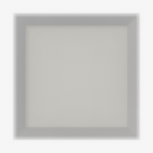

# Scenes

A **scene** is a static environment in a TDW simulation. It usually contains objects such as an empty room, outdoor terrain, etc. It might include additional objects such as trees, houses, etc., but these objects are also static (they can't be moved or adjusted). Scenes can contain [objects](objects.md), [avatars](avatars.md), and other non-static entities.

For most of the [TDW Command API](commands.md) to work, you must add a scene to the simulation. There can never be more than one scene in TDW; loading a new scene will discard the previous scene.

There are three ways to load a scene in TDW:

## 1. Procedurally-generated scene

Creating a procedurally-generated interior scene (often abbreviated to "proc-gen room") in TDW includes at least two steps:

1. Send the [`load_scene` command](https://github.com/threedworld-mit/tdw/blob/master/Documentation/api/command_api.md#load_scene) or call `c.start()`:

```python
from tdw.controller import Controller

c = Controller()
c.start()
```

2. Send the [`create_exterior_walls` command](https://github.com/threedworld-mit/tdw/blob/master/Documentation/api/command_api.md#create_exterior_walls). This command can be difficult to use, so TDW includes a wrapper function called `TDWUtils.create_empty_room(width, length)` that will create an empty room:

```python
from tdw.controller import Controller
from tdw.tdw_utils import TDWUtils

c = Controller()
c.start()
c.communicate(TDWUtils.create_empty_room(12, 12))
```

Which will create this room:



### More procedural generation options

It is possible to create much more elaborate rooms with differing exterior walls as well as interior walls; you can also add a ceiling, set the visual material of the walls and floor, and so on.

- [These commands](https://github.com/threedworld-mit/tdw/blob/master/Documentation/api/command_api.md#procgenroomcommand) are applicable to any proc-gen room.
- These controllers showcase some simple proc-gen algorithms:
  - [Create a room from an image file](https://github.com/threedworld-mit/tdw/blob/master/Python/example_controllers/proc_gen_room_from_image.py)
  - [Procedurally generate the shape and interior walls of the room](https://github.com/threedworld-mit/tdw/blob/master/Python/example_controllers/proc_gen_room.py)

## 2. Download and load a streamed scene

TDW includes many pre-generated photorealistic scenes. These scenes exist on a remote Amazon S3 server as *asset bundles*, which are Unity3D-specific binary files that can be loaded into a Unity3D application (e.g. the TDW build) at runtime. To access a scene asset bundle, TDW downloads the scene into active memory (not to a local file). The asset bundle is discarded from memory when another scene is loaded (including a proc-gen room) or when the TDW build process is terminated.

To add a scene, send the `add_scene` command:

```python
from tdw.controller import Controller

c = Controller()
c.communicate({'$type': 'add_scene',
               'name': 'tdw_room',
               'url': 'https://tdw-public.s3.amazonaws.com/scenes/linux/2020.2/tdw_room'})
```

Managing the URLs for streamed scene asset bundles can be a needlessly complex task, so TDW includes a wrapper function to access streamed scenes:

```python
from tdw.controller import Controller

c = Controller()
c.communicate(c.get_add_scene(scene_name="tdw_room"))
```

Metadata for scene asset bundles are stored in a [`SceneLibrarian`]

## 3. Create an empty environment

Create a totally empty environment with no surface. This is mostly useful for backend developers when debugging core features of TDW.

```python
from tdw.controller import Controller

c = Controller()
c.communicate({"$type": "create_empty_environment"})
```

