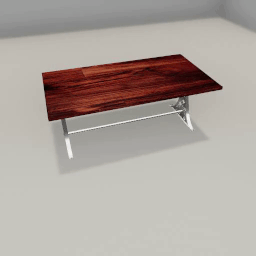
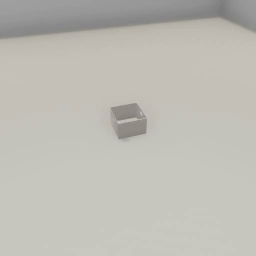

##### Semantic States

# Containment (the `ContainerManager` add-on)

[`ContainerManager`](../../python/add_ons/container_manager.md) is a high-level implementation of [`TriggerCollisionManager`](trigger_collisions.md) that adds pre-defined trigger colliders to certain objects, each with a semantic tag. Only a subset of objects in TDW that could be containers have these predefined trigger colliders; more will be added over time. To print the current full list:

```python
from tdw.add_ons.container_manager import ContainerManager

for k in ContainerManager.CONTAINERS:
    print(k)
```

To use the `ContainerManager` you must add it to `c.add_ons`, add at least one of the objects in `ContainerManager.CONTAINERS`, and add a second object that will be contained by the first object:

```python
from tdw.controller import Controller
from tdw.tdw_utils import TDWUtils
from tdw.add_ons.container_manager import ContainerManager
from tdw.add_ons.third_person_camera import ThirdPersonCamera

c = Controller()
container_manager = ContainerManager()
camera = ThirdPersonCamera(position={"x": 2, "y": 2, "z": 0.3},
                           look_at={"x": 0, "y": 0.6, "z": 0})
c.add_ons.extend([container_manager, camera])
commands = [TDWUtils.create_empty_room(12, 12)]
container_id = Controller.get_unique_id()
commands.extend(Controller.get_add_physics_object(model_name="4ft_shelf_metal",
                                                  object_id=container_id,
                                                  kinematic=True))
commands.extend(Controller.get_add_physics_object(model_name="iron_box",
                                                  object_id=Controller.get_unique_id(),
                                                  position={"x": 0, "y": 3, "z": 0}))
c.communicate(commands)
for i in range(200):
    if container_id in container_manager.events:
        for event in container_manager.events[container_id]:
            print(i, event.container_id, event.object_id, event.tag)
    c.communicate([])
c.communicate({"$type": "terminate"})
```

Result:


Output:

```
129 13566232 14793386 ContainerColliderTag.on
129 13566232 14793386 ContainerColliderTag.on
130 13566232 14793386 ContainerColliderTag.on
168 13566232 14793386 ContainerColliderTag.on
168 13566232 14793386 ContainerColliderTag.on
169 13566232 14793386 ContainerColliderTag.on
170 13566232 14793386 ContainerColliderTag.on
171 13566232 14793386 ContainerColliderTag.on
172 13566232 14793386 ContainerColliderTag.on
173 13566232 14793386 ContainerColliderTag.on
174 13566232 14793386 ContainerColliderTag.on
175 13566232 14793386 ContainerColliderTag.on
176 13566232 14793386 ContainerColliderTag.on
177 13566232 14793386 ContainerColliderTag.on
178 13566232 14793386 ContainerColliderTag.on
179 13566232 14793386 ContainerColliderTag.on
180 13566232 14793386 ContainerColliderTag.on
181 13566232 14793386 ContainerColliderTag.on
182 13566232 14793386 ContainerColliderTag.on
183 13566232 14793386 ContainerColliderTag.on
184 13566232 14793386 ContainerColliderTag.on
185 13566232 14793386 ContainerColliderTag.on
186 13566232 14793386 ContainerColliderTag.on
187 13566232 14793386 ContainerColliderTag.on
188 13566232 14793386 ContainerColliderTag.on
189 13566232 14793386 ContainerColliderTag.on
190 13566232 14793386 ContainerColliderTag.on
191 13566232 14793386 ContainerColliderTag.on
192 13566232 14793386 ContainerColliderTag.on
193 13566232 14793386 ContainerColliderTag.on
194 13566232 14793386 ContainerColliderTag.on
195 13566232 14793386 ContainerColliderTag.on
196 13566232 14793386 ContainerColliderTag.on
197 13566232 14793386 ContainerColliderTag.on
198 13566232 14793386 ContainerColliderTag.on
199 13566232 14793386 ContainerColliderTag.on
```

## Fields

`ContainerManager` inherits the fields of [`TriggerCollisionManager`](../../python/add_ons/trigger_collision_manager.md): `trigger_ids` and `collisions`.

Additionally, `container_manager.events` is a list of [`ContainmentEvent`](../../python/add_ons/container_manager_data/containment_event.md) data. This is updated per-frame and lists instances in which one object contains another. Key = The container ID. Value = The event: 

- `container_id` is the ID of the container.
- `object_id` is the ID of the object being contained.
- `tag` is a [`ContainerColliderTag`](../../python/add_ons/container_manager_data/container_collider_tag.md), a semantic description of the containment event. In the above example, the box was *on* the shelf.

## Functions

`ContainerManager` has the same functions as [`TriggerCollisionManager`](../../python/add_ons/trigger_collision_manager.md); it is possible to add box, sphere, or cylinder trigger colliders to an object. However, `ContainerManager` includes an additional `tag` optional parameter to each of these functions. The default value is `ContainerColliderTag.on`.

In this example, we'll add a shelf, which has trigger colliders on each shelf, and then add a sphere collider above the shelf:

```python
from tdw.controller import Controller
from tdw.tdw_utils import TDWUtils
from tdw.add_ons.container_manager import ContainerManager
from tdw.add_ons.third_person_camera import ThirdPersonCamera
from tdw.add_ons.container_manager_data.container_collider_tag import ContainerColliderTag

c = Controller()
container_manager = ContainerManager()
camera = ThirdPersonCamera(position={"x": 2, "y": 2, "z": 0.3},
                           look_at={"x": 0, "y": 0.6, "z": 0})
c.add_ons.extend([container_manager, camera])
commands = [TDWUtils.create_empty_room(12, 12)]
container_id = Controller.get_unique_id()
commands.extend(Controller.get_add_physics_object(model_name="4ft_shelf_metal",
                                                  object_id=container_id,
                                                  kinematic=True))
commands.extend(Controller.get_add_physics_object(model_name="iron_box",
                                                  object_id=Controller.get_unique_id(),
                                                  position={"x": 0, "y": 3, "z": 0}))
# Add a collider.
container_manager.add_sphere_collider(object_id=container_id,
                                      position={"x": 0, "y": 2, "z": 0},
                                      diameter=0.5,
                                      tag=ContainerColliderTag.inside)
c.communicate(commands)
for i in range(200):
    if container_id in container_manager.events:
        for event in container_manager.events[container_id]:
            print(i, event.container_id, event.object_id, event.tag)
    c.communicate([])
c.communicate({"$type": "terminate"})
```

Output (note the `inside` events, which are generated by the sphere collider):

```
39 15123665 8891277 ContainerColliderTag.inside
39 15123665 8891277 ContainerColliderTag.inside
40 15123665 8891277 ContainerColliderTag.inside
41 15123665 8891277 ContainerColliderTag.inside
42 15123665 8891277 ContainerColliderTag.inside
43 15123665 8891277 ContainerColliderTag.inside
44 15123665 8891277 ContainerColliderTag.inside
45 15123665 8891277 ContainerColliderTag.inside
46 15123665 8891277 ContainerColliderTag.inside
47 15123665 8891277 ContainerColliderTag.inside
48 15123665 8891277 ContainerColliderTag.inside
49 15123665 8891277 ContainerColliderTag.inside
50 15123665 8891277 ContainerColliderTag.inside
51 15123665 8891277 ContainerColliderTag.inside
52 15123665 8891277 ContainerColliderTag.inside
53 15123665 8891277 ContainerColliderTag.inside
54 15123665 8891277 ContainerColliderTag.inside
72 15123665 8891277 ContainerColliderTag.inside
72 15123665 8891277 ContainerColliderTag.inside
73 15123665 8891277 ContainerColliderTag.inside
74 15123665 8891277 ContainerColliderTag.inside
75 15123665 8891277 ContainerColliderTag.inside
76 15123665 8891277 ContainerColliderTag.inside
77 15123665 8891277 ContainerColliderTag.inside
78 15123665 8891277 ContainerColliderTag.inside
79 15123665 8891277 ContainerColliderTag.inside
80 15123665 8891277 ContainerColliderTag.inside
81 15123665 8891277 ContainerColliderTag.inside
82 15123665 8891277 ContainerColliderTag.inside
83 15123665 8891277 ContainerColliderTag.inside
84 15123665 8891277 ContainerColliderTag.inside
85 15123665 8891277 ContainerColliderTag.inside
86 15123665 8891277 ContainerColliderTag.inside
87 15123665 8891277 ContainerColliderTag.inside
88 15123665 8891277 ContainerColliderTag.inside
89 15123665 8891277 ContainerColliderTag.inside
90 15123665 8891277 ContainerColliderTag.inside
91 15123665 8891277 ContainerColliderTag.inside
92 15123665 8891277 ContainerColliderTag.inside
93 15123665 8891277 ContainerColliderTag.inside
94 15123665 8891277 ContainerColliderTag.inside
95 15123665 8891277 ContainerColliderTag.inside
96 15123665 8891277 ContainerColliderTag.inside
97 15123665 8891277 ContainerColliderTag.inside
98 15123665 8891277 ContainerColliderTag.inside
99 15123665 8891277 ContainerColliderTag.inside
100 15123665 8891277 ContainerColliderTag.inside
101 15123665 8891277 ContainerColliderTag.inside
102 15123665 8891277 ContainerColliderTag.inside
103 15123665 8891277 ContainerColliderTag.inside
104 15123665 8891277 ContainerColliderTag.inside
105 15123665 8891277 ContainerColliderTag.inside
106 15123665 8891277 ContainerColliderTag.inside
107 15123665 8891277 ContainerColliderTag.inside
108 15123665 8891277 ContainerColliderTag.inside
109 15123665 8891277 ContainerColliderTag.inside
110 15123665 8891277 ContainerColliderTag.inside
111 15123665 8891277 ContainerColliderTag.inside
112 15123665 8891277 ContainerColliderTag.inside
113 15123665 8891277 ContainerColliderTag.inside
114 15123665 8891277 ContainerColliderTag.inside
115 15123665 8891277 ContainerColliderTag.inside
116 15123665 8891277 ContainerColliderTag.inside
129 15123665 8891277 ContainerColliderTag.on
129 15123665 8891277 ContainerColliderTag.on
130 15123665 8891277 ContainerColliderTag.on
168 15123665 8891277 ContainerColliderTag.on
168 15123665 8891277 ContainerColliderTag.on
169 15123665 8891277 ContainerColliderTag.on
170 15123665 8891277 ContainerColliderTag.on
171 15123665 8891277 ContainerColliderTag.on
172 15123665 8891277 ContainerColliderTag.on
173 15123665 8891277 ContainerColliderTag.on
174 15123665 8891277 ContainerColliderTag.on
175 15123665 8891277 ContainerColliderTag.on
176 15123665 8891277 ContainerColliderTag.on
177 15123665 8891277 ContainerColliderTag.on
178 15123665 8891277 ContainerColliderTag.on
179 15123665 8891277 ContainerColliderTag.on
180 15123665 8891277 ContainerColliderTag.on
181 15123665 8891277 ContainerColliderTag.on
182 15123665 8891277 ContainerColliderTag.on
183 15123665 8891277 ContainerColliderTag.on
184 15123665 8891277 ContainerColliderTag.on
185 15123665 8891277 ContainerColliderTag.on
186 15123665 8891277 ContainerColliderTag.on
187 15123665 8891277 ContainerColliderTag.on
188 15123665 8891277 ContainerColliderTag.on
189 15123665 8891277 ContainerColliderTag.on
190 15123665 8891277 ContainerColliderTag.on
191 15123665 8891277 ContainerColliderTag.on
192 15123665 8891277 ContainerColliderTag.on
193 15123665 8891277 ContainerColliderTag.on
194 15123665 8891277 ContainerColliderTag.on
195 15123665 8891277 ContainerColliderTag.on
196 15123665 8891277 ContainerColliderTag.on
197 15123665 8891277 ContainerColliderTag.on
198 15123665 8891277 ContainerColliderTag.on
199 15123665 8891277 ContainerColliderTag.on
```

## Visualize containment

This is a simple example of how to capture images and containment data and convert the containment data into a diagram using PIL. For aesthetic reasons, you will probably want to improve upon this visualizer or perhaps use a different visualizer entirely:

```python
from PIL import Image, ImageDraw, ImageFont
from tdw.controller import Controller
from tdw.tdw_utils import TDWUtils
from tdw.add_ons.container_manager import ContainerManager
from tdw.add_ons.object_manager import ObjectManager
from tdw.add_ons.third_person_camera import ThirdPersonCamera
from tdw.add_ons.image_capture import ImageCapture
from tdw.add_ons.container_manager_data.container_collider_tag import ContainerColliderTag
from tdw.backend.paths import EXAMPLE_CONTROLLER_OUTPUT_PATH


class Containment(Controller):
    """
    Add objects to the scene and listen for containment events.
    Save the image of each frame.
    At the end of a trial, create a timeline diagram of the containment states.
    """

    def __init__(self, port: int = 1071, check_version: bool = True, launch_build: bool = True):
        super().__init__(port=port, check_version=check_version, launch_build=launch_build)
        self.container_manager: ContainerManager = ContainerManager()
        self.object_manager: ObjectManager = ObjectManager(transforms=False, rigidbodies=True, bounds=False)
        self.camera = ThirdPersonCamera(position={"x": 3, "y": 2.5, "z": -1},
                                        look_at={"x": 0, "y": 0, "z": 0},
                                        avatar_id="a")
        self.path = EXAMPLE_CONTROLLER_OUTPUT_PATH.joinpath("containment")
        print(f"Images will be saved to: {str(self.path.resolve())}")
        self.capture = ImageCapture(path=self.path, avatar_ids=["a"], pass_masks=["_img"])
        self.add_ons.extend([self.object_manager, self.container_manager, self.camera, self.capture])

    def trial(self, container_name: str):
        self.container_manager.reset()
        self.object_manager.reset()
        self.camera.initialized = False
        self.capture.initialized = False
        # Create the room.
        commands = [{'$type': "load_scene",
                     'scene_name': "ProcGenScene"},
                    TDWUtils.create_empty_room(12, 12)]
        # Add the container.
        container_id = Controller.get_unique_id()
        commands.extend(Controller.get_add_physics_object(model_name=container_name,
                                                          object_id=container_id,
                                                          kinematic=True))
        falling_object_id = Controller.get_unique_id()
        # Add the falling object.
        commands.extend(Controller.get_add_physics_object(model_name="jug02",
                                                          object_id=falling_object_id,
                                                          position={"x": 0, "y": 3, "z": 0}))
        self.communicate(commands)
        # Wait for the object to stop moving.
        sleeping = False
        # Record the containment states.
        frames = []
        while not sleeping:
            sleeping = self.object_manager.rigidbodies[falling_object_id].sleeping
            containment = False
            tag = ContainerColliderTag.inside
            for object_id in self.container_manager.events:
                if object_id == container_id:
                    for event in self.container_manager.events[object_id]:
                        if event.object_id == falling_object_id:
                            containment = True
                            tag = event.tag
                            break
            frames.append((containment, tag))
            self.communicate([])
        # Create a timeline diagram of the containment states.
        image = Image.new(mode="RGB", size=(1024, 256))
        x_0 = 36
        y_0 = 256 // 3
        frame_width = 2
        for frame in frames:
            if not frame[0]:
                color = (255, 255, 255)
            else:
                if frame[1] == ContainerColliderTag.on:
                    color = (255, 0, 0)
                else:
                    color = (0, 0, 255)
            for x in range(x_0, x_0 + frame_width):
                for y in range(y_0, y_0 + 64):
                    image.putpixel((x, y), color)
            x_0 += frame_width
        draw = ImageDraw.Draw(image)
        font = ImageFont.truetype("Roboto-Regular.ttf", size=36)
        draw.text((800, y_0), "On", (255, 0, 0), font=font)
        draw.text((800, y_0 + 50), "Inside", (0, 0, 255), font=font)
        # Save the image.
        image.save(str(self.path.joinpath(container_name + ".png").resolve()))

    def run(self):
        for container_name in ["quatre_dining_table", "basket_18inx18inx12iin_plastic_lattice"]:
            self.trial(container_name=container_name)
        self.communicate({"$type": "terminate"})


if __name__ == "__main__":
    c = Containment()
    c.run()
```

**Table:**

 


**Basket:**

 


## Refining and defining containment

An object is "contained" by another object as soon as it intersects with one of the container's trigger colliders. In the above two examples, this is not neccesarily a totally intuitive defintion of "containment":

- In the table trial, there are three initial short "containment" events as the object bounces on the table, even though it is unlikely that you would intuitively consider the table to be "containing" the object until the end of the trial.
- In the basket trial, there is one initial medium-length "containment" event as the object bounces. The basket's trigger collider is the size of the total interior of the basket (this way, objects stacked on top of each other but not touching the base of the basket are still "inside" the basket). As the object bounces, it stays within this box-shaped region for a relatively long time span.

You may wish to record the raw containment data and then further filter it for containment events. Some possible strategies:

- Ignore short containment events to filter out bounces.
- You may choose to filter out containment events if the object is moving; however, this will remove scenarios such as when there is a basket containing an object and the basket is lifted or otherwise moved.

***

**Next: [Openness](openness.md)**

[Return to the README](../../../README.md)

***

Example controllers:

- [containment.py](https://github.com/threedworld-mit/tdw/blob/master/Python/example_controllers/semantic_states/containment.py) Add objects to the scene and listen for containment events. Save the image of each frame. At the end of a trial, create a timeline diagram of the containment states.

Python API:

- [`ContainerManager`](../../python/add_ons/container_manager.md)
- [`ContainmentEvent`](../../python/add_ons/container_manager_data/containment_event.md)
- [`ContainerColliderTag`](../../python/add_ons/container_manager_data/container_collider_tag.md)
- [`TriggerCollisionManager`](../../python/add_ons/trigger_collision_manager.md)

