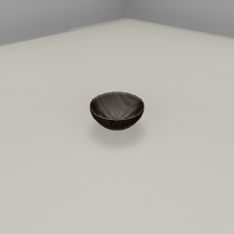
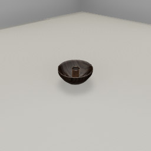
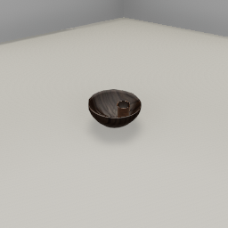

##### Semantic States

# Line of sight (`Raycast` output data)

*Note that this document doesn't cover visual perception, which is a separate topic. [Read this for more information.](../visual_perception/overview.md)*

A **raycast** is a ray cast from an origin position to a destination position; it returns useful information such as whether the ray hit something in between the two points (and if so, what it hit and where). Raycasts are commonly used in video games to solve many problems such as determining line of sight or procedural generation. 

In TDW, you can raycast by sending [`send_raycast`](../../api/command_api.md#send_raycast) which returns [`Raycast`](../../api/output_data.md#Raycast) output data.

There's a few unusual qualities to raycast data that should be noted here:

- `send_raycast` has an `id` parameter. The returned `Raycast` data will have a matching ID. You can use this ID to send multiple `send_raycast` commands on the same frame and match them to their output.
- Raycasting does *not* require an avatar (camera).
- Unlike output data you've seen so far such as [`Transforms`](../core_concepts/output_data.md) or [`Bounds`](bounds.md), `Raycast` output data is always sent exactly once; there isn't an option to raycast per-frame.

## Raycasts and object placement

Suppose we want to add a bowl to the scene and put an object in the bowl. [`Bounds` output data](bounds.md) alone is insufficient for this because it will tell us the y (height) value of the bottom of the bowl but not y value for the top side of the interior surface.

In the below examples, we'll  first learn how to raycast and then use the raycast data to place an object in a bowl.

To start, we'll create a scene with a bowl and enable image capture:

```python
from tdw.controller import Controller
from tdw.tdw_utils import TDWUtils
from tdw.add_ons.third_person_camera import ThirdPersonCamera
from tdw.add_ons.image_capture import ImageCapture
from tdw.backend.paths import EXAMPLE_CONTROLLER_OUTPUT_PATH

c = Controller()
bowl_id = c.get_unique_id()

camera = ThirdPersonCamera(position={"x": 0.5, "y": 1.6, "z": -1},
                           look_at=bowl_id,
                           avatar_id="a")
path = EXAMPLE_CONTROLLER_OUTPUT_PATH.joinpath("raycast")
print(f"Images will be saved to: {path}")
capture = ImageCapture(avatar_ids=[camera.avatar_id], path=path, png=True)
c.add_ons.extend([camera, capture])

c.communicate([TDWUtils.create_empty_room(12, 12),
               c.get_add_object(position={"x": -1, "y": 0, "z": 0.5},
                                object_id=bowl_id,
                                model_name="round_bowl_small_walnut")])
c.communicate({"$type": "terminate"})
```

Result:



Next, we will raycast from a point above the bowl to a point below the bowl. The ray will stop at a point on the surface of the bowl. Then, we'll add an object at that point:

```python
from tdw.controller import Controller
from tdw.tdw_utils import TDWUtils
from tdw.add_ons.third_person_camera import ThirdPersonCamera
from tdw.add_ons.image_capture import ImageCapture
from tdw.backend.paths import EXAMPLE_CONTROLLER_OUTPUT_PATH
from tdw.output_data import OutputData, Raycast

c = Controller()
bowl_id = c.get_unique_id()

camera = ThirdPersonCamera(position={"x": 0.5, "y": 1.6, "z": -1},
                           look_at=bowl_id,
                           avatar_id="a")
path = EXAMPLE_CONTROLLER_OUTPUT_PATH.joinpath("raycast")
print(f"Images will be saved to: {path}")
capture = ImageCapture(avatar_ids=[camera.avatar_id], path=path, png=True)
c.add_ons.extend([camera, capture])

bowl_position = {"x": -1, "y": 0, "z": 0.5}

raycast_id = c.get_unique_id()
resp = c.communicate([TDWUtils.create_empty_room(12, 12),
                      c.get_add_object(position=bowl_position,
                                       object_id=bowl_id,
                                       model_name="round_bowl_small_walnut"),
                      {"$type": "send_raycast",
                       "origin": {"x": bowl_position["x"], "y": 100, "z": bowl_position["z"]},
                       "destination": {"x": bowl_position["x"], "y": -100, "z": bowl_position["z"]},
                       "id": raycast_id}])
commands = []
for i in range(len(resp) - 1):
    # Get raycast output data.
    r_id = OutputData.get_data_type_id(resp[i])
    if r_id == "rayc":
        raycast = Raycast(resp[i])
        # Is this the same raycast that we requested?
        if raycast.get_raycast_id() == raycast_id:
            # Did the raycast hit anything (including the floor)?
            # Did the raycast hit an object?
            # Did the raycast hit the bowl?
            if raycast.get_hit() and raycast.get_hit_object() and raycast.get_object_id() == bowl_id:
                # Get the point that the raycast hit.
                position = raycast.get_point()
                # Add an object at that position.
                commands.append(c.get_add_object(model_name="jug03",
                                                 position=TDWUtils.array_to_vector3(position),
                                                 object_id=c.get_unique_id()))
c.communicate(commands)
c.communicate({"$type": "terminate"})
```

Result:



## Shape casts

It's possible to cast *shapes* from an origin to a destination. They will return multiple `Raycast` data objects with information regarding what the shape hit along the way.

The commands are:

-  [`send_boxcast`](../../api/command_api.md#send_boxcast)
-  [`send_spherecast`](../../api/command_api.md#send_spherecast)

In this example, we'll add a bowl to the scene and then spherecast from a point above it. We'll then get all of the points of the spherecast on the bowl and then place an object at a randomly chosen point:

```python
import random
from tdw.controller import Controller
from tdw.tdw_utils import TDWUtils
from tdw.add_ons.third_person_camera import ThirdPersonCamera
from tdw.add_ons.image_capture import ImageCapture
from tdw.backend.paths import EXAMPLE_CONTROLLER_OUTPUT_PATH
from tdw.output_data import OutputData, Raycast

c = Controller()
bowl_id = c.get_unique_id()

camera = ThirdPersonCamera(position={"x": 0.5, "y": 1.6, "z": -1},
                           look_at=bowl_id,
                           avatar_id="a")
path = EXAMPLE_CONTROLLER_OUTPUT_PATH.joinpath("spherecast")
print(f"Images will be saved to: {path}")
capture = ImageCapture(avatar_ids=[camera.avatar_id], path=path, png=True)
c.add_ons.extend([camera, capture])

bowl_position = {"x": -1, "y": 0, "z": 0.5}

raycast_id = c.get_unique_id()
resp = c.communicate([TDWUtils.create_empty_room(12, 12),
                      c.get_add_object(position=bowl_position,
                                       object_id=bowl_id,
                                       model_name="round_bowl_small_walnut"),
                      {"$type": "send_spherecast",
                       "radius": 0.3,
                       "origin": {"x": bowl_position["x"], "y": 100, "z": bowl_position["z"]},
                       "destination": {"x": bowl_position["x"], "y": -100, "z": bowl_position["z"]},
                       "id": raycast_id}])
hits = []
for i in range(len(resp) - 1):
    r_id = OutputData.get_data_type_id(resp[i])
    if r_id == "rayc":
        raycast = Raycast(resp[i])
        if raycast.get_raycast_id() == raycast_id:
            if raycast.get_hit() and raycast.get_hit_object() and raycast.get_object_id() == bowl_id:
                hits.append(raycast.get_point())
jug_position = random.choice(hits)
# Add an object at a random position on the bowl.
c.communicate(c.get_add_object(model_name="jug03",
                               position=TDWUtils.array_to_vector3(jug_position),
                               object_id=c.get_unique_id()))
c.communicate({"$type": "terminate"})
```

Result:



***

**Next: [Proximity to a region (`Overlap` output data)](overlap.md)**

[Return to the README](../../../README.md)

***

Example controllers:

- [raycast.py](https://github.com/threedworld-mit/tdw/blob/master/Python/example_controllers/semantic_states/raycast.py) Use raycast data to place an object in a bowl.
- [spherecast.py](https://github.com/threedworld-mit/tdw/blob/master/Python/example_controllers/semantic_states/spherecast.py) Use spherecast data to place an object in a bowl.

Command API:

-  [`send_raycast`](../../api/command_api.md#send_raycast)
-  [`send_boxcast`](../../api/command_api.md#send_boxcast)
-  [`send_spherecast`](../../api/command_api.md#send_spherecast)

Output Data:

- [`Raycast`](../../api/output_data.md#Raycast)
