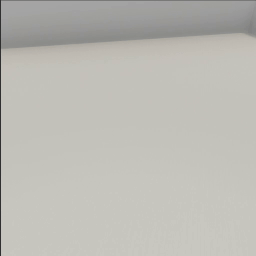

##### Semantic States

# Proximity to other objects (the `TriggerCollisionManager` add-on)

*For more information regarding physics collisions, [read this.](../physx/collisions.md)*

[Overlaps](overlap.md) are mostly useful to define *regions* for proximity detection. Often, you'll want a region to be linked to an object, such that when the object moves, the proximity detector moves as well. For this, it is best to use **trigger colliders.** In Unity, trigger colliders are *non-physics colliders.* Trigger colliders will detect collisions between themselves and any collider (physics or non-physics) without affecting the physics state. For example, suppose that there are two spheres that *don't* have physics colliders but *do* have trigger colliders. These spheres will detect when they intersect with each other but will be able to pass through each other.

In TDW, trigger colliders can be used to determine how close one object is to another. 

## The `TriggerCollisionManager` add-on

The simplest way to add trigger colliders to objects is to use the [`TriggerCollisionManager`](../../python/add_ons/trigger_collision_manager.md) add-on. 

There is an even higher-level implementation of  this add-on that uses pre-defined trigger colliders; see [Containment](containment.md), the next document in this section.

In this example, we'll create a scene and add two objects, a basket and a small ball. We'll attach a trigger collider to the basket using `trigger_collision_manager.add_box_collider()`. Then we'll [apply a force](../physx/forces.md) to both objects. Even though both objects move, the trigger collider will still detect when the ball is in the basket:

```python
from tdw.controller import Controller
from tdw.tdw_utils import TDWUtils
from tdw.add_ons.trigger_collision_manager import TriggerCollisionManager
from tdw.add_ons.third_person_camera import ThirdPersonCamera


class TriggerCollisions(Controller):
    """
    An example of how to attach trigger colliders to objects and listen for trigger collision events.
    """

    def __init__(self, port: int = 1071, check_version: bool = True, launch_build: bool = True):
        super().__init__(port=port, check_version=check_version, launch_build=launch_build)
        # Create the trigger collision manager.
        self.trigger_collision_manager: TriggerCollisionManager = TriggerCollisionManager()
        # Create a camera.
        camera = ThirdPersonCamera(position={"x": 0.5, "y": 2, "z": 2},
                                   look_at={"x": 0, "y": 0.6, "z": 0})
        self.add_ons.extend([camera, self.trigger_collision_manager])
        # Create an empty scene.
        self.communicate(TDWUtils.create_empty_room(12, 12))

    def trial(self, basket_force: float, ball_force: float) -> None:
        # Reset the trigger collision manager between trials.
        self.trigger_collision_manager.reset()
        # Add the objects.
        basket_id = Controller.get_unique_id()
        commands = Controller.get_add_physics_object(model_name="basket_18inx18inx12iin_bamboo",
                                                     object_id=basket_id,
                                                     position={"x": 1, "y": 0.5, "z": 0},
                                                     rotation={"x": -90, "y": 0, "z": 90},
                                                     library="models_core.json")
        ball_id = Controller.get_unique_id()
        commands.extend(Controller.get_add_physics_object(model_name="sphere",
                                                          object_id=ball_id,
                                                          position={"x": -1, "y": 0, "z": 0},
                                                          scale_factor={"x": 0.3, "y": 0.3, "z": 0.3},
                                                          library="models_flex.json",
                                                          default_physics_values=False,
                                                          mass=0.3))
        # Apply forces to the objects.
        commands.extend([{"$type": "apply_force_to_object",
                          "id": basket_id,
                          "force": {"x": -basket_force, "y": 0, "z": 0}},
                         {"$type": "apply_force_to_object",
                          "id": ball_id,
                          "force": {"x": ball_force, "y": 0, "z": 0}}])
        # Attach a trigger collider.
        self.trigger_collision_manager.add_box_collider(object_id=basket_id,
                                                        position={"x": 0, "y": 0.15855943, "z": 0},
                                                        scale={"x": 0.4396923, "y": 0.29288113, "z": 0.43977804})
        # Send the commands.
        self.communicate(commands)
        print(f"Basket ID: {basket_id}")
        print(f"Ball ID: {ball_id}")
        for i in range(200):
            for trigger_collision in self.trigger_collision_manager.collisions:
                if trigger_collision.collidee_id == basket_id:
                    if trigger_collision.state == "enter":
                        print(f"{i} {trigger_collision.collider_id} entered {trigger_collision.collidee_id}")
                    elif trigger_collision.state == "exit":
                        print(f"{i} {trigger_collision.collider_id} exited {trigger_collision.collidee_id}")
            self.communicate([])
        # Destroy the objects.
        self.communicate([{"$type": "destroy_object",
                           "id": basket_id},
                          {"$type": "destroy_object",
                           "id": ball_id}])


if __name__ == "__main__":
    c = TriggerCollisions(launch_build=False)
    c.trial(basket_force=8, ball_force=2)
    c.communicate({"$type": "terminate"})
```

Output:

```
Basket ID: 10147661
Ball ID: 2691112
22 2691112 entered 10147661
50 2691112 exited 10147661
```

Result:



### Add trigger colliders

Add box-shaped colliders with `trigger_collision_manager.add_box_collider(object_id, position, scale, rotation, trigger_id)`.

- `position` is *relative* to the parent object; the trigger collider will always move with the parent object.
- `scale` is the dimensions of the trigger collider. 
- `rotation` is optional. It is Euler angles relative to the parent object. If this isn't set, it will default to `{"x": 0, "y": 0, "z": 0}`. 
- `trigger_id` is optional. It is the ID of the trigger collider, which can be useful if an object has multiple trigger colliders. If this isn't set, it defaults to a random integer.

Add cylinder-shaped colliders with `trigger_collision_manager.add_cylinder_collider(object_id, position, scale, rotation, trigger_id)`.

- `position` is *relative* to the parent object; the trigger collider will always move with the parent object.
- `scale` is the dimensions of the trigger collider. 
- `rotation` is optional. It is Euler angles relative to the parent object. If this isn't set, it will default to `{"x": 0, "y": 0, "z": 0}`. 
- `trigger_id` is optional. It is the ID of the trigger collider, which can be useful if an object has multiple trigger colliders. If this isn't set, it defaults to a random integer.

Add sphere-shaped colliders with `trigger_collision_manager.add_sphere_collider(object_id, position, diameter)`.

- `position` is *relative* to the parent object; the trigger collider will always move with the parent object. 
- `diameter` is the diameter of the trigger collider.
- `trigger_id` is optional. It is the ID of the trigger collider, which can be useful if an object has multiple trigger colliders. If this isn't set, it defaults to a random integer.

The three functions listed above will update `trigger_collision_manager.trigger_ids`, a dictionary. The key is a trigger ID and the value is an object ID.

### Output data

On every `c.communicate()` call, `trigger_collision_manager.collisions` updates. This is a dictionary; the key is the collider ID and the value is a [`TriggerCollisionEvent`](../../python/collision_data/trigger_collision_event.md). The collidee is the object that has the trigger collider and the collider is the object that is colliding with it.

### Reset

Call `trigger_collision_manager.reset()` whenever you [reset a scene](../objects_and_scenes/reset_scene.md).

## Low-level API

Add trigger colliders to objects with [`add_trigger_collider`](../../api/command_api.md#add_trigger_collider). Once a trigger collider is added to an object, it will send [`TriggerCollision`](../../api/output_data.md#TriggerCollision) output data whenever there is a trigger collision event.

***

**Next: [Containment (the `ContainerManager` add-on)](containment.md)**

[Return to the README](../../../README.md)

***

Example controllers:

- [trigger_collisions.py](https://github.com/threedworld-mit/tdw/blob/master/Python/example_controllers/semantic_states/trigger_collisions.py) An example of how to attach trigger colliders to objects and listen for trigger collision events.

Python API:

- [`TriggerCollisionManager`](../../python/add_ons/trigger_collision_manager.md)
- [`TriggerCollisionEvent`](../../python/collision_data/trigger_collision_event.md)

Command API:

-  [`add_trigger_collider`](../../api/command_api.md#add_trigger_collider)

Output data:

- [`TriggerCollision`](../../api/output_data.md#TriggerCollision)
