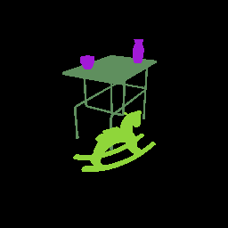

##### Visual Perception

# Semantic category segmentation colors (`_category` pass)

The `_category` pass is similar to the `_id` pass but it assigns colors based on the semantic category of the objects in the scene. Note that the two items on the table are in the same category and therefore receive the same color:



## Model category metadata

You can get each object's category via the [`ModelLibrarian`](../../python/librarian/model_librarian.md):

```python
from tdw.librarian import ModelLibrarian

lib = ModelLibrarian()

for object_name in ["small_table_green_marble", "rh10", "jug01", "jug05"]:
    record = lib.get_record(object_name)
    print(object_name, record.wcategory)
```

Result:

```
small_table_green_marble table
rh10 toy
jug01 jug
jug05 jug
```

## `Categories` output data

To get each object's category at runtime, send [`send_segmentation_colors`](../../api/command_api#send_segmentation_colors):

```python
from tdw.controller import Controller
from tdw.tdw_utils import TDWUtils
from tdw.output_data import OutputData, SegmentationColors

c = Controller()
object_id_0 = c.get_unique_id()
object_id_1 = c.get_unique_id()
object_id_2 = c.get_unique_id()
object_id_3 = c.get_unique_id()
object_names = {object_id_0: "small_table_green_marble",
                object_id_1: "rh10",
                object_id_2: "jug01",
                object_id_3: "jug05"}
resp = c.communicate([TDWUtils.create_empty_room(12, 12),
                      c.get_add_object(object_names[object_id_0],
                                       object_id=object_id_0),
                      c.get_add_object(object_names[object_id_1],
                                       position={"x": 0.7, "y": 0, "z": 0.4},
                                       rotation={"x": 0, "y": 30, "z": 0},
                                       object_id=object_id_1),
                      c.get_add_object(model_name=object_names[object_id_2],
                                       position={"x": -0.3, "y": 0.9, "z": 0.2},
                                       object_id=object_id_2),
                      c.get_add_object(object_names[object_id_3],
                                       position={"x": 0.3, "y": 0.9, "z": -0.2},
                                       object_id=object_id_3),
                      {"$type": "send_segmentation_colors",
                       "frequency": "once"}])
# Get each object category.
for i in range(len(resp) - 1):
    r_id = OutputData.get_data_type_id(resp[i])
    if r_id == "segm":
        segm = SegmentationColors(resp[i])
        for j in range(segm.get_num()):
            object_id = segm.get_object_id(j)
            object_category = segm.get_object_category(j)
            print(object_id, object_category)
c.communicate({"$type": "terminate"})
```

To get the color of each category, send [`send_categories`](../../api/command_api#send_categories), which will return [`Categories`](../../api/output_data.md#Categories) output data:

```python
from tdw.controller import Controller
from tdw.tdw_utils import TDWUtils
from tdw.output_data import OutputData, SegmentationColors, Categories

"""
Get the _category pass and category data per object.
"""

c = Controller()
object_id_0 = c.get_unique_id()
object_id_1 = c.get_unique_id()
object_id_2 = c.get_unique_id()
object_id_3 = c.get_unique_id()
object_names = {object_id_0: "small_table_green_marble",
                object_id_1: "rh10",
                object_id_2: "jug01",
                object_id_3: "jug05"}
resp = c.communicate([TDWUtils.create_empty_room(12, 12),
                      c.get_add_object(object_names[object_id_0],
                                       object_id=object_id_0),
                      c.get_add_object(object_names[object_id_1],
                                       position={"x": 0.7, "y": 0, "z": 0.4},
                                       rotation={"x": 0, "y": 30, "z": 0},
                                       object_id=object_id_1),
                      c.get_add_object(model_name=object_names[object_id_2],
                                       position={"x": -0.3, "y": 0.9, "z": 0.2},
                                       object_id=object_id_2),
                      c.get_add_object(object_names[object_id_3],
                                       position={"x": 0.3, "y": 0.9, "z": -0.2},
                                       object_id=object_id_3),
                      {"$type": "send_categories",
                       "frequency": "once"},
                      {"$type": "send_segmentation_colors",
                       "frequency": "once"}])
# Get each object category and category color.
object_categories = dict()
category_colors = dict()
for i in range(len(resp) - 1):
    r_id = OutputData.get_data_type_id(resp[i])
    if r_id == "segm":
        segm = SegmentationColors(resp[i])
        for j in range(segm.get_num()):
            object_id = segm.get_object_id(j)
            object_category = segm.get_object_category(j)
            object_categories[object_id] = object_category
    elif r_id == "cate":
        cate = Categories(resp[i])
        for j in range(cate.get_num_categories()):
            category_name = cate.get_category_name(j)
            category_color = cate.get_category_color(j)
            category_colors[category_name] = category_color
# Print the category colors of each object.
for object_id in object_categories:
    category_name = object_categories[object_id]
    object_category_color = category_colors[category_name]
    print(object_id, category_name, object_category_color)
c.communicate({"$type": "terminate"})
```

Note that `SegmentationColors` and `Categories` return only static data and do not need to be sent per-frame.

***

**Next: [Depth maps (`_depth` and `_depth_simple` passes)](depth.md)**

Example controllers:

- [category.py](https://github.com/threedworld-mit/tdw/blob/master/Python/example_controllers/visual_perception/category.py) Example implementation of the `_category` pass and `Categories` output data.

Command API:

- [`send_segmentation_colors`](../../api/command_api.md#send_segmentation_colors)
- [`send_categories`](../../api/command_api.md#send_categories)

Output Data API:

- [`SegmentationColors`](../../api/output_data.md#SegmentationColors.md)
- [`Categories`](../../api/output_data.md#Categories.md)

[Return to the README](../../README.md)

