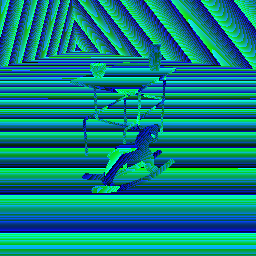
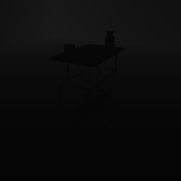
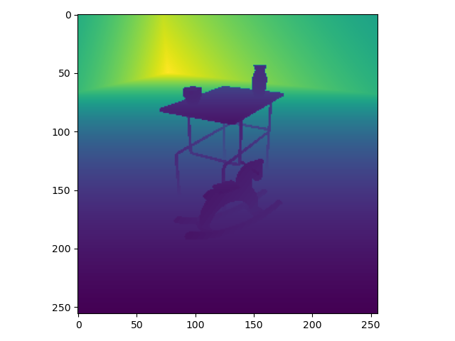

# Visual Perception: Depth Maps

## The `_depth` pass

The `_depth` pass encodes depth values per pixel into 3 bytes (RGB). The resulting image looks strange but is very accurate:



## The `_depth_simple` pass

The `_depth_simple` pass is similar to the `_depth` pass but encodes depth values to grayscale (1 byte). This makes it less accurate but somewhat easier to use. Note that the fact that this image is nearly all black is actually accurate:



## Convert a depth pass to depth values

To convert the image into depth values, you can use `TDWUtils.get_depth_values()`:

```python
import matplotlib.pyplot as plt
from tdw.controller import Controller
from tdw.tdw_utils import TDWUtils
from tdw.add_ons.third_person_camera import ThirdPersonCamera
from tdw.add_ons.image_capture import ImageCapture
from tdw.backend.paths import EXAMPLE_CONTROLLER_OUTPUT_PATH

"""
Convert the _depth pass to depth values and plot them using matplotlib.
"""

c = Controller()
c.start()
object_id_0 = c.get_unique_id()
object_id_1 = c.get_unique_id()
object_id_2 = c.get_unique_id()
object_id_3 = c.get_unique_id()
object_names = {object_id_0: "small_table_green_marble",
                object_id_1: "rh10",
                object_id_2: "jug01",
                object_id_3: "jug05"}

cam = ThirdPersonCamera(position={"x": 2.478, "y": 1.602, "z": 1.412},
                        look_at={"x": 0, "y": 0.2, "z": 0},
                        avatar_id="a")
output_directory = EXAMPLE_CONTROLLER_OUTPUT_PATH.joinpath("depth")
print(f"Images will be saved to: {output_directory.resolve()}")
c.add_ons.append(cam)
cap = ImageCapture(path=output_directory, avatar_ids=["a"], pass_masks=["_depth"])
c.add_ons.append(cap)
c.communicate([TDWUtils.create_empty_room(12, 12),
               c.get_add_object(object_names[object_id_0],
                                object_id=object_id_0),
               c.get_add_object(object_names[object_id_1],
                                position={"x": 0.7, "y": 0, "z": 0.4},
                                rotation={"x": 0, "y": 30, "z": 0},
                                object_id=object_id_1),
               c.get_add_object(model_name=object_names[object_id_2],
                                position={"x": -0.3, "y": 0.9, "z": 0.2},
                                object_id=object_id_2),
               c.get_add_object(object_names[object_id_3],
                                position={"x": 0.3, "y": 0.9, "z": -0.2},
                                object_id=object_id_3)])
images = cap.images["a"]
for i in range(images.get_num_passes()):
    if images.get_pass_mask(i) == "_depth":
        depth_values = TDWUtils.get_depth_values(images.get_image(i), depth_pass="_depth",
                                                 width=images.get_width(), height=images.get_height())
        plt.imshow(depth_values)
        plt.show()
c.communicate({"$type": "terminate"})
```

Result:



## Convert depth values to point clouds

It is possible to convert the `_depth` pass into a point cloud. To this we need to add 3 things to the previous example:

- Send the [`send_camera_matrices`](../../api/command_api.md#send_camera_matrices) command.
- Parse the output data to receive [`CameraMatrices`](../../api/output_data.md#CameraMatrices.md).
- Call [`TDWUtils.get_point_cloud(depth, filename, camera_matrix)`](../../python/tdw_utils.md).

```python
import matplotlib.pyplot as plt
from tdw.controller import Controller
from tdw.tdw_utils import TDWUtils
from tdw.add_ons.third_person_camera import ThirdPersonCamera
from tdw.add_ons.image_capture import ImageCapture
from tdw.output_data import OutputData, CameraMatrices
from tdw.backend.paths import EXAMPLE_CONTROLLER_OUTPUT_PATH

"""
Convert the _depth pass to depth values, plot them using matplotlib, and generate a point cloud
"""

c = Controller()
c.start()
object_id_0 = c.get_unique_id()
object_id_1 = c.get_unique_id()
object_id_2 = c.get_unique_id()
object_id_3 = c.get_unique_id()
object_names = {object_id_0: "small_table_green_marble",
                object_id_1: "rh10",
                object_id_2: "jug01",
                object_id_3: "jug05"}

cam = ThirdPersonCamera(position={"x": 2.478, "y": 1.602, "z": 1.412},
                        look_at={"x": 0, "y": 0.2, "z": 0},
                        avatar_id="a")
output_directory = EXAMPLE_CONTROLLER_OUTPUT_PATH.joinpath("depth")
print(f"Images will be saved to: {output_directory.resolve()}")
c.add_ons.append(cam)
cap = ImageCapture(path=output_directory, avatar_ids=["a"], pass_masks=["_depth"])
c.add_ons.append(cap)
resp = c.communicate([TDWUtils.create_empty_room(12, 12),
                      c.get_add_object(object_names[object_id_0],
                                       object_id=object_id_0),
                      c.get_add_object(object_names[object_id_1],
                                       position={"x": 0.7, "y": 0, "z": 0.4},
                                       rotation={"x": 0, "y": 30, "z": 0},
                                       object_id=object_id_1),
                      c.get_add_object(model_name=object_names[object_id_2],
                                       position={"x": -0.3, "y": 0.9, "z": 0.2},
                                       object_id=object_id_2),
                      c.get_add_object(object_names[object_id_3],
                                       position={"x": 0.3, "y": 0.9, "z": -0.2},
                                       object_id=object_id_3),
                      {"$type": "send_camera_matrices",
                       "frequency": "always"}])
# Get the camera matrix.
camera_matrix = None
for i in range(len(resp) - 1):
    r_id = OutputData.get_data_type_id(resp[i])
    if r_id == "cama":
        camera_matrix = CameraMatrices(resp[i]).get_camera_matrix()
images = cap.images["a"]
for i in range(images.get_num_passes()):
    if images.get_pass_mask(i) == "_depth":
        # Get the depth values.
        depth_values = TDWUtils.get_depth_values(images.get_image(i), depth_pass="_depth",
                                                 width=images.get_width(), height=images.get_height())
        
        # Comment out these two lines on a Linux server.
        plt.imshow(depth_values)
        plt.show()
        
        # Convert the depth values to a point cloud.
        point_cloud_filename = str(output_directory.joinpath("point_cloud.txt").resolve())
        TDWUtils.get_point_cloud(depth=depth_values, filename=point_cloud_filename, camera_matrix=camera_matrix)
c.communicate({"$type": "terminate"})
```

***

**Next: [Motion perception](flow.md)**

Example controllers:

- [depth.py](https://github.com/threedworld-mit/tdw/blob/master/Python/example_controllers/capture_passes/depth.py) Save a depth pass, get the depth values, and save a point cloud.

Python API:

- [`TDWUtils.get_depth_values(image, depth_pass, width, height, near_plane, far_plane)`](../../python/tdw_utils.md) 
- [`TDWUtils.get_point_cloud(depth, filename, camera_matrix)`](../../python/tdw_utils.md) 

Command API:

- [`send_camera_matrices`](../../api/command_api.md#send_camera_matrices)

Output Data API:

- [`CameraMatrices`](../../api/output_data.md#CameraMatrices.md)

[Return to the README](../../README.md)