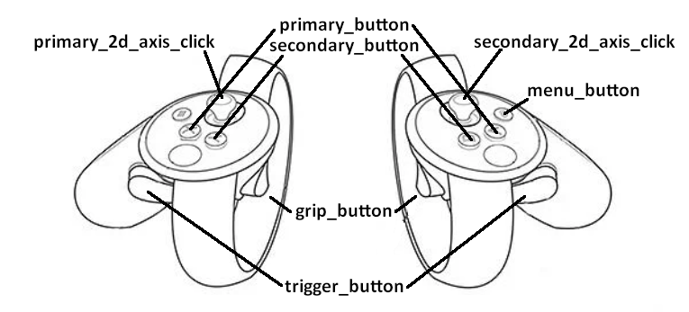
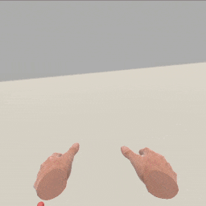
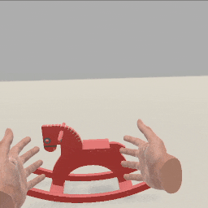
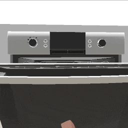

##### Virtual Reality (VR)

# Oculus Touch

The **Oculus Touch** is a VR rig that uses an Oculus headset and Touch controllers. It supports head and hand tracking, grasping and dropping objects, controller button input, and teleporting around the room.

## Requirements

- Windows 10
- [A compatible GPU](https://support.oculus.com/articles/headsets-and-accessories/oculus-link/oculus-link-compatibility/)
- Oculus headset (Rift, Rift S, Quest, or Quest 2)
- *Quest and Quest 2:* An Oculus Link Cable
  - A USB-C port
- [The Oculus PC app](https://www.oculus.com/setup/)

## Setup

After installing the Oculus PC app, you must run it while running the controller and the build.

## Rig description

The Oculus Touch VR rig has two floating hands. The hands can interact with objects either by pushing them (the hands have colliders and Rigidbodies) or by grabbing them. The hands may be "robot" hands or "human" hands. The rig has a small collider on the floor and a head camera. The head, torso, legs, etc. don't have visual meshes or physics colliders.

## Controls



*[Source](https://circuitstream.com/blog/oculus-unity-setup/)*

| Button                | Effect                                                       |
| --------------------- | ------------------------------------------------------------ |
| grip_button (left)    | Grab or drop an object with the left hand.                   |
| grip_button (right)   | Grab or drop an object with the right hand.                  |
| primary_2d_axis_click | Click and hold to set a position to teleport to. Release to teleport. |

## The `OculusTouch` add-on

The simplest way to add an Oculus Touch rig to the scene is to use the [`OculusTouch` add-on](../../python/add_ons/oculus_touch.md):

```python
from tdw.controller import Controller
from tdw.tdw_utils import TDWUtils
from tdw.add_ons.oculus_touch import OculusTouch

c = Controller()
vr = OculusTouch()
c.add_ons.append(vr)
c.communicate([TDWUtils.create_empty_room(12, 12),
               c.get_add_object(model_name="rh10",
                                object_id=Controller.get_unique_id(),
                                position={"x": 0, "y": 0, "z": 0.5})])
while True:
    c.communicate([])
```

Result:



### Set the initial position and rotation

Set the initial position and rotation of the VR rig by setting `position` and `rotation` in the constructor or in `vr.reset()`:

```python
from tdw.controller import Controller
from tdw.tdw_utils import TDWUtils
from tdw.add_ons.oculus_touch import OculusTouch

c = Controller()
vr = OculusTouch(position={"x": 1, "y": 0, "z": 0}, rotation=30)
c.add_ons.append(vr)
c.communicate([TDWUtils.create_empty_room(12, 12),
               c.get_add_object(model_name="rh10",
                                object_id=Controller.get_unique_id(),
                                position={"x": 0, "y": 0, "z": 0.5})])
while True:
    c.communicate([])
```

### Teleport and rotate the VR rig

You can "teleport" around your scene by clicking down the left control stick; release to teleport to the location at the end of the rendered arc. This can be useful when your virtual scene space is larger than your real-world (Guardian) space, and you cannot simply walk to certain areas within your virtual space. You can programatically set the rig's position in the scene with `vr.set_position(position)`. This can be useful for initially placing yourself at a particular location within your scene.

You can rotate the rig by physically turning your body. You can programatically rotate the rig with `vr.rotate_by(angle)`. This can be useful for setting the initial rotation of the rig, in order to start off facing a particular direction in your scene. 

### Button presses

It can be useful to listen to button presses in order to trigger global events. In this example, we'll use `vr.listen_to_button()` to listen for a button press to trigger the end of the simulation. Note that the `button` parameter accepts an [`OculusTouchButton`](../../python/vr_data/oculus_touch_button.md) value.

```python
from tdw.controller import Controller
from tdw.tdw_utils import TDWUtils
from tdw.add_ons.oculus_touch import OculusTouch
from tdw.vr_data.oculus_touch_button import OculusTouchButton


class VirtualReality(Controller):
    """
    Minimal VR example.
    """

    def __init__(self, port: int = 1071, check_version: bool = True, launch_build: bool = True):
        super().__init__(port=port, check_version=check_version, launch_build=launch_build)
        self.done = False
        self.vr = OculusTouch()
        # Quit when the left control stick is clicked.
        self.vr.listen_to_button(button=OculusTouchButton.primary_2d_axis_click, is_left=True, function=self.quit)
        self.add_ons.extend([self.vr])

    def run(self) -> None:
        object_id = self.get_unique_id()
        self.communicate([TDWUtils.create_empty_room(12, 12),
                          self.get_add_object(model_name="rh10",
                                              object_id=object_id,
                                              position={"x": 0, "y": 0, "z": 1.2})])
        while not self.done:
            self.communicate([])
        self.communicate({"$type": "terminate"})

    def quit(self):
        self.done = True


if __name__ == "__main__":
    c = VirtualReality()
    c.run()
```

This somewhat more complicated example creates "trials" of different objects in the scene whenever a button is pressed:

```python
import random
from tdw.controller import Controller
from tdw.tdw_utils import TDWUtils
from tdw.add_ons.oculus_touch import OculusTouch
from tdw.vr_data.oculus_touch_button import OculusTouchButton


class OculusTouchButtonListener(Controller):
    """
    Listen for button presses to reset the scene.
    """

    MODEL_NAMES = ["rh10", "iron_box", "trunck"]

    def __init__(self, port: int = 1071, check_version: bool = True, launch_build: bool = True):
        super().__init__(port=port, check_version=check_version, launch_build=launch_build)
        self.simulation_done = False
        self.trial_done = False
        self.vr = OculusTouch()
        # Quit when the left trigger button is pressed.
        self.vr.listen_to_button(button=OculusTouchButton.trigger_button, is_left=True, function=self.quit)
        # End the trial when the Y button is pressed.
        self.vr.listen_to_button(button=OculusTouchButton.secondary_button, is_left=True, function=self.end_trial)
        self.add_ons.extend([self.vr])
        self.communicate(TDWUtils.create_empty_room(12, 12))

    def trial(self) -> None:
        self.vr.reset()
        # Start a new trial.
        self.trial_done = False
        # Choose a random model.
        model_name = random.choice(OculusTouchButtonListener.MODEL_NAMES)
        # Add the model.
        object_id = self.get_unique_id()
        self.communicate(self.get_add_object(model_name=model_name,
                                             object_id=object_id,
                                             position={"x": 0, "y": 0, "z": 1.2}))
        # Wait until the trial is done.
        while not self.trial_done and not self.simulation_done:
            self.communicate([])
        # Destroy the object.
        self.communicate({"$type": "destroy_object",
                          "id": object_id})

    def run(self) -> None:
        while not self.simulation_done:
            # Run a trial.
            self.trial()
        # End the simulation.
        self.communicate({"$type": "terminate"})

    def quit(self):
        self.simulation_done = True

    def end_trial(self):
        self.trial_done = True


if __name__ == "__main__":
    c = OculusTouchButtonListener()
    c.run()
```

Result:



### Controller sticks

Call `vr.listen_to_axis()` to listen to axis movement from the left and right control sticks. These functions must have a single parameter: a numpy array of expected shape (`2`) (the x, y coordinates of the control stick movement delta, ranging from -1 to 1).

This example listens to control stick input to move two joints of a [robot arm](../robots/overview.md). The functions `left_axis(delta)` and `right_axis(delta)` are every frame. They then evaluate `delta` to determine a) if there was movement along a particular axis and if so b) which commands to send.

```python
import numpy as np
from tdw.controller import Controller
from tdw.add_ons.oculus_touch import OculusTouch
from tdw.add_ons.robot import Robot
from tdw.tdw_utils import TDWUtils
from tdw.vr_data.oculus_touch_button import OculusTouchButton


class OculusTouchAxisListener(Controller):
    """
    Control a robot arm with the Oculus Touch control sticks.
    """

    # This controls how fast the joints will rotate.
    SPEED: float = 10

    def __init__(self, port: int = 1071, check_version: bool = True, launch_build: bool = True):
        super().__init__(port=port, check_version=check_version, launch_build=launch_build)
        self.robot: Robot = Robot(name="ur5", position={"x": 0, "y": 0.5, "z": 2})
        self.vr: OculusTouch = OculusTouch()
        # Move the robot joints with the control sticks.
        self.vr.listen_to_axis(is_left=True, function=self.left_axis)
        self.vr.listen_to_axis(is_left=False, function=self.right_axis)
        # Quit when the left control stick is clicked.
        self.vr.listen_to_button(button=OculusTouchButton.primary_2d_axis_click, is_left=True, function=self.quit)
        self.add_ons.extend([self.robot, self.vr])
        self.done: bool = False

    def run(self) -> None:
        self.communicate(TDWUtils.create_empty_room(12, 12))
        while not self.done:
            self.communicate([])
        self.communicate({"$type": "terminate"})

    def left_axis(self, delta: np.array) -> None:
        if self.robot.joints_are_moving():
            return
        targets = dict()
        # Rotate the shoulder link.
        if abs(delta[0]) > 0:
            shoulder_link_id = self.robot.static.joint_ids_by_name["shoulder_link"]
            shoulder_link_angle = self.robot.dynamic.joints[shoulder_link_id].angles[0]
            targets[shoulder_link_id] = shoulder_link_angle + delta[0] * OculusTouchAxisListener.SPEED
        self.robot.set_joint_targets(targets=targets)

    def right_axis(self, delta: np.array) -> None:
        if self.robot.joints_are_moving():
            return
        targets = dict()
        # Rotate the upper arm link.
        if abs(delta[0]) > 0:
            upper_arm_link_id = self.robot.static.joint_ids_by_name["upper_arm_link"]
            upper_arm_link_angle = self.robot.dynamic.joints[upper_arm_link_id].angles[0]
            targets[upper_arm_link_id] = upper_arm_link_angle + delta[1] * OculusTouchAxisListener.SPEED
        self.robot.set_joint_targets(targets=targets)

    def quit(self):
        self.done = True


if __name__ == "__main__":
    c = OculusTouchAxisListener()
    c.run()
```

Result:


### Graspable objects

By default, objects in TDW are not graspable in VR; they must be explicitly set as such via a command. **The `OculusTouch` add-on sets all non-kinematic objects as graspable in VR.** You can optionally disable this by setting `set_graspable=False` in the constructor:

```python
from tdw.controller import Controller
from tdw.tdw_utils import TDWUtils
from tdw.add_ons.oculus_touch import OculusTouch

c = Controller()
vr = OculusTouch(set_graspable=False)
c.add_ons.append(vr)
c.communicate([TDWUtils.create_empty_room(12, 12),
               c.get_add_object(model_name="rh10",
                                object_id=Controller.get_unique_id(),
                                position={"x": 0, "y": 0, "z": 0.5})])
while True:
    c.communicate([])
```

### Composite objects

It is possible to grasp [composite sub-objects](../composite_objects/overview.md) such as the door of a microwave in VR. The VR system automatically finds 'affordance points' for the hands to grasp. The resulting motion may at times be jittery; this is due to the underlying hand tracking and object grasping system:

```python
from tdw.controller import Controller
from tdw.tdw_utils import TDWUtils
from tdw.add_ons.oculus_touch import OculusTouch
from tdw.vr_data.oculus_touch_button import OculusTouchButton


class OculusTouchCompositeObject(Controller):
    """
    Manipulate a composite object in VR.
    """

    def __init__(self, port: int = 1071, check_version: bool = True, launch_build: bool = True):
        super().__init__(port=port, check_version=check_version, launch_build=launch_build)
        self.communicate(TDWUtils.create_empty_room(12, 12))
        self.done = False
        # Add the VR rig.
        self.vr = OculusTouch(human_hands=False, output_data=True, attach_avatar=True, set_graspable=False)
        # Quit when the left control stick is clicked.
        self.vr.listen_to_button(button=OculusTouchButton.primary_2d_axis_click, is_left=True, function=self.quit)
        self.add_ons.append(self.vr)

    def run(self) -> None:
        self.communicate(Controller.get_add_physics_object(model_name="vm_v5_072_composite",
                                                           object_id=Controller.get_unique_id(),
                                                           position={"x": 0, "y": 0.7, "z": 0.9},
                                                           kinematic=True))
        while not self.done:
            self.communicate([])
        self.communicate({"$type": "terminate"})

    def quit(self):
        self.done = True


if __name__ == "__main__":
    c = OculusTouchCompositeObject()
    c.run()
```

Result:



### Non-graspable

If you want certain non-kinematic objects to be non-graspable you can set the optional `non_graspable` parameter in the constructor:

```python
from tdw.controller import Controller
from tdw.tdw_utils import TDWUtils
from tdw.add_ons.oculus_touch import OculusTouch

c = Controller()
object_id = Controller.get_unique_id()
vr = OculusTouch(non_graspable=[object_id])
c.add_ons.append(vr)
c.communicate([TDWUtils.create_empty_room(12, 12),
               c.get_add_object(model_name="rh10",
                                object_id=object_id,
                                position={"x": 0, "y": 0, "z": 0.5})])
while True:
    c.communicate([])
```

### Output data

The `OculusTouch` add-on saves the head, rig base, and hands data per-frame as [`Transform` objects](../../python/object_data/transform.md). `vr.held_left` and `vr.held_right` are arrays of IDs of objects held in the left and right hands:

```python
from tdw.controller import Controller
from tdw.tdw_utils import TDWUtils
from tdw.add_ons.oculus_touch import OculusTouch

c = Controller()
vr = OculusTouch()
c.add_ons.append(vr)
c.communicate([TDWUtils.create_empty_room(12, 12),
               c.get_add_object(model_name="rh10",
                                object_id=Controller.get_unique_id(),
                                position={"x": 0, "y": 0, "z": 1.2})])
while True:
    print(vr.rig.position)
    print(vr.head.position)
    print(vr.left_hand.position)
    print(vr.right_hand.position)
    print(vr.held_left, vr.held_right)
    c.communicate([])
```

You can disable output data by setting `output_data=False` in the constructor:

```python
from tdw.controller import Controller
from tdw.tdw_utils import TDWUtils
from tdw.add_ons.oculus_touch import OculusTouch

c = Controller()
vr = OculusTouch(output_data=False)
c.add_ons.append(vr)
c.communicate([TDWUtils.create_empty_room(12, 12),
               c.get_add_object(model_name="rh10",
                                object_id=Controller.get_unique_id(),
                                position={"x": 0, "y": 0, "z": 1.2})])
while True:
    c.communicate([])
```

### Image capture

VR rig cameras are not [avatars](../core_concepts/avatars.md).  You can attach an avatar to a VR rig by setting `attach_avatar=True` in the constructor:

```python
from tdw.controller import Controller
from tdw.tdw_utils import TDWUtils
from tdw.add_ons.oculus_touch import OculusTouch

c = Controller()
vr = OculusTouch(attach_avatar=True)
c.add_ons.append(vr)
c.communicate([TDWUtils.create_empty_room(12, 12),
               c.get_add_object(model_name="rh10",
                                object_id=Controller.get_unique_id(),
                                position={"x": 0, "y": 0, "z": 0.5})])
while True:
    c.communicate([])
```

You can then adjust the camera and capture image data like with any other avatar. The ID of this avatar is always `"vr"`.

For performance reasons, the default width of the avatar's images is 512, which is lower than the resolution of the headset. The height is always scaled proportional to the width. To adjust the pixel width and height ratio, set `avatar_camera_width` and `headset_aspect_ratio` in the constructor.

### Loading screen

If you load a new scene, the VR rig will appear to act strangely while the scene is loading. This is harmless but can be unintuitive for new users.

You can "solve" this by adding a loading screen to the VR rig. Call `vr.show_loading_screen(True)` followed by `c.communicate([])` to show the loading screen. The `communicate([])` call should be sent *before* loading the scene. After loading the scene, call `vr.show_loading_screen(False)` followed by `c.communicate([])`

This is a minimal example of how to show and hide a loading screen (see `def next_trial(self):` for the loading screen code):

```python
from tdw.add_ons.oculus_touch import OculusTouch
from tdw.vr_data.oculus_touch_button import OculusTouchButton
from tdw.controller import Controller


class LoadingScreen(Controller):
    """
    A minimal example of how to use a VR loading screen.
    """

    SCENE_NAMES = ['mm_craftroom_2a', 'mm_craftroom_2b', 'mm_craftroom_3a', 'mm_craftroom_3b',
                   'mm_kitchen_2a', 'mm_kitchen_2b', 'mm_kitchen_3a', 'mm_kitchen_3b']

    def __init__(self, port: int = 1071, check_version: bool = True, launch_build: bool = True):
        super().__init__(port=port, check_version=check_version, launch_build=launch_build)
        self.scene_index: int = 0
        # Add a VR rig.
        self.vr: OculusTouch = OculusTouch()
        self.done: bool = False
        # Quit when the left control stick is clicked.
        self.vr.listen_to_button(button=OculusTouchButton.primary_2d_axis_click, is_left=True, function=self.quit)
        # Go to the next scene when the Y button is pressed.
        self.vr.listen_to_button(button=OculusTouchButton.secondary_button, is_left=True, function=self.next_trial)
        self.add_ons.append(self.vr)
        # Load the first scene.
        self.next_trial()

    def run(self) -> None:
        # Loop until the user quits.
        while not self.done:
            self.communicate([])
        self.communicate({"$type": "terminate"})

    def quit(self) -> None:
        self.done = True

    def next_trial(self) -> None:
        # Enable the loading screen.
        self.vr.show_loading_screen(show=True)
        self.communicate([])
        # Reset the VR rig.
        self.vr.reset()
        # Load the next scene.
        self.communicate([Controller.get_add_scene(scene_name=LoadingScreen.SCENE_NAMES[self.scene_index]),
                          Controller.get_add_object(model_name="rh10",
                                                    object_id=Controller.get_unique_id(),
                                                    position={"x": 0, "y": 0, "z": 0.5})])
        # Hide the loading screen.
        self.vr.show_loading_screen(show=False)
        self.communicate([])
        # Increment the scene index for the next scene.
        self.scene_index += 1
        if self.scene_index >= len(LoadingScreen.SCENE_NAMES):
            self.scene_index = 0


if __name__ == "__main__":
    c = LoadingScreen()
    c.run()
```

### Hand models

The Oculus Touch rig has two hand models:

1. Human-like hands
2. Robot-like hands

Set the hand model with the optional constructor parameter `human_hands` (default is True).

### Reset

Whenever you reset a scene, you must call `vr.reset()` to re-initialize the VR add-on:

```python
from tdw.controller import Controller
from tdw.tdw_utils import TDWUtils
from tdw.add_ons.oculus_touch import OculusTouch

c = Controller()
vr = OculusTouch()
c.add_ons.append(vr)
c.communicate([TDWUtils.create_empty_room(12, 12),
               c.get_add_object(model_name="rh10",
                                object_id=Controller.get_unique_id(),
                                position={"x": 0, "y": 0, "z": 0.5})])
vr.reset()
c.communicate([{"$type": "load_scene",
                "scene_name": "ProcGenScene"},
               TDWUtils.create_empty_room(12, 12)])
c.communicate({"$type" : "terminate"})
```

If you want to reset a scene with an explicitly-defined non-graspable object, you must set the `non_graspable` parameter in both the constructor and in `reset()`:

```python
from tdw.controller import Controller
from tdw.tdw_utils import TDWUtils
from tdw.add_ons.oculus_touch import OculusTouch

c = Controller()
object_id = Controller.get_unique_id()
vr = OculusTouch(non_graspable=[object_id])
c.add_ons.append(vr)
c.communicate([TDWUtils.create_empty_room(12, 12),
               c.get_add_object(model_name="rh10",
                                object_id=object_id,
                                position={"x": 0, "y": 0, "z": 0.5})])
object_id = Controller.get_unique_id()
vr.reset(non_graspable=[object_id])
c.communicate([{"$type": "load_scene",
                "scene_name": "ProcGenScene"},
               TDWUtils.create_empty_room(12, 12),
               c.get_add_object(model_name="rh10",
                                object_id=object_id,
                                position={"x": 0, "y": 0, "z": 0.5})])
c.communicate({"$type" : "terminate"})
```

You can set an initial position and rotation with the optional `position` and `rotation` parameters:

```python
from tdw.controller import Controller
from tdw.tdw_utils import TDWUtils
from tdw.add_ons.oculus_touch import OculusTouch

c = Controller()
vr = OculusTouch()
c.add_ons.append(vr)
c.communicate([TDWUtils.create_empty_room(12, 12),
               c.get_add_object(model_name="rh10",
                                object_id=Controller.get_unique_id(),
                                position={"x": 0, "y": 0, "z": 0.5})])
vr.reset(position={"x": 1, "y": 0, "z": 0}, rotation=30)
c.communicate([{"$type": "load_scene",
                "scene_name": "ProcGenScene"},
               TDWUtils.create_empty_room(12, 12)])
c.communicate({"$type" : "terminate"})
```

## Collision detection

*For more information regarding collision detection, [read this](../physx/collisions.md).*

The Oculus Touch rig can send basic haptics data. The rig has a small collider at its base. Each palm has a Rigidbody and a collider. The base and the palms will be detected if [collision detection is enabled](../physx/collisions.md) as if they were standard TDW objects. If you are using [Clatter](../clatter/overview.md) (see below), tapping your hands together will create a faint sound.

## Audio

*For more information regarding audio in TDW, [read this](../audio/overview.md).*

Audio is supported in the Oculus Touch rig. Unlike other audio setups in TDW, it isn't necessary to [initialize audio](../audio/initialize_audio.md); the VR rig is already set up to listen for audio.

[Resonance Audio](../audio/resonance_audio.md) is *not* supported on the Oculus Touch rig. Oculus does have audio spatialization but this hasn't yet been implemented in TDW.

This example controller adds an Oculus Touch rig and [Clatter](../clatter/overview.md) to a scene:

```python
import random
from tdw.controller import Controller
from tdw.tdw_utils import TDWUtils
from tdw.add_ons.oculus_touch import OculusTouch
from tdw.add_ons.clatter import Clatter
from tdw.vr_data.oculus_touch_button import OculusTouchButton


class OculusTouchClatter(Controller):
    """
    Listen to audio generated by Clatter.
    """

    MODEL_NAMES = ["rh10", "iron_box", "trunck"]

    def __init__(self, port: int = 1071, check_version: bool = True, launch_build: bool = True):
        super().__init__(port=port, check_version=check_version, launch_build=launch_build)
        self.simulation_done = False
        self.trial_done = False
        self.vr = OculusTouch(set_graspable=True)
        # Quit when the left control stick is clicked.
        self.vr.listen_to_button(button=OculusTouchButton.primary_2d_axis_click, is_left=True, function=self.quit)
        # End the trial when the Y button is pressed.
        self.vr.listen_to_button(button=OculusTouchButton.secondary_button, is_left=True, function=self.end_trial)
        # Enable Clatter.
        self.clatter = Clatter()
        self.add_ons.extend([self.vr, self.clatter])
        self.communicate(TDWUtils.create_empty_room(12, 12))

    def trial(self) -> None:
        # Start a new trial.
        self.trial_done = False
        # Reset Clatter.
        self.clatter.reset()
        self.vr.reset()
        # Choose a random model.
        model_name = random.choice(OculusTouchClatter.MODEL_NAMES)
        # Add the model.
        object_id_0 = Controller.get_unique_id()
        commands = Controller.get_add_physics_object(model_name=model_name,
                                                     object_id=object_id_0,
                                                     position={"x": 0, "y": 0, "z": 0.7})
        object_id_1 = Controller.get_unique_id()
        commands.extend(Controller.get_add_physics_object(model_name="vase_02",
                                                          position={"x": 0, "y": 3, "z": 0.7},
                                                          object_id=object_id_1))
        self.communicate(commands)
        # Wait until the trial is done.
        while not self.trial_done and not self.simulation_done:
            self.communicate([])
        # Destroy the object.
        self.communicate([{"$type": "destroy_object",
                           "id": object_id_0},
                          {"$type": "destroy_object",
                           "id": object_id_1}])

    def run(self) -> None:
        while not self.simulation_done:
            # Run a trial.
            self.trial()
        # End the simulation.
        self.communicate({"$type": "terminate"})

    def quit(self):
        self.simulation_done = True

    def end_trial(self):
        self.trial_done = True


if __name__ == "__main__":
    c = OculusTouchClatter()
    c.run()
```

## Physics glitches

There are known physics glitches associated with the Oculus Touch rig, particularly when grasping objects, the most common being that objects will interpenetrate. There are several overlapping causes for this:

 By default, all objects in TDW use [the `continuous_dynamic` collision detection mode](../../api/command_api.md#set_object_collision_detection_mode). VR simulations seem to work better when non-kinematic objects use the `discrete` collision detection mode (emphasis on "seem" because there isn't an automated means of testing this behavior). By default, the `OculusTouch` add-on will set the hands of the rig and all graspable objects to `discrete`. There are cases where this won't be desirable because the physics behavior will be different in a VR scene than in a non-VR scene. You can optionally set `discrete_collision_detection=False` in the `OculusTouch` constructor.

Some of the glitchiness is possibly due to how the rig's hands work (they use third-party code), but we haven't yet fully explored to what extent this is true or what can be done to fix it.

Some of the glitchiness is probably due to issues in the PhysX engine itself. In general, models with simpler geometry seem to work better in VR.

## Low-level commands

The `OculusTouchRig` initializes the rig with the following commands:

- [`create_vr_rig`](../../api/command_api.md#create_vr_rig)
- [`set_vr_resolution_scale`](../../api/command_api.md#set_vr_resolution_scale)
- [`set_post_process`](../../api/command_api.md#set_post_process) (Disables post-process)
- [`send_vr_rig`](../../api/command_api.md#send_vr_rig) (Sends [`VRRig`](../../api/output_data.md#VRRig) output data every frame)
- [`attach_avatar_to_vr_rig`](../../api/command_api.md#attach_avatar_to_vr_rig) (If `attach_avatar` in the constructor is True)
- [`set_screen_size`](../../api/command_api.md#set_screen_size) (If `attach_avatar` in the constructor is True; this sets the size of the images captured by the avatar)
- [`send_static_rigidbodies`](../../api/command_api.md#send_static_rigidbodies) (Only once, and only if `set_graspable` in the constructor is True. This will return [`StaticRigidbodies`](../../api/output_data.md#StaticRigidbodies) output data, which is used to set graspable objects)
- [`send_oculus_touch_buttons`](../../api/command_api.md#send_oculus_touch_buttons) (Sends [`OculusTouchButtons`](../../api/output_data.md#OculusTouchButtons) output data every frame)
-  [`send_static_oculus_touch`](../../api/command_api.md#send_static_oculus_touch) (Sends [`StaticOculusTouch`](../../api/output_data.md#StaticOculusTouch) output data on the first frame)

On the second `communicate()` call after initialization:

- Using `StaticRigidbodies` data, send [`set_vr_graspable`](../../api/command_api.md#set_vr_graspable) for each non-kinematic object in the scene.

Position and rotation:

- [`teleport_vr_rig`](../../api/command_api.md#teleport_vr_rig)
- [`rotate_vr_rig_by`](../../api/command_api.md#rotate_vr_rig_by)

Loading screen:

- [`set_vr_loading_screen`](../../api/command_api.md#set_vr_loading_screen)

On the backend, the root body and hands are cached as objects with their own IDs (generated randomly by the build).

***

**This is the last document in the "Virtual Reality (VR)" tutorial.**

[Return to the README](../../../README.md)

***

Python API:

- [`OculusTouch`](../../python/add_ons/oculus_touch.md)
- [`OculusTouchButton`](../../python/vr_data/oculus_touch_button.md)
- [`Transform`](../../python/object_data/transform.md)

Example controllers:

- [oculus_touch_minimal.py](https://github.com/threedworld-mit/tdw/blob/master/Python/example_controllers/vr/oculus_touch_minimal.py) Minimal VR example.
- [oculus_touch_button_listener.py](https://github.com/threedworld-mit/tdw/blob/master/Python/example_controllers/vr/oculus_touch_button_listener.py) Listen for button presses to reset the scene.
- [oculus_touch_composite_object.py](https://github.com/threedworld-mit/tdw/blob/master/Python/example_controllers/vr/oculus_touch_composite_object.py) Manipulate a composite object in VR.
- [oculus_touch_output_data.py](https://github.com/threedworld-mit/tdw/blob/master/Python/example_controllers/vr/oculus_touch_output_data.py) Add several objects to the scene and parse VR output data.
- [oculus_touch_image_capture.py](https://github.com/threedworld-mit/tdw/blob/master/Python/example_controllers/vr/oculus_touch_image_capture.py) Add several objects to the scene. Record which objects are visible to the VR agent.
- [oculus_touch_clatter.py](https://github.com/threedworld-mit/tdw/blob/master/Python/example_controllers/vr/oculus_touch_clatter.py) Listen to audio generated by Clatter.
- [oculus_touch_axis_listener.py](https://github.com/threedworld-mit/tdw/blob/master/Python/example_controllers/vr/oculus_touch_axis_listener.py) Control a robot arm with the Oculus Touch control sticks.
- [oculus_touch_loading_screen.py](https://github.com/threedworld-mit/tdw/blob/master/Python/example_controllers/vr/oculus_touch_loading_screen.py) A minimal example of how to use a VR loading screen.

Command API:

- [`create_vr_rig`](../../api/command_api.md#create_vr_rig)
- [`set_vr_resolution_scale`](../../api/command_api.md#set_vr_resolution_scale)
- [`set_post_process`](../../api/command_api.md#set_post_process)
- [`send_vr_rig`](../../api/command_api.md#send_vr_rig) 
- [`attach_avatar_to_vr_rig`](../../api/command_api.md#attach_avatar_to_vr_rig)
- [`set_screen_size`](../../api/command_api.md#set_screen_size)
- [`send_static_rigidbodies`](../../api/command_api.md#send_static_rigidbodies)
- [`send_oculus_touch_buttons`](../../api/command_api.md#send_oculus_touch_buttons)
- [`set_vr_graspable`](../../api/command_api.md#set_vr_graspable)
- [`teleport_vr_rig`](../../api/command_api.md#teleport_vr_rig)
- [`rotate_vr_rig_by`](../../api/command_api.md#rotate_vr_rig_by)
- [`send_static_oculus_touch`](../../api/command_api.md#send_static_oculus_touch)
- [`set_vr_loading_screen`](../../api/command_api.md#set_vr_loading_screen)

Output Data:

- [`VRRig`](../../api/output_data.md#VRRig)
- [`OculusTouchButtons`](../../api/output_data.md#OculusTouchButtons)
- [`StaticRigidbodies`](../../api/output_data.md#StaticRigidbodies)
- [`StaticOculusTouch`](../../api/output_data.md#StaticOculusTouch)
